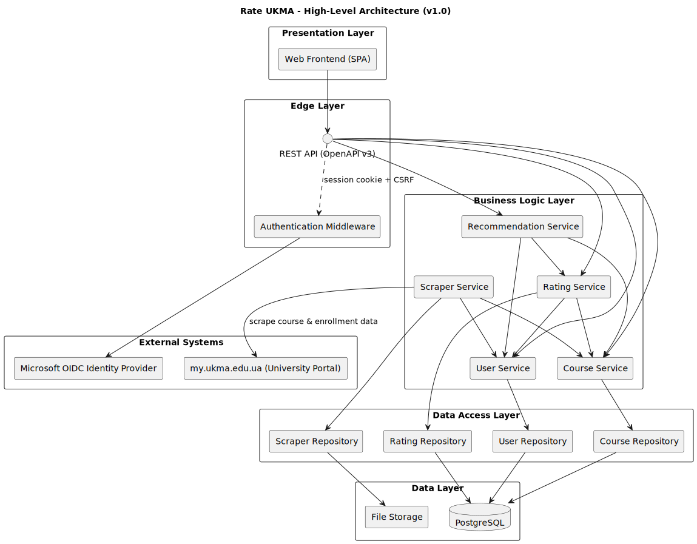

# High-Level Architecture Overview

The **Rate UKMA** system is built using a **layered / N-tier architecture**  
(see [ADR-0001: N-tier Architecture](./decisions/0001-n-tier-arch.md)), separating the application into presentation, edge/API, business logic, data access, and data layers, while integrating external systems.

---

## System Context

The Rate UKMA platform enables students of NaUKMA to browse courses, submit ratings, read reviews, and receive personalized recommendations.

- **Users** interact through a Single Page Application (SPA).
- **Backend services** process requests, enforce business rules, and persist data.
- **External systems** provide authentication (Microsoft OIDC) and supply course information (university portal `my.ukma.edu.ua`).

---

## Architecture Diagram

**References:**

- [Download Diagram (SVG)](./uml/high-level-design.svg)
- [View PlantUML Source](./uml/high-level-design.puml)

---

## Components

### Presentation Layer

A **Single Page Application (SPA)** that allows students to browse, search, filter courses, submit ratings, track progress, and view recommendations and analytics. It communicates with the backend via REST API.

### Edge Layer

Exposes a **REST API (OpenAPI v3)** and validates authentication through middleware.

### Business Logic Layer

Provides the core services:

- **Course Service** – manages the course catalog
- **Rating Service** – processes ratings and reviews
- **User Service** – manages user accounts and activity
- **Recommendation Service** – generates personalized recommendations
- **Scraper Service** – manually imports course and enrollment data from the university portal

#### Service Interactions

- **Rating Service → Course Service** – validates and enriches rating submissions
- **Rating Service → User Service** – verifies student identity and authorship
- **Recommendation Service → Rating Service** – uses rating data to generate suggestions
- **Recommendation Service → Course Service** – fetches course information for recommendations
- **Recommendation Service → User Service** – reads user history to personalize results
- **Scraper Service → Course Service** – updates courses with scraped data
- **Scraper Service → User Service** – updates enrollments with scraped data

### Data Access Layer

Provides **repositories** (`CourseRepository`, `RatingRepository`, `UserRepository`, `ScraperRepository`) that abstract persistence. Repositories use the ORM for PostgreSQL and adapters for file storage.

### Data Layer

- **PostgreSQL** stores structured data
- **File Storage** keeps raw scraped artifacts

### External Systems

- **Microsoft OIDC Identity Provider** – authentication with corporate email
- **University Portal (my.ukma.edu.ua)** – source of course and enrollment data

---

## Data Flows

1. The SPA sends REST API requests (e.g. browse courses, submit ratings, view recommendations).
2. Authentication middleware validates sessions via Microsoft OIDC.
3. The REST API forwards requests to the relevant Business Logic Service.
4. Services call repositories in the DAL, which handle persistence in PostgreSQL and File Storage.
5. The Scraper Service (manually triggered) collects data from the university portal, stores raw files through its repository, and updates course and enrollment records.
6. Aggregated and processed data (courses, ratings, recommendations, progress) is returned through the REST API to the SPA.
