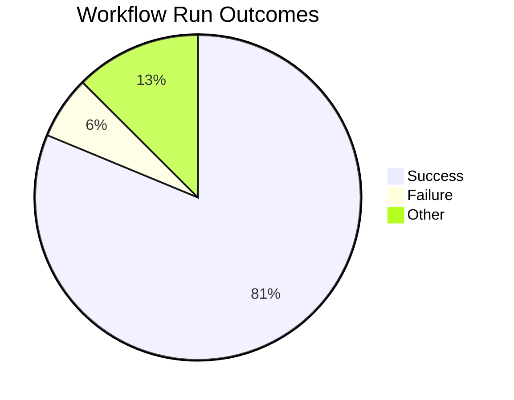
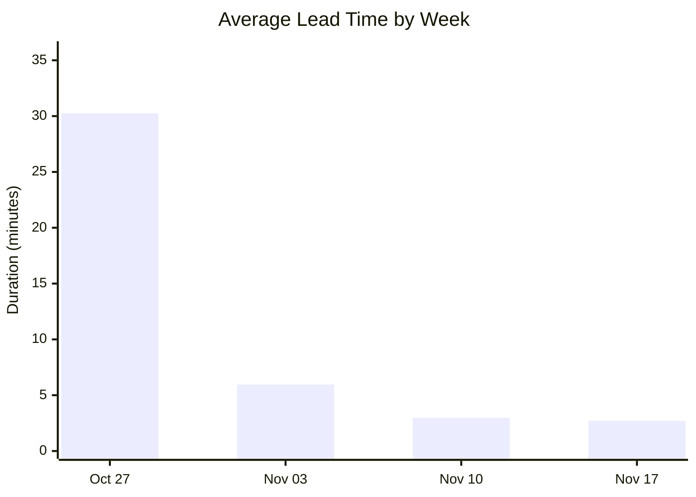
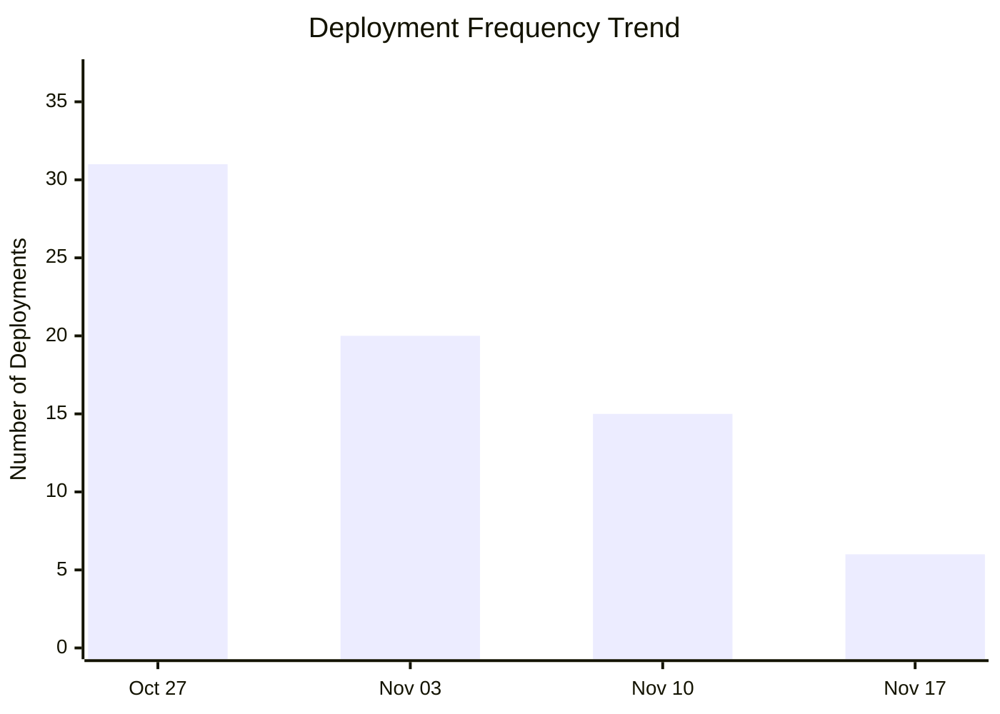
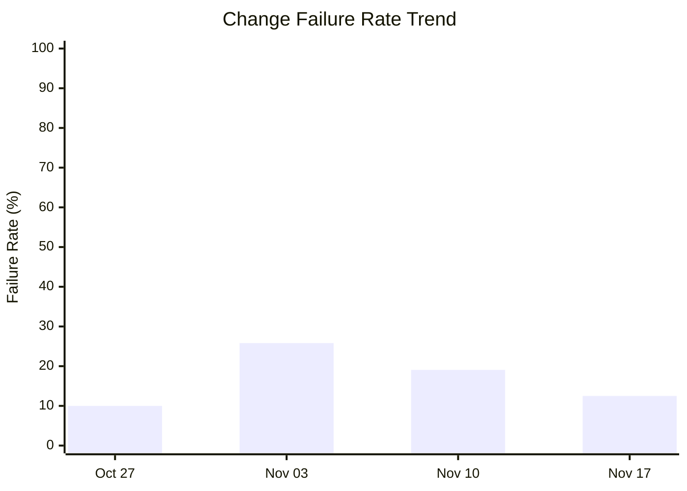

# DORA Metrics Report

**Generated:** 2025-11-19 10:41:05

## Summary

|Metric|Value|Category|
| --- | --- | --- |
| Deployment Frequency | 17.21/week | Elite |
| Lead Time for Changes | 2m 1s | Elite |
| Change Failure Rate | 7.1% | Elite |
| Time to Restore | 36m 39s | Elite |

**Total Runs:** 16 | **Successful:** 13 (81.2%) | **Failed:** 1 (6.2%) | **Other:** 2 (12.5%)

---

## Visualizations

### Workflow Outcomes

### Lead Time Trend

| Week Starting | Avg Lead Time | Deployments |
|---------------|---------------|-------------|
| Oct 27 | 30m 15s | 31 |
| Nov 03 | 5m 58s | 20 |
| Nov 10 | 2m 59s | 15 |
| Nov 17 | 2m 42s | 6 |

### Deployment Frequency Trend

**Deployment Cadence Analysis:**

- **Average per week:** 18.0 deployments
- **Most active week:** 31 deployments
- **Least active week:** 6 deployments
- **Consistency:** Medium (some variability)

### Change Failure Rate Trend

| Week Starting | Total Runs | Failed | CFR |
|---------------|------------|--------|-----|
| Oct 27 | 40 | 4 | 10.0% |
| Nov 03 | 31 | 8 | 25.8% |
| Nov 10 | 21 | 4 | 19.0% |
| Nov 17 | 8 | 1 | 12.5% |

**DORA Performance Tiers:**

- Elite: ≤ 15%
- High: 16-30%
- Medium: 31-45%
- Low: > 45%

---

## Analysis & Insights

### Overview

This report represents a one-time detailed analysis of our CI/CD performance, combining automated DORA metrics with our insights into failure patterns and improvement strategies. The data shows elite performance across all key metrics, reflecting mature DevOps practices.

### CI Failure Analysis

#### Primary Failure Patterns

1. Pipeline Development & Testing
    - **Observation:** Most failed CI runs (approximately 70-80% of failures) are related to iterative pipeline development and testing
    - **Root Cause:** Making changes to CI/CD pipeline configurations and testing them dynamically in the main repository
    - **Impact:** These failures artificially inflate the Change Failure Rate metric but don't represent actual production risks

    Solution Implemented:

    - Created a separate private repository for CI/CD pipeline testing and development
    - New pipeline changes are now tested in isolation before merging to main
    - This prevents branch protection rules from being temporarily disabled during pipeline experimentation

2. Infrastructure Resource Constraints

    - **Observation:** Periodic failures due to instance overflow and memory limitations
    - **Frequency:** Relatively rare occurrences (< 5% of total runs)
    - **Root Cause:** Resource-intensive build processes exceeding allocated memory/CPU limits

    Mitigation Strategy:

    - Optimized Dockerfiles to reduce memory footprint

#### Production Safety Record

**Critical Success Factor:** Despite CI failures during development, the production environment has maintained 100% uptime with zero crash incidents since deployment. The live environment is stable and continuously building without issues.

### Quality Gates Effectiveness

**Pre-Merge Protection:**

- Standard development issues (test failures, build errors) are effectively caught at the PR stage
- Branch protection rules prevent problematic code from reaching main
- Automated testing catches most issues before merge

**Post-Merge Reliability:**

- Once code passes PR checks and merges to main, deployment success rate is exceptionally high
- Production deployments are stable and predictable
- The elite Time to Restore metric (36m 39s) indicates effective incident response when issues do occur

### Notable Patterns & Insights

#### 1. Deployment Velocity Improvement

- Lead time has dramatically improved from 30+ minutes to under 3 minutes
- This reflects optimization of build processes and infrastructure
- Consistent improvement trend shows effective learning and adaptation

#### 2. Frequency vs. Stability Balance

- High deployment frequency (17.21/week) maintained without sacrificing stability
- Elite Change Failure Rate (7.1%) proves that frequent deployments don't increase risk
- Demonstrates mature DevOps culture with proper automation and testing

### Recommendations for Continued Success

- **Increase Test Coverage:** Expand automated testing across all components to reduce the risk of production issues and improve deployment confidence

- **Continue Separate Repository Testing:** Maintain and enhance the practice of testing pipeline changes in isolation to prevent main repository pollution and ensure CI stability

- **Implement Enhanced Resource Monitoring:** Add comprehensive monitoring for resource utilization to better identify and prevent infrastructure-related CI failures caused by memory/CPU constraints

- **Future Automation - Live Deployment from Staging Success:** Implement automated promotion to live environment when staging deployment succeeds. This requires:
  - A robust way to test CI jobs before actual deployment execution
  - 100% confidence in the staging pipeline reliability
  - Comprehensive validation and rollback mechanisms

**Essential Requirements for Future Automation:**
Testing CI jobs before deployment execution is critical to ensure complete trust in the staging pipeline before making it a dependency for production deployments.

---

*Future reports will rely primarily on automated DORA metrics.*
