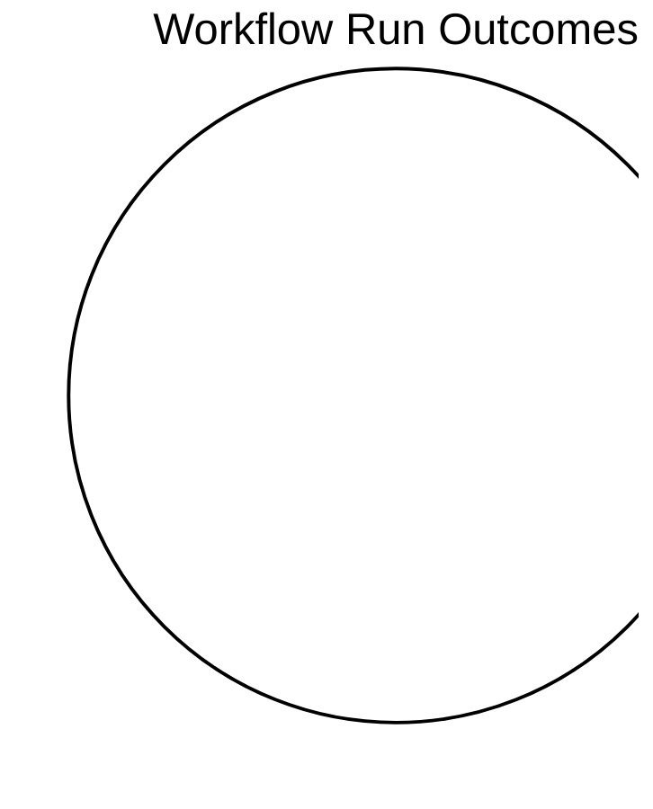
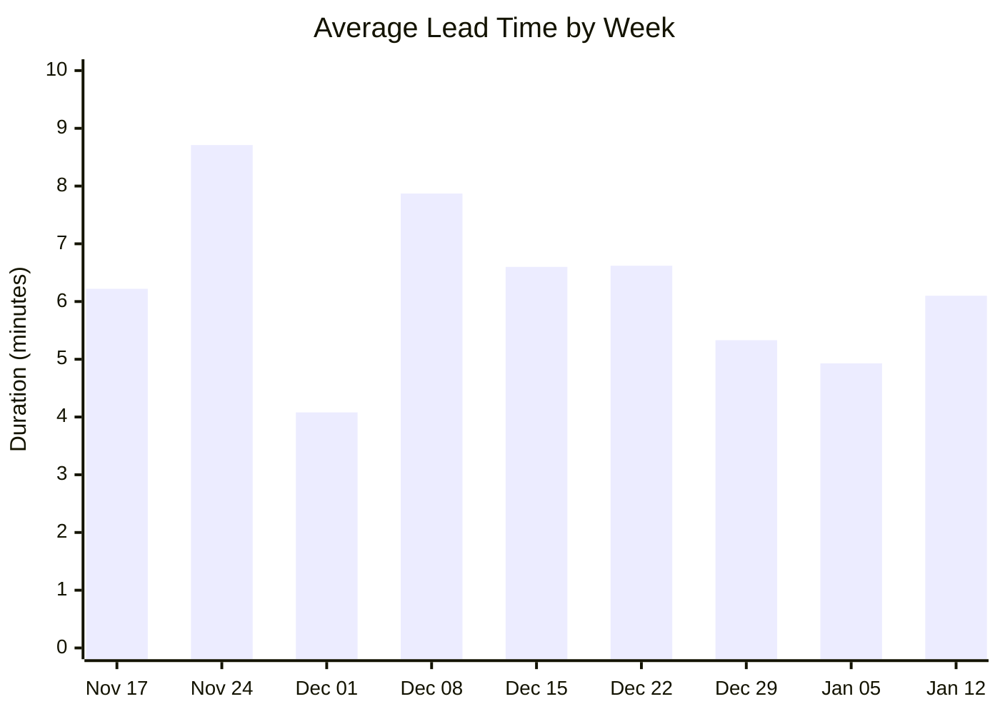
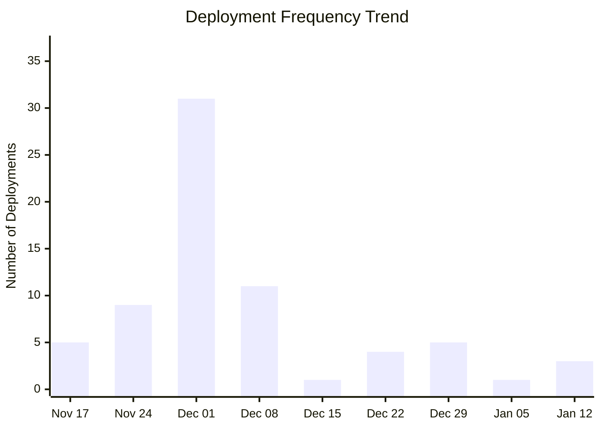
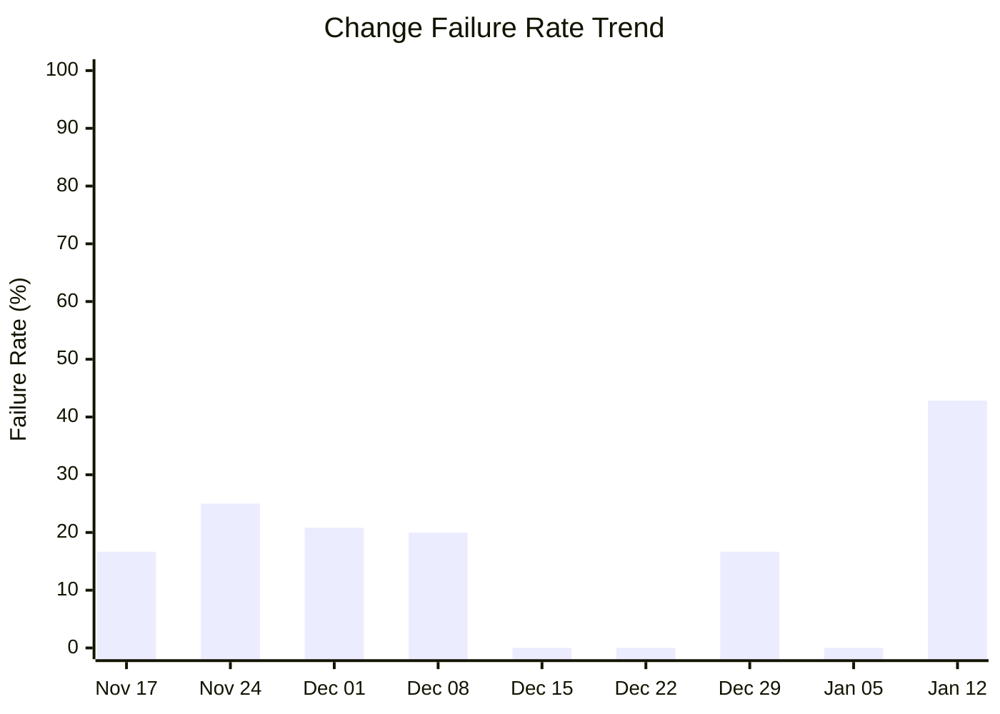

# DORA Metrics Report

**Generated:** 2026-01-27 09:07:28

## Summary

|Metric|Value|Category|
| --- | --- | --- |
| Deployment Frequency | 0.00/week | Low |
| Lead Time for Changes | 0m 0s | Elite |
| Change Failure Rate | 0.0% | Elite |
| Time to Restore | 3h 31m | High |

---

## Visualizations

### Workflow Outcomes

### Lead Time Trend

| Week Starting | Avg Lead Time | Deployments |
|---------------|---------------|-------------|
| Nov 17 | 6m 13s | 5 |
| Nov 24 | 8m 43s | 9 |
| Dec 01 | 4m 5s | 31 |
| Dec 08 | 7m 52s | 11 |
| Dec 15 | 6m 36s | 1 |
| Dec 22 | 6m 38s | 4 |
| Dec 29 | 5m 20s | 5 |
| Jan 05 | 4m 56s | 1 |
| Jan 12 | 6m 6s | 3 |

### Deployment Frequency Trend

**Deployment Cadence Analysis:**
- **Average per week:** 7.8 deployments
- **Most active week:** 31 deployments
- **Least active week:** 1 deployments
- **Consistency:** Low (irregular release pattern)

### Change Failure Rate Trend

| Week Starting | Total Runs | Failed | CFR |
|---------------|------------|--------|-----|
| Nov 17 | 6 | 1 | 16.7% |
| Nov 24 | 12 | 3 | 25.0% |
| Dec 01 | 48 | 10 | 20.8% |
| Dec 08 | 15 | 3 | 20.0% |
| Dec 15 | 1 | 0 | 0.0% |
| Dec 22 | 4 | 0 | 0.0% |
| Dec 29 | 6 | 1 | 16.7% |
| Jan 05 | 1 | 0 | 0.0% |
| Jan 12 | 7 | 3 | 42.9% |
**DORA Performance Tiers:**
- Elite: ≤ 15%
- High: 16-30%
- Medium: 31-45%
- Low: > 45%