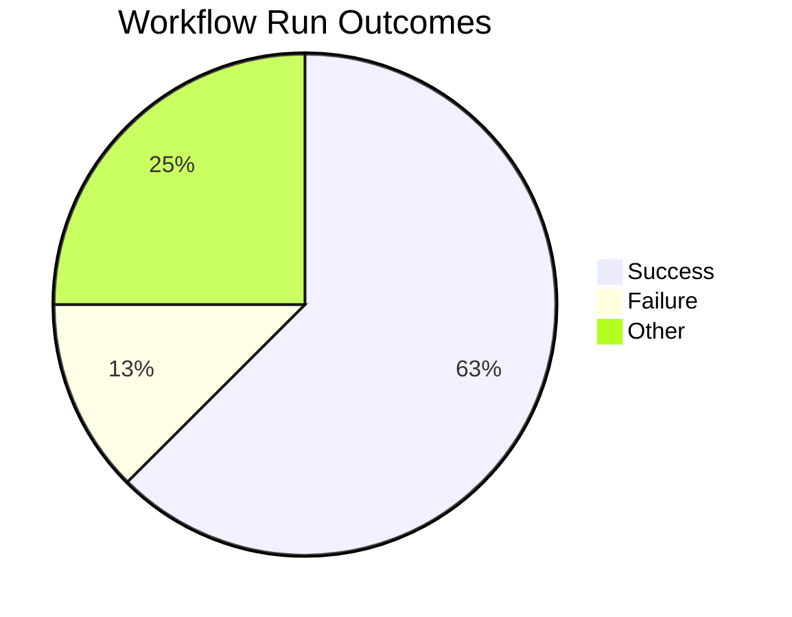
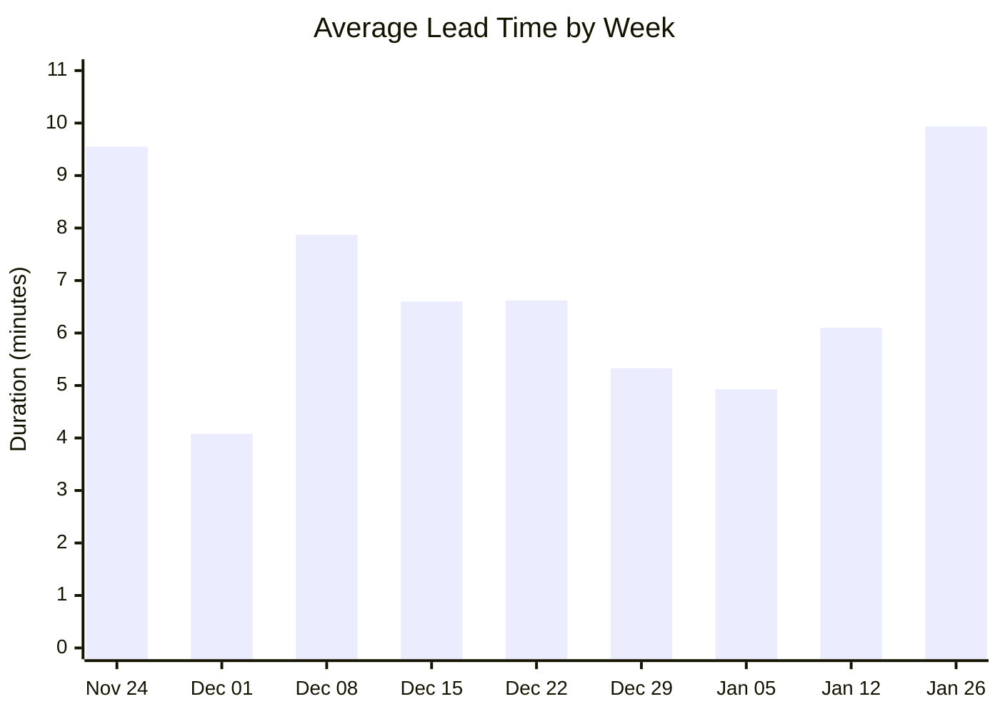
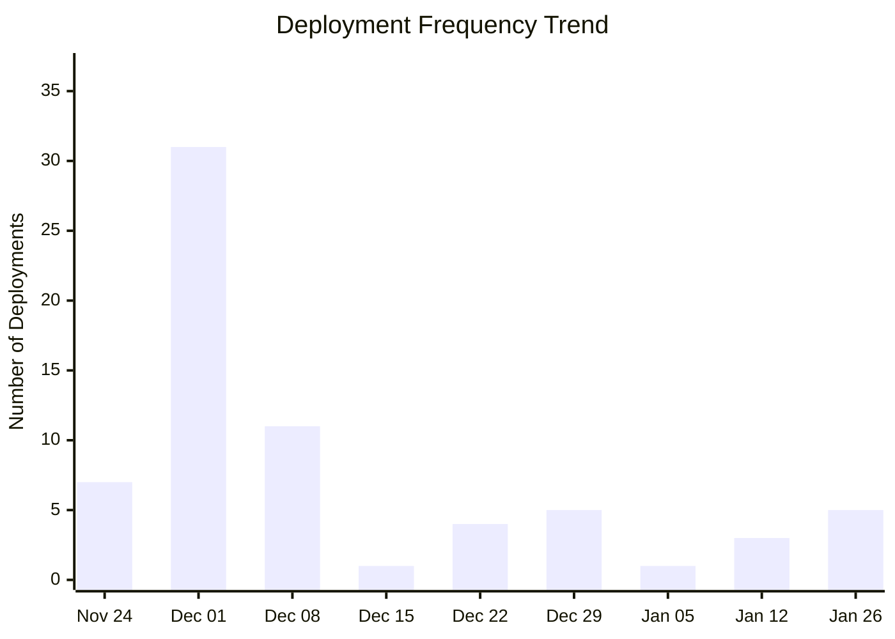
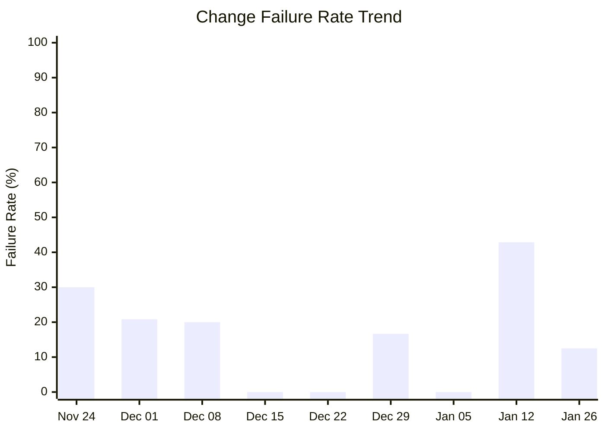

# DORA Metrics Report

**Generated:** 2026-02-03 09:11:43

## Summary

|Metric|Value|Category|
| --- | --- | --- |
| Deployment Frequency | 35.00/week | Elite |
| Lead Time for Changes | 9m 56s | Elite |
| Change Failure Rate | 16.7% | High |
| Time to Restore | 3h 31m | High |

**Total Runs:** 8 | **Successful:** 5 (62.5%) | **Failed:** 1 (12.5%) | **Other:** 2 (25.0%)

---

## Visualizations

### Workflow Outcomes

### Lead Time Trend

| Week Starting | Avg Lead Time | Deployments |
|---------------|---------------|-------------|
| Nov 24 | 9m 33s | 7 |
| Dec 01 | 4m 5s | 31 |
| Dec 08 | 7m 52s | 11 |
| Dec 15 | 6m 36s | 1 |
| Dec 22 | 6m 38s | 4 |
| Dec 29 | 5m 20s | 5 |
| Jan 05 | 4m 56s | 1 |
| Jan 12 | 6m 6s | 3 |
| Jan 26 | 9m 56s | 5 |

### Deployment Frequency Trend

**Deployment Cadence Analysis:**
- **Average per week:** 7.6 deployments
- **Most active week:** 31 deployments
- **Least active week:** 1 deployments
- **Consistency:** Low (irregular release pattern)

### Change Failure Rate Trend

| Week Starting | Total Runs | Failed | CFR |
|---------------|------------|--------|-----|
| Nov 24 | 10 | 3 | 30.0% |
| Dec 01 | 48 | 10 | 20.8% |
| Dec 08 | 15 | 3 | 20.0% |
| Dec 15 | 1 | 0 | 0.0% |
| Dec 22 | 4 | 0 | 0.0% |
| Dec 29 | 6 | 1 | 16.7% |
| Jan 05 | 1 | 0 | 0.0% |
| Jan 12 | 7 | 3 | 42.9% |
| Jan 26 | 8 | 1 | 12.5% |
**DORA Performance Tiers:**
- Elite: ≤ 15%
- High: 16-30%
- Medium: 31-45%
- Low: > 45%