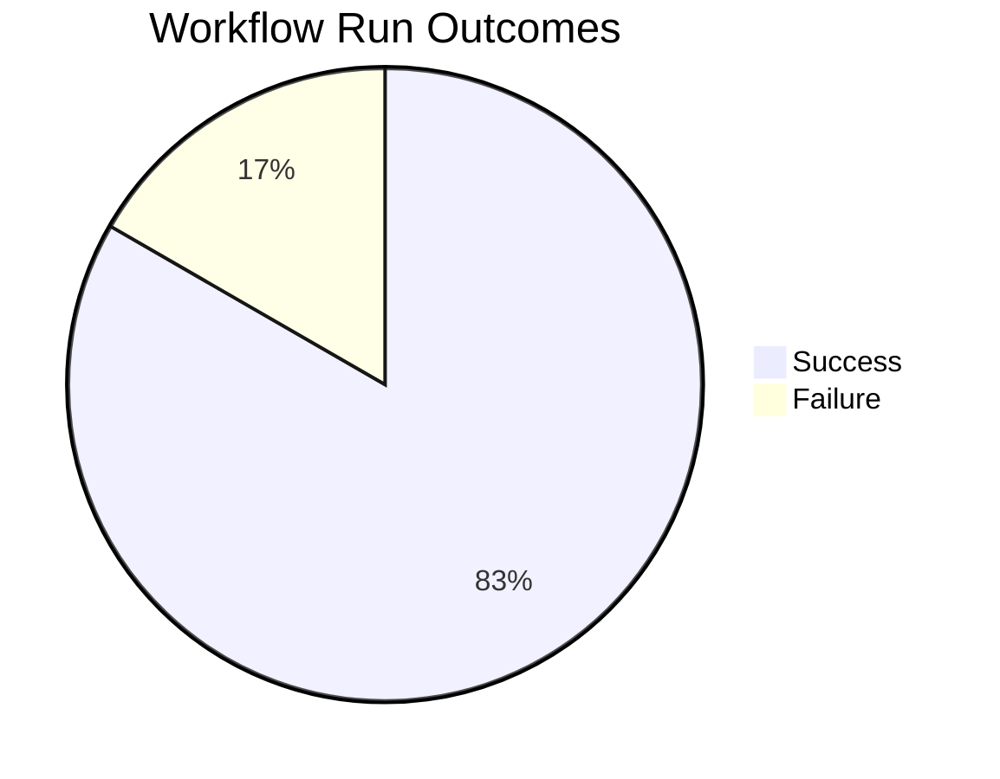
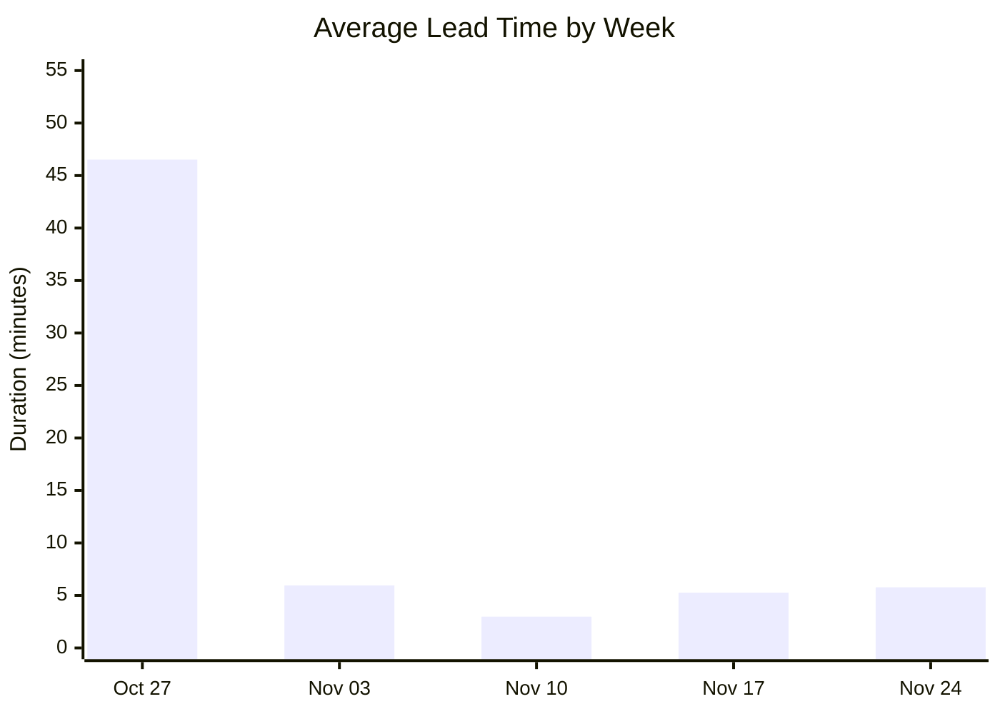
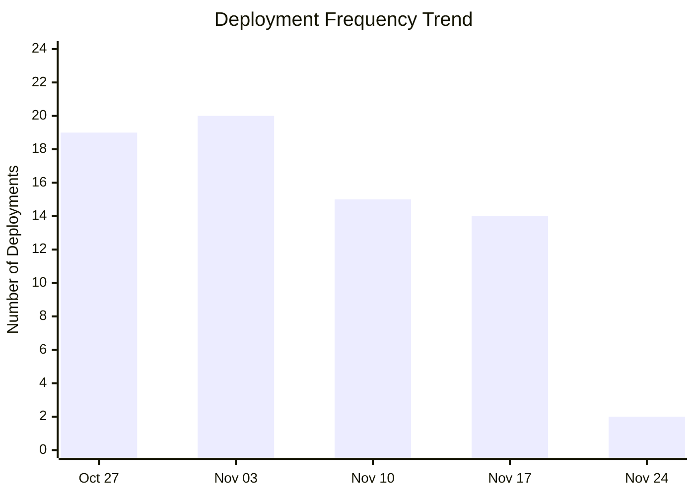
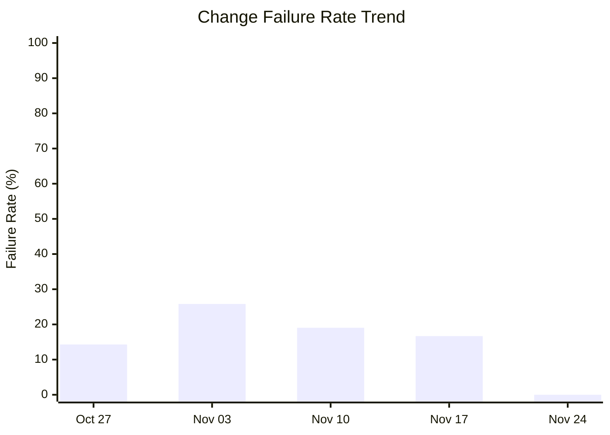

# DORA Metrics Report

**Generated:** 2025-11-25 09:03:54

## Summary

|Metric|Value|Category|
| --- | --- | --- |
| Deployment Frequency | 14.22/week | Elite |
| Lead Time for Changes | 6m 54s | Elite |
| Change Failure Rate | 16.7% | High |
| Time to Restore | 35m 18s | Elite |

**Total Runs:** 12 | **Successful:** 10 (83.3%) | **Failed:** 2 (16.7%)

---

## Visualizations

### Workflow Outcomes

### Lead Time Trend

| Week Starting | Avg Lead Time | Deployments |
|---------------|---------------|-------------|
| Oct 27 | 46m 31s | 19 |
| Nov 03 | 5m 58s | 20 |
| Nov 10 | 2m 59s | 15 |
| Nov 17 | 5m 16s | 14 |
| Nov 24 | 5m 47s | 2 |

### Deployment Frequency Trend

**Deployment Cadence Analysis:**
- **Average per week:** 14.0 deployments
- **Most active week:** 20 deployments
- **Least active week:** 2 deployments
- **Consistency:** Medium (some variability)

### Change Failure Rate Trend

| Week Starting | Total Runs | Failed | CFR |
|---------------|------------|--------|-----|
| Oct 27 | 28 | 4 | 14.3% |
| Nov 03 | 31 | 8 | 25.8% |
| Nov 10 | 21 | 4 | 19.0% |
| Nov 17 | 18 | 3 | 16.7% |
| Nov 24 | 2 | 0 | 0.0% |
**DORA Performance Tiers:**
- Elite: ≤ 15%
- High: 16-30%
- Medium: 31-45%
- Low: > 45%