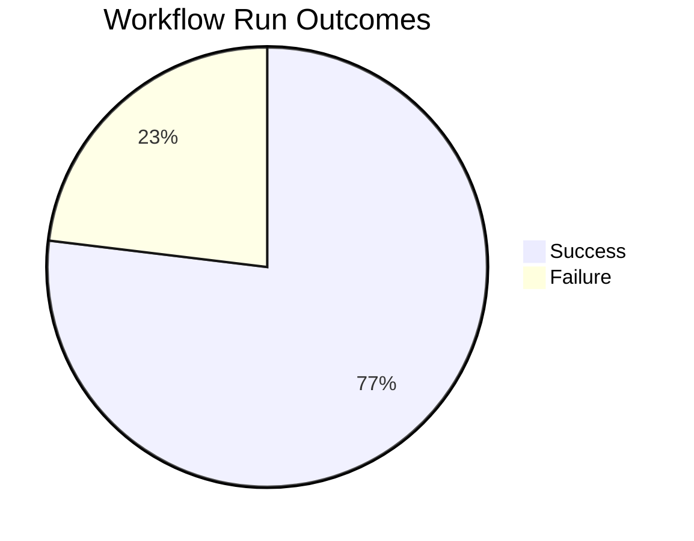
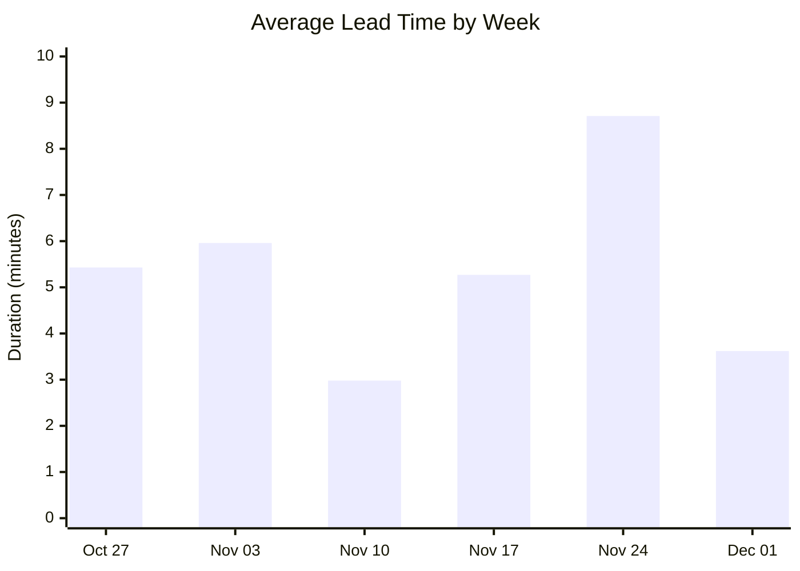
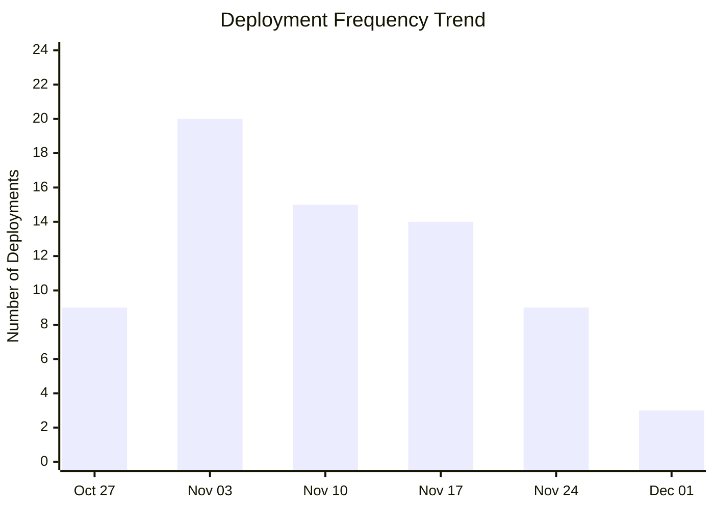
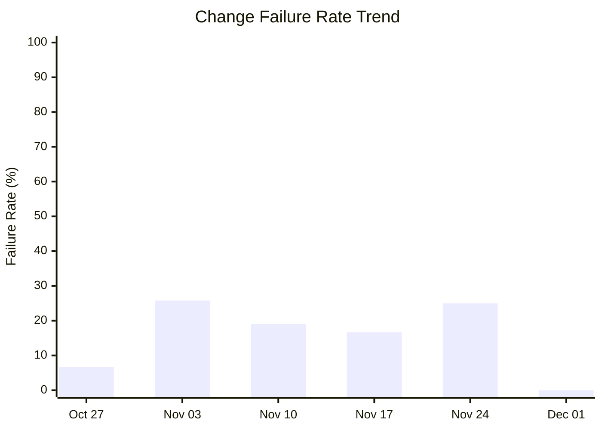

# DORA Metrics Report

**Generated:** 2025-12-02 09:05:37

## Summary

|Metric|Value|Category|
| --- | --- | --- |
| Deployment Frequency | 33.71/week | Elite |
| Lead Time for Changes | 7m 46s | Elite |
| Change Failure Rate | 23.1% | High |
| Time to Restore | 1h 3m | High |

**Total Runs:** 13 | **Successful:** 10 (76.9%) | **Failed:** 3 (23.1%)

---

## Visualizations

### Workflow Outcomes

### Lead Time Trend

| Week Starting | Avg Lead Time | Deployments |
|---------------|---------------|-------------|
| Oct 27 | 5m 26s | 9 |
| Nov 03 | 5m 58s | 20 |
| Nov 10 | 2m 59s | 15 |
| Nov 17 | 5m 16s | 14 |
| Nov 24 | 8m 43s | 9 |
| Dec 01 | 3m 37s | 3 |

### Deployment Frequency Trend

**Deployment Cadence Analysis:**
- **Average per week:** 11.7 deployments
- **Most active week:** 20 deployments
- **Least active week:** 3 deployments
- **Consistency:** Medium (some variability)

### Change Failure Rate Trend

| Week Starting | Total Runs | Failed | CFR |
|---------------|------------|--------|-----|
| Oct 27 | 15 | 1 | 6.7% |
| Nov 03 | 31 | 8 | 25.8% |
| Nov 10 | 21 | 4 | 19.0% |
| Nov 17 | 18 | 3 | 16.7% |
| Nov 24 | 12 | 3 | 25.0% |
| Dec 01 | 3 | 0 | 0.0% |
**DORA Performance Tiers:**
- Elite: ≤ 15%
- High: 16-30%
- Medium: 31-45%
- Low: > 45%