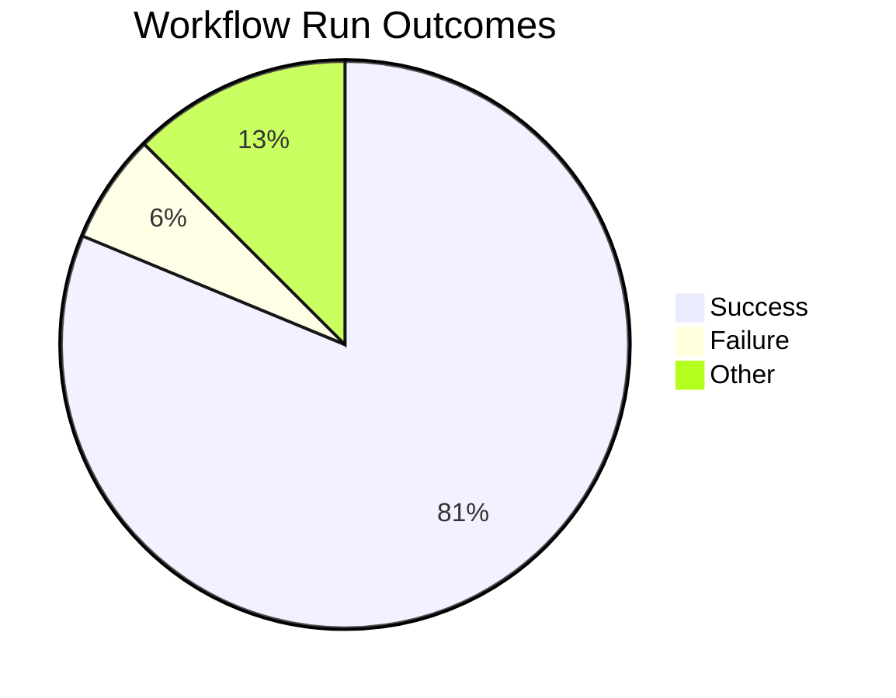
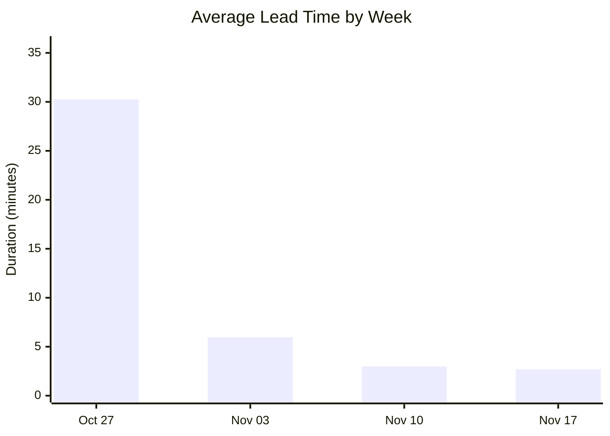
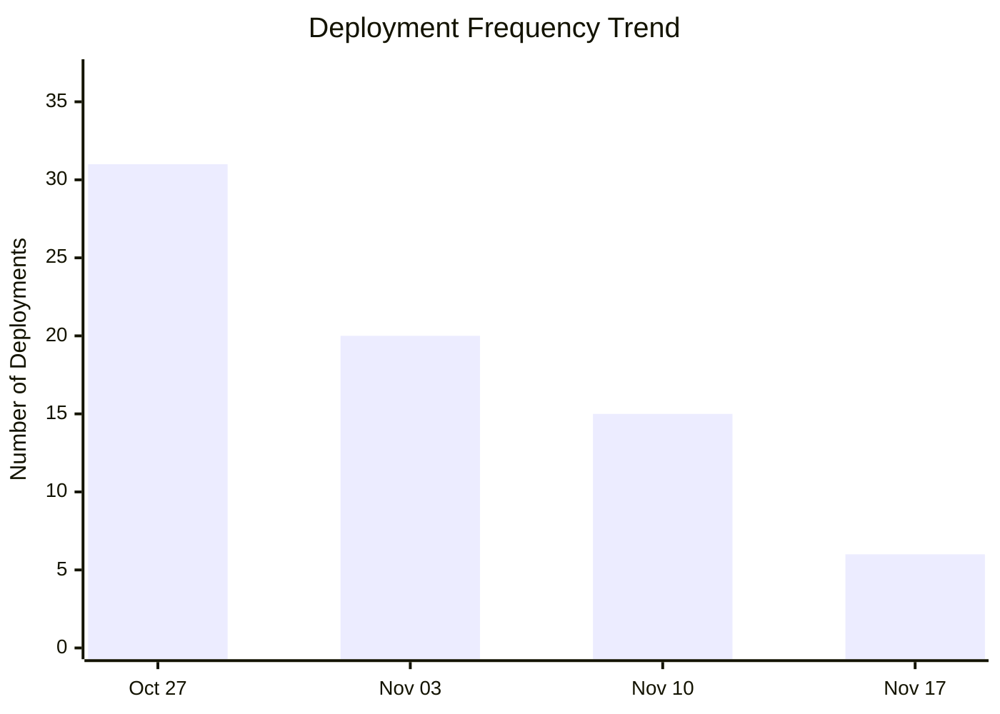
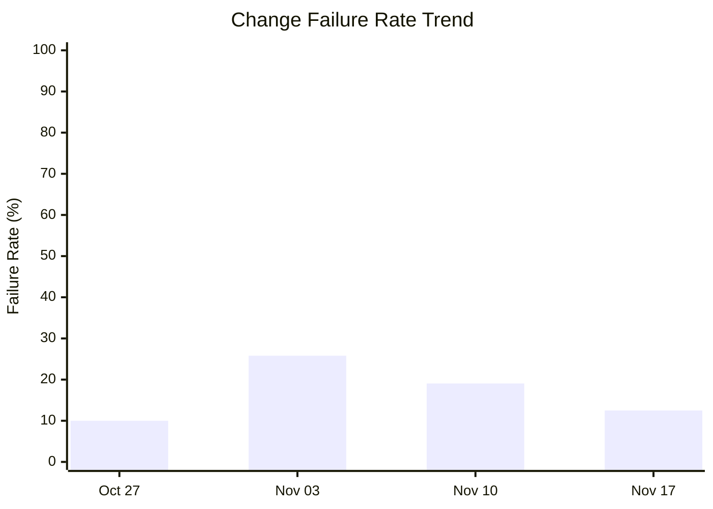

# DORA Metrics Report

**Generated:** 2025-11-19 10:36:24

## Summary

|Metric|Value|Category|
| --- | --- | --- |
| Deployment Frequency | 17.21/week | Elite |
| Lead Time for Changes | 2m 1s | Elite |
| Change Failure Rate | 7.1% | Elite |
| Time to Restore | 36m 39s | Elite |

**Total Runs:** 16 | **Successful:** 13 (81.2%) | **Failed:** 1 (6.2%) | **Other:** 2 (12.5%)

---

## Visualizations

### Workflow Outcomes

### Lead Time Trend

| Week Starting | Avg Lead Time | Deployments |
|---------------|---------------|-------------|
| Oct 27 | 30m 15s | 31 |
| Nov 03 | 5m 58s | 20 |
| Nov 10 | 2m 59s | 15 |
| Nov 17 | 2m 42s | 6 |

### Deployment Frequency Trend

**Deployment Cadence Analysis:**
- **Average per week:** 18.0 deployments
- **Most active week:** 31 deployments
- **Least active week:** 6 deployments
- **Consistency:** Medium (some variability)

### Change Failure Rate Trend

| Week Starting | Total Runs | Failed | CFR |
|---------------|------------|--------|-----|
| Oct 27 | 40 | 4 | 10.0% |
| Nov 03 | 31 | 8 | 25.8% |
| Nov 10 | 21 | 4 | 19.0% |
| Nov 17 | 8 | 1 | 12.5% |
**DORA Performance Tiers:**
- Elite: ≤ 15%
- High: 16-30%
- Medium: 31-45%
- Low: > 45%