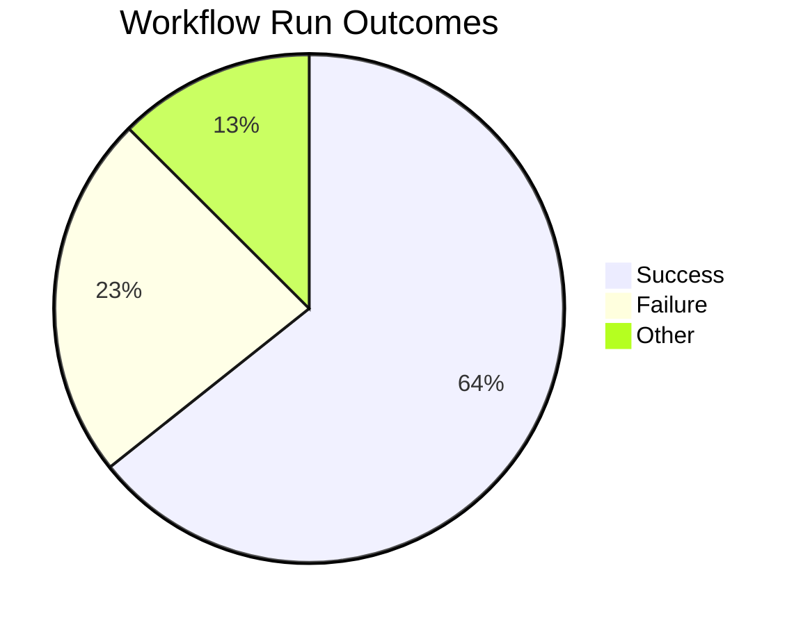
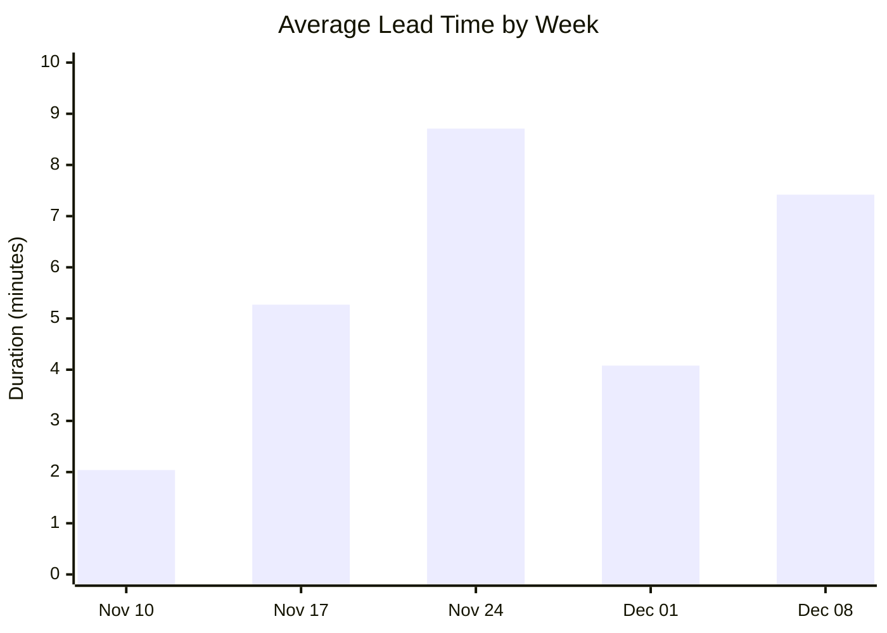
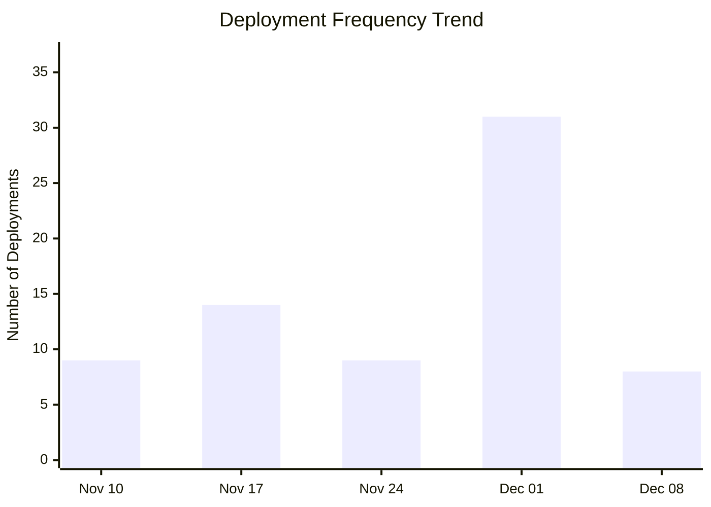
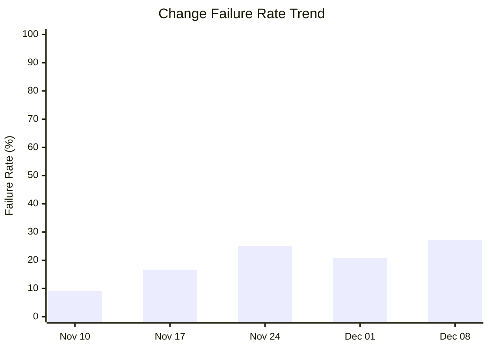

# DORA Metrics Report

**Generated:** 2025-12-09 09:04:39

## Summary

|Metric|Value|Category|
| --- | --- | --- |
| Deployment Frequency | 40.35/week | Elite |
| Lead Time for Changes | 4m 52s | Elite |
| Change Failure Rate | 26.5% | High |
| Time to Restore | 3h 37m | High |

**Total Runs:** 56 | **Successful:** 36 (64.3%) | **Failed:** 13 (23.2%) | **Other:** 7 (12.5%)

---

## Visualizations

### Workflow Outcomes

### Lead Time Trend

| Week Starting | Avg Lead Time | Deployments |
|---------------|---------------|-------------|
| Nov 10 | 2m 3s | 9 |
| Nov 17 | 5m 16s | 14 |
| Nov 24 | 8m 43s | 9 |
| Dec 01 | 4m 5s | 31 |
| Dec 08 | 7m 26s | 8 |

### Deployment Frequency Trend

**Deployment Cadence Analysis:**
- **Average per week:** 14.2 deployments
- **Most active week:** 31 deployments
- **Least active week:** 8 deployments
- **Consistency:** Low (irregular release pattern)

### Change Failure Rate Trend

| Week Starting | Total Runs | Failed | CFR |
|---------------|------------|--------|-----|
| Nov 10 | 11 | 1 | 9.1% |
| Nov 17 | 18 | 3 | 16.7% |
| Nov 24 | 12 | 3 | 25.0% |
| Dec 01 | 48 | 10 | 20.8% |
| Dec 08 | 11 | 3 | 27.3% |
**DORA Performance Tiers:**
- Elite: ≤ 15%
- High: 16-30%
- Medium: 31-45%
- Low: > 45%