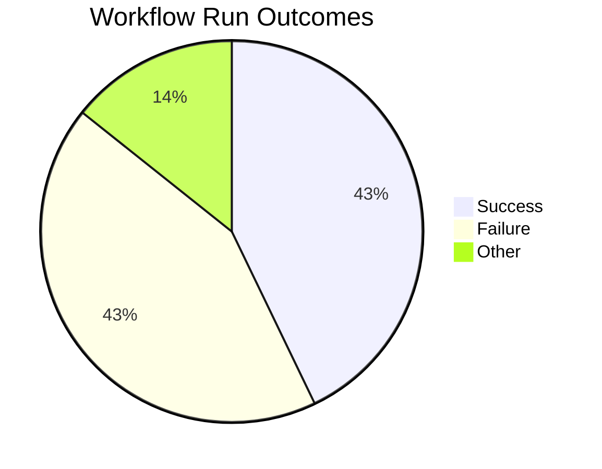
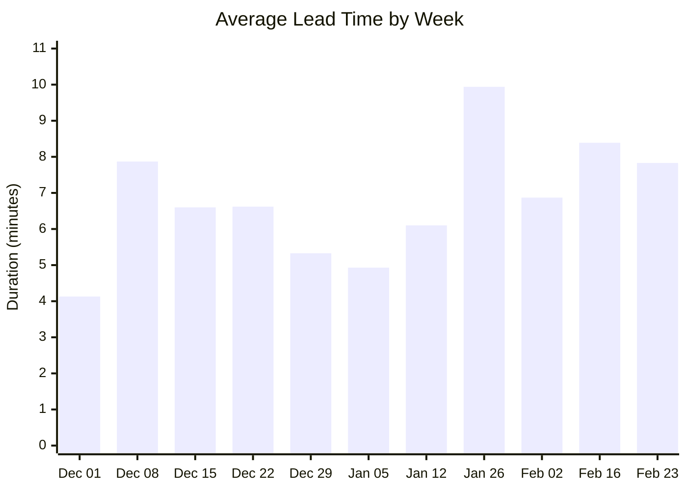
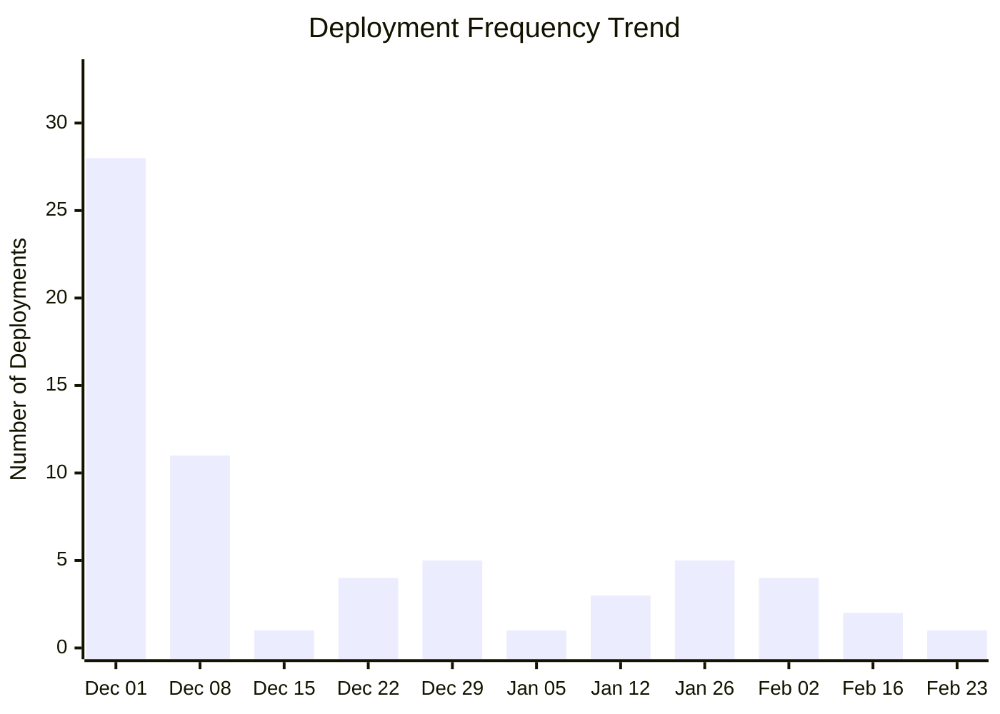
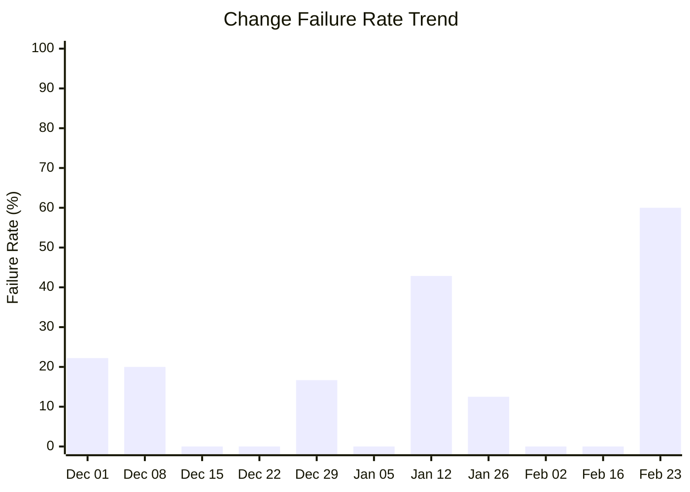

# DORA Metrics Report

**Generated:** 2026-02-24 09:16:19

## Summary

|Metric|Value|Category|
| --- | --- | --- |
| Deployment Frequency | 21.00/week | Elite |
| Lead Time for Changes | 8m 12s | Elite |
| Change Failure Rate | 50.0% | Low |
| Time to Restore | 3h 10m | High |

**Total Runs:** 7 | **Successful:** 3 (42.9%) | **Failed:** 3 (42.9%) | **Other:** 1 (14.3%)

---

## Visualizations

### Workflow Outcomes

### Lead Time Trend

| Week Starting | Avg Lead Time | Deployments |
|---------------|---------------|-------------|
| Dec 01 | 4m 8s | 28 |
| Dec 08 | 7m 52s | 11 |
| Dec 15 | 6m 36s | 1 |
| Dec 22 | 6m 38s | 4 |
| Dec 29 | 5m 20s | 5 |
| Jan 05 | 4m 56s | 1 |
| Jan 12 | 6m 6s | 3 |
| Jan 26 | 9m 56s | 5 |
| Feb 02 | 6m 52s | 4 |
| Feb 16 | 8m 23s | 2 |
| Feb 23 | 7m 50s | 1 |

### Deployment Frequency Trend

**Deployment Cadence Analysis:**
- **Average per week:** 5.9 deployments
- **Most active week:** 28 deployments
- **Least active week:** 1 deployments
- **Consistency:** Low (irregular release pattern)

### Change Failure Rate Trend

| Week Starting | Total Runs | Failed | CFR |
|---------------|------------|--------|-----|
| Dec 01 | 45 | 10 | 22.2% |
| Dec 08 | 15 | 3 | 20.0% |
| Dec 15 | 1 | 0 | 0.0% |
| Dec 22 | 4 | 0 | 0.0% |
| Dec 29 | 6 | 1 | 16.7% |
| Jan 05 | 1 | 0 | 0.0% |
| Jan 12 | 7 | 3 | 42.9% |
| Jan 26 | 8 | 1 | 12.5% |
| Feb 02 | 6 | 0 | 0.0% |
| Feb 16 | 2 | 0 | 0.0% |
| Feb 23 | 5 | 3 | 60.0% |
**DORA Performance Tiers:**
- Elite: ≤ 15%
- High: 16-30%
- Medium: 31-45%
- Low: > 45%