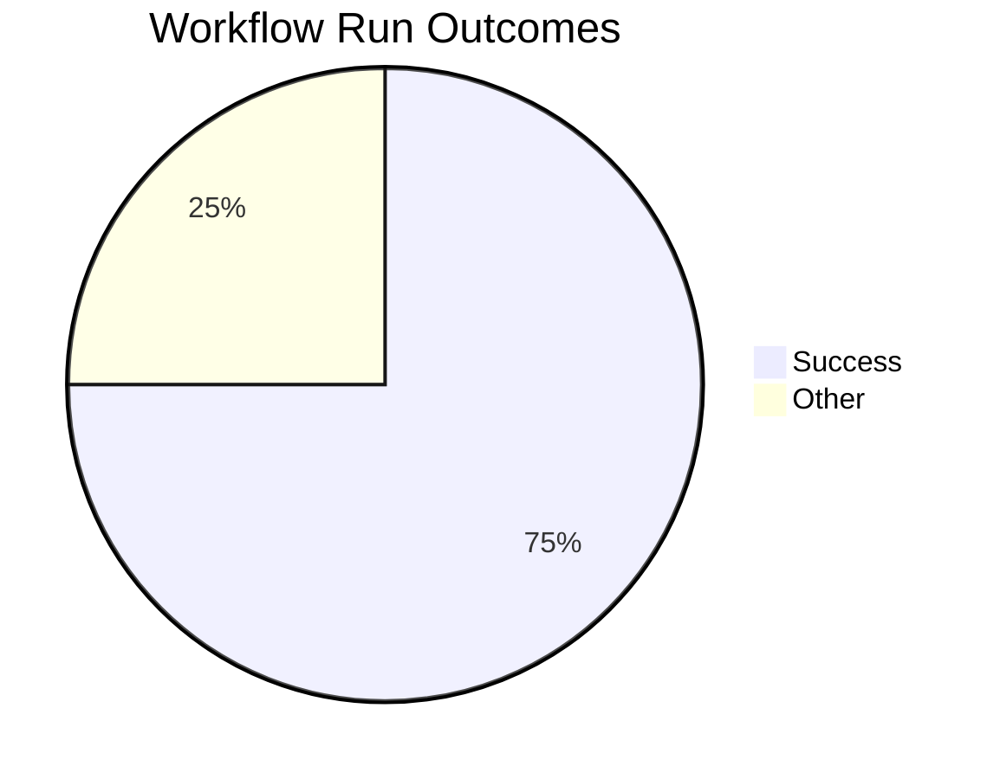
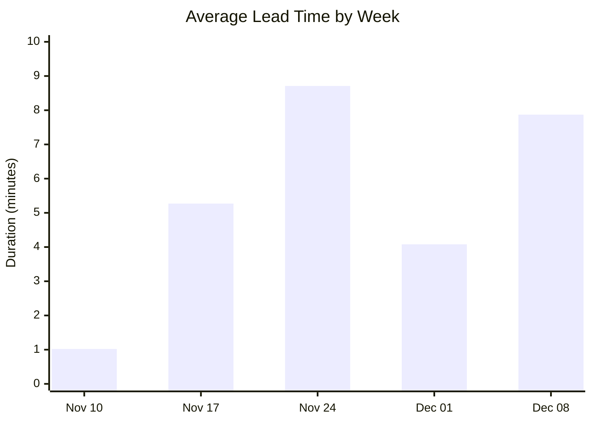
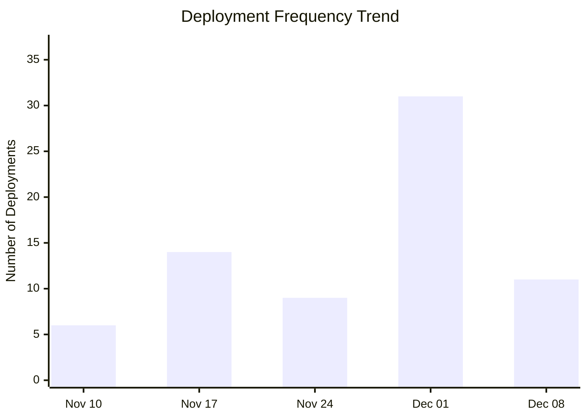
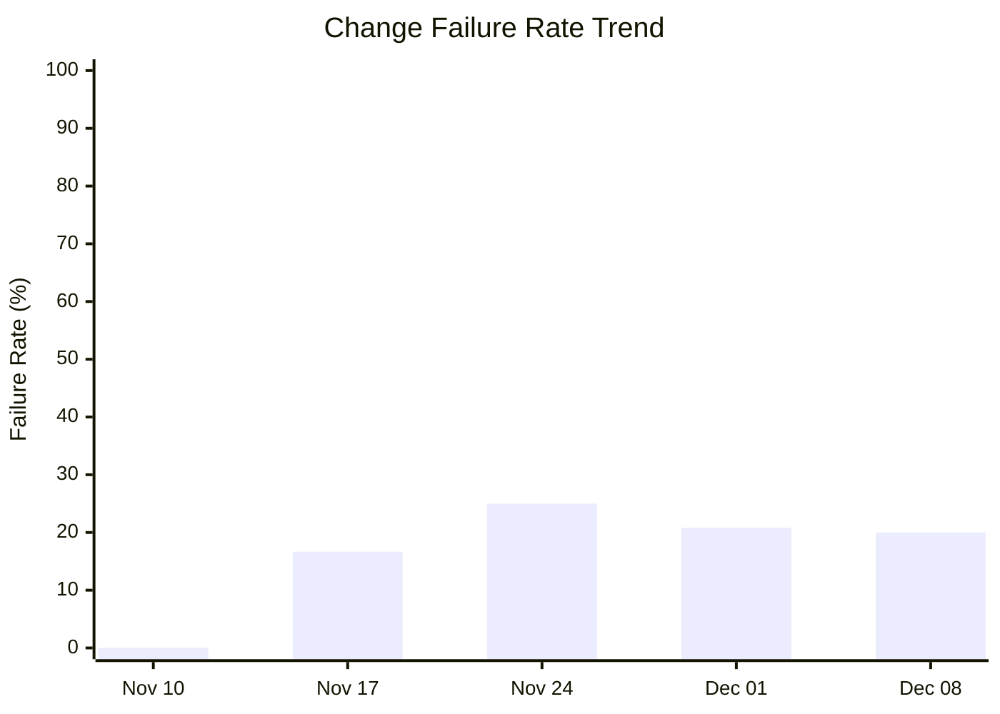

# DORA Metrics Report

**Generated:** 2025-12-16 09:05:44

## Summary

|Metric|Value|Category|
| --- | --- | --- |
| Deployment Frequency | 4.59/week | High |
| Lead Time for Changes | 9m 4s | Elite |
| Change Failure Rate | 0.0% | Elite |
| Time to Restore | 3h 47m | High |

**Total Runs:** 4 | **Successful:** 3 (75.0%) | **Failed:** 0 (0.0%) | **Other:** 1 (25.0%)

---

## Visualizations

### Workflow Outcomes

### Lead Time Trend

| Week Starting | Avg Lead Time | Deployments |
|---------------|---------------|-------------|
| Nov 10 | 1m 1s | 6 |
| Nov 17 | 5m 16s | 14 |
| Nov 24 | 8m 43s | 9 |
| Dec 01 | 4m 5s | 31 |
| Dec 08 | 7m 52s | 11 |

### Deployment Frequency Trend

**Deployment Cadence Analysis:**
- **Average per week:** 14.2 deployments
- **Most active week:** 31 deployments
- **Least active week:** 6 deployments
- **Consistency:** Low (irregular release pattern)

### Change Failure Rate Trend

| Week Starting | Total Runs | Failed | CFR |
|---------------|------------|--------|-----|
| Nov 10 | 7 | 0 | 0.0% |
| Nov 17 | 18 | 3 | 16.7% |
| Nov 24 | 12 | 3 | 25.0% |
| Dec 01 | 48 | 10 | 20.8% |
| Dec 08 | 15 | 3 | 20.0% |
**DORA Performance Tiers:**
- Elite: ≤ 15%
- High: 16-30%
- Medium: 31-45%
- Low: > 45%