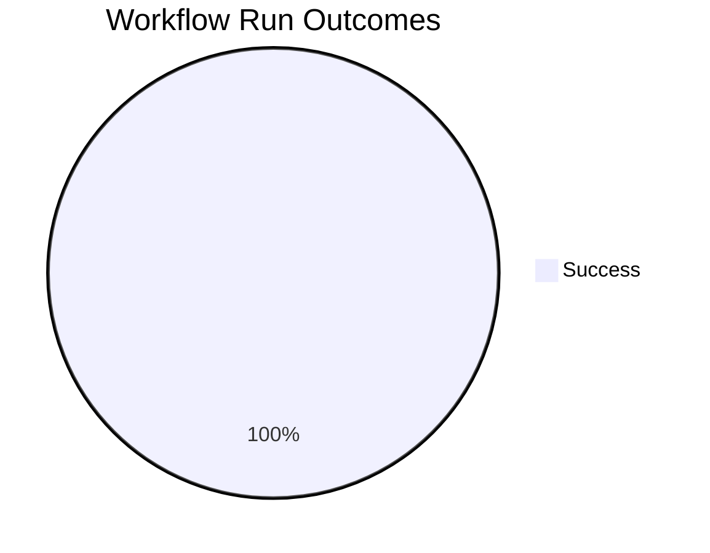
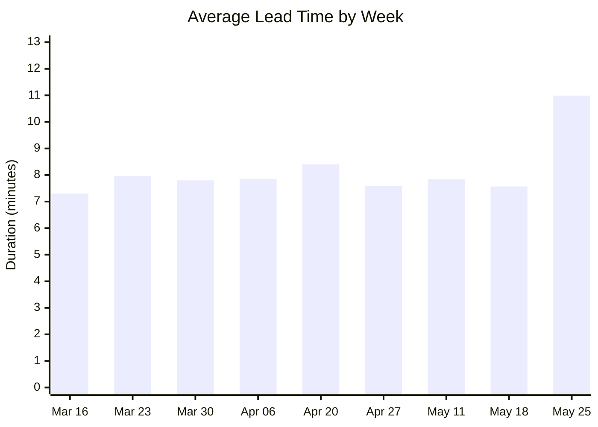
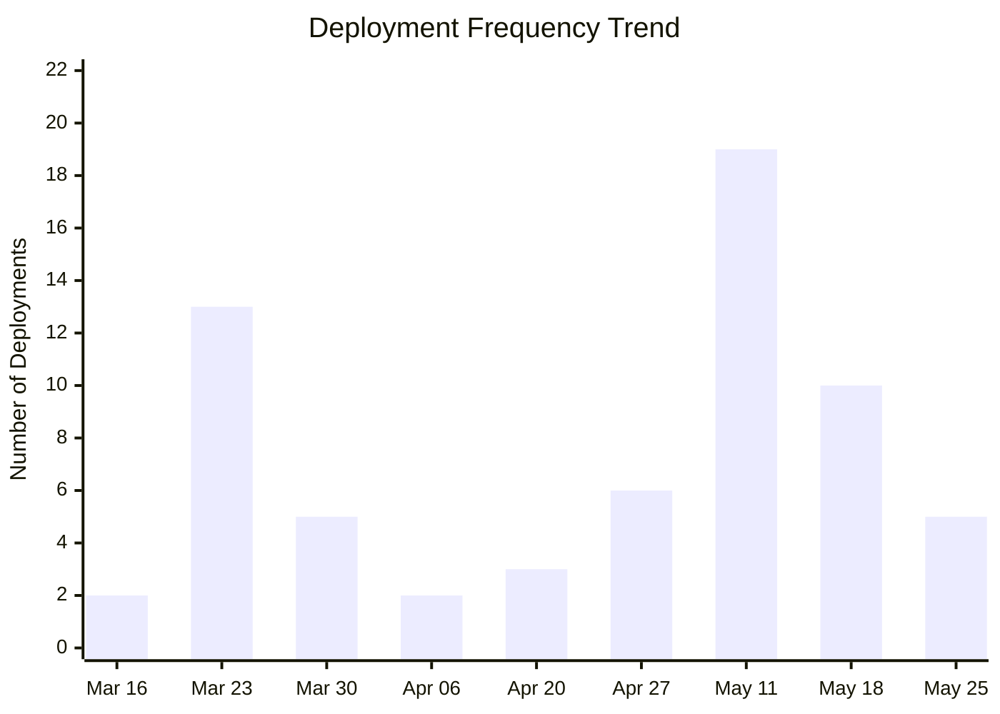
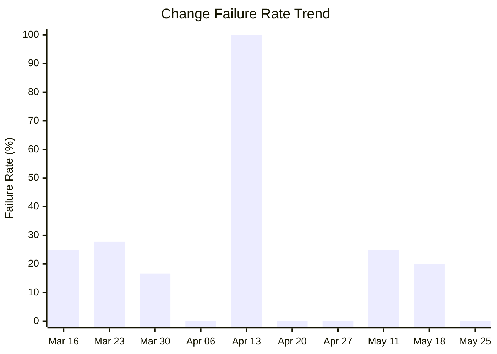

# DORA Metrics Report

**Generated:** 2026-06-02 10:31:13

## Summary

|Metric|Value|Category|
| --- | --- | --- |
| Deployment Frequency | 14.00/week | Elite |
| Lead Time for Changes | 6m 32s | Elite |
| Change Failure Rate | 0.0% | Elite |
| Time to Restore | 20h 20m | High |

**Total Runs:** 2 | **Successful:** 2 (100.0%) | **Failed:** 0 (0.0%)

---

## Visualizations

### Workflow Outcomes

```mermaid
pie title Workflow Run Outcomes
    "Success" : 2
```

### Lead Time Trend

```mermaid
xychart-beta
    title "Average Lead Time by Week"
    x-axis ["Mar 16", "Mar 23", "Mar 30", "Apr 06", "Apr 20", "Apr 27", "May 11", "May 18", "May 25"]
    y-axis "Duration (minutes)" 0 --> 13
    bar [7.30, 7.96, 7.80, 7.85, 8.40, 7.58, 7.84, 7.57, 10.99]
```

| Week Starting | Avg Lead Time | Deployments |
|---------------|---------------|-------------|
| Mar 16 | 7m 18s | 2 |
| Mar 23 | 7m 57s | 13 |
| Mar 30 | 7m 48s | 5 |
| Apr 06 | 7m 51s | 2 |
| Apr 20 | 8m 24s | 3 |
| Apr 27 | 7m 34s | 6 |
| May 11 | 7m 51s | 19 |
| May 18 | 7m 34s | 10 |
| May 25 | 10m 59s | 5 |

### Deployment Frequency Trend

```mermaid
xychart-beta
    title "Deployment Frequency Trend"
    x-axis ["Mar 16", "Mar 23", "Mar 30", "Apr 06", "Apr 20", "Apr 27", "May 11", "May 18", "May 25"]
    y-axis "Number of Deployments" 0 --> 22
    bar [2.00, 13.00, 5.00, 2.00, 3.00, 6.00, 19.00, 10.00, 5.00]
```

**Deployment Cadence Analysis:**
- **Average per week:** 7.2 deployments
- **Most active week:** 19 deployments
- **Least active week:** 2 deployments
- **Consistency:** Low (irregular release pattern)

### Change Failure Rate Trend

```mermaid
xychart-beta
    title "Change Failure Rate Trend"
    x-axis ["Mar 16", "Mar 23", "Mar 30", "Apr 06", "Apr 13", "Apr 20", "Apr 27", "May 11", "May 18", "May 25"]
    y-axis "Failure Rate (%)" 0 --> 100
    bar [25.00, 27.78, 16.67, 0.00, 100.00, 0.00, 0.00, 25.00, 20.00, 0.00]
```

| Week Starting | Total Runs | Failed | CFR |
|---------------|------------|--------|-----|
| Mar 16 | 4 | 1 | 25.0% |
| Mar 23 | 18 | 5 | 27.8% |
| Mar 30 | 6 | 1 | 16.7% |
| Apr 06 | 2 | 0 | 0.0% |
| Apr 13 | 2 | 2 | 100.0% |
| Apr 20 | 3 | 0 | 0.0% |
| Apr 27 | 9 | 0 | 0.0% |
| May 11 | 36 | 9 | 25.0% |
| May 18 | 15 | 3 | 20.0% |
| May 25 | 5 | 0 | 0.0% |
**DORA Performance Tiers:**
- Elite: ≤ 15%
- High: 16-30%
- Medium: 31-45%
- Low: > 45%