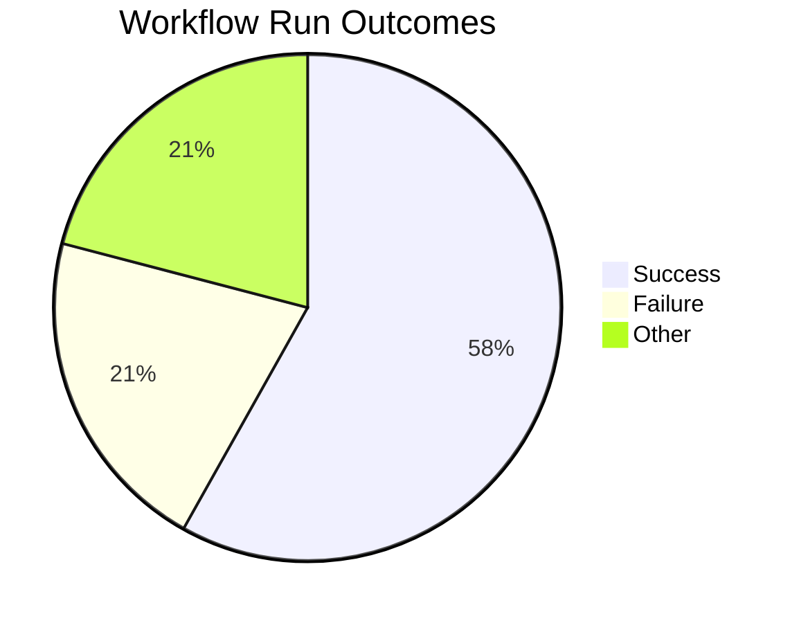
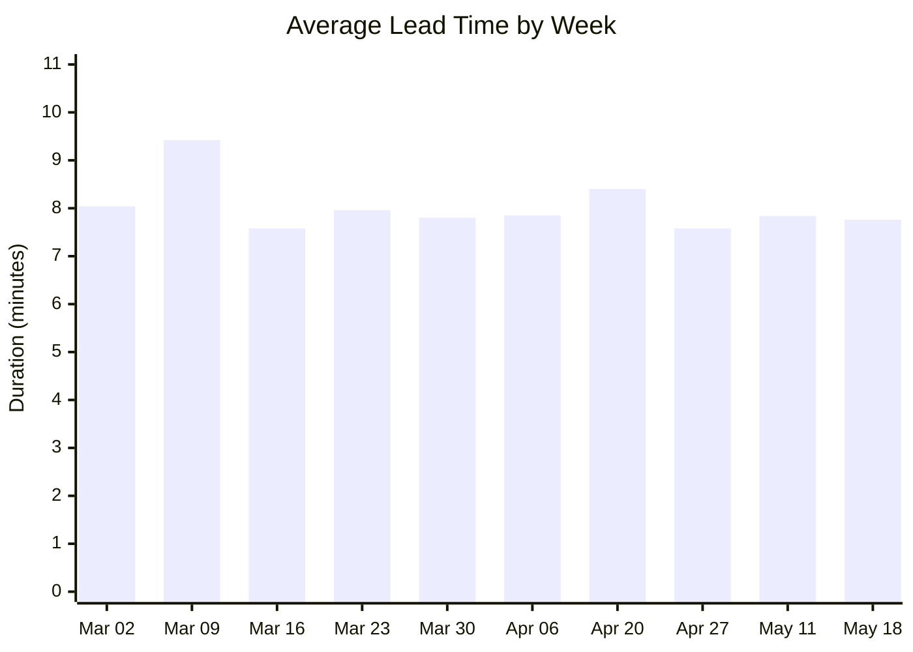
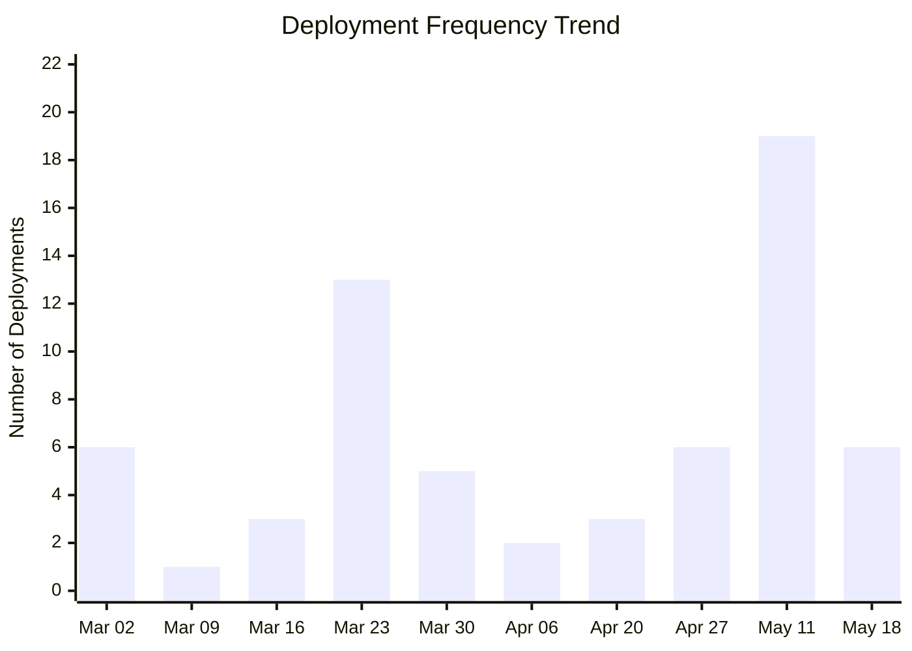
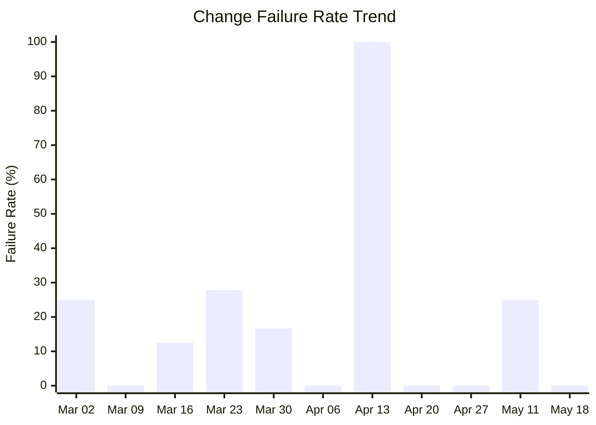

# DORA Metrics Report

**Generated:** 2026-05-19 10:16:02

## Summary

|Metric|Value|Category|
| --- | --- | --- |
| Deployment Frequency | 28.86/week | Elite |
| Lead Time for Changes | 7m 49s | Elite |
| Change Failure Rate | 26.5% | High |
| Time to Restore | 21h 19m | High |

**Total Runs:** 43 | **Successful:** 25 (58.1%) | **Failed:** 9 (20.9%) | **Other:** 9 (20.9%)

---

## Visualizations

### Workflow Outcomes

```mermaid
pie title Workflow Run Outcomes
    "Success" : 25
    "Failure" : 9
    "Other" : 9
```

### Lead Time Trend

```mermaid
xychart-beta
    title "Average Lead Time by Week"
    x-axis ["Mar 02", "Mar 09", "Mar 16", "Mar 23", "Mar 30", "Apr 06", "Apr 20", "Apr 27", "May 11", "May 18"]
    y-axis "Duration (minutes)" 0 --> 11
    bar [8.04, 9.42, 7.58, 7.96, 7.80, 7.85, 8.40, 7.58, 7.84, 7.76]
```

| Week Starting | Avg Lead Time | Deployments |
|---------------|---------------|-------------|
| Mar 02 | 8m 3s | 6 |
| Mar 09 | 9m 25s | 1 |
| Mar 16 | 7m 35s | 3 |
| Mar 23 | 7m 57s | 13 |
| Mar 30 | 7m 48s | 5 |
| Apr 06 | 7m 51s | 2 |
| Apr 20 | 8m 24s | 3 |
| Apr 27 | 7m 34s | 6 |
| May 11 | 7m 51s | 19 |
| May 18 | 7m 46s | 6 |

### Deployment Frequency Trend

```mermaid
xychart-beta
    title "Deployment Frequency Trend"
    x-axis ["Mar 02", "Mar 09", "Mar 16", "Mar 23", "Mar 30", "Apr 06", "Apr 20", "Apr 27", "May 11", "May 18"]
    y-axis "Number of Deployments" 0 --> 22
    bar [6.00, 1.00, 3.00, 13.00, 5.00, 2.00, 3.00, 6.00, 19.00, 6.00]
```

**Deployment Cadence Analysis:**
- **Average per week:** 6.4 deployments
- **Most active week:** 19 deployments
- **Least active week:** 1 deployments
- **Consistency:** Low (irregular release pattern)

### Change Failure Rate Trend

```mermaid
xychart-beta
    title "Change Failure Rate Trend"
    x-axis ["Mar 02", "Mar 09", "Mar 16", "Mar 23", "Mar 30", "Apr 06", "Apr 13", "Apr 20", "Apr 27", "May 11", "May 18"]
    y-axis "Failure Rate (%)" 0 --> 100
    bar [25.00, 0.00, 12.50, 27.78, 16.67, 0.00, 100.00, 0.00, 0.00, 25.00, 0.00]
```

| Week Starting | Total Runs | Failed | CFR |
|---------------|------------|--------|-----|
| Mar 02 | 8 | 2 | 25.0% |
| Mar 09 | 1 | 0 | 0.0% |
| Mar 16 | 8 | 1 | 12.5% |
| Mar 23 | 18 | 5 | 27.8% |
| Mar 30 | 6 | 1 | 16.7% |
| Apr 06 | 2 | 0 | 0.0% |
| Apr 13 | 2 | 2 | 100.0% |
| Apr 20 | 3 | 0 | 0.0% |
| Apr 27 | 9 | 0 | 0.0% |
| May 11 | 36 | 9 | 25.0% |
| May 18 | 7 | 0 | 0.0% |
**DORA Performance Tiers:**
- Elite: ≤ 15%
- High: 16-30%
- Medium: 31-45%
- Low: > 45%