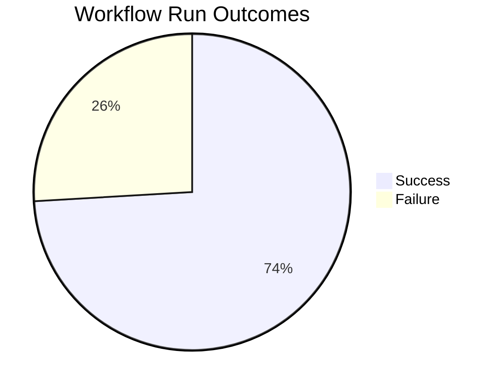
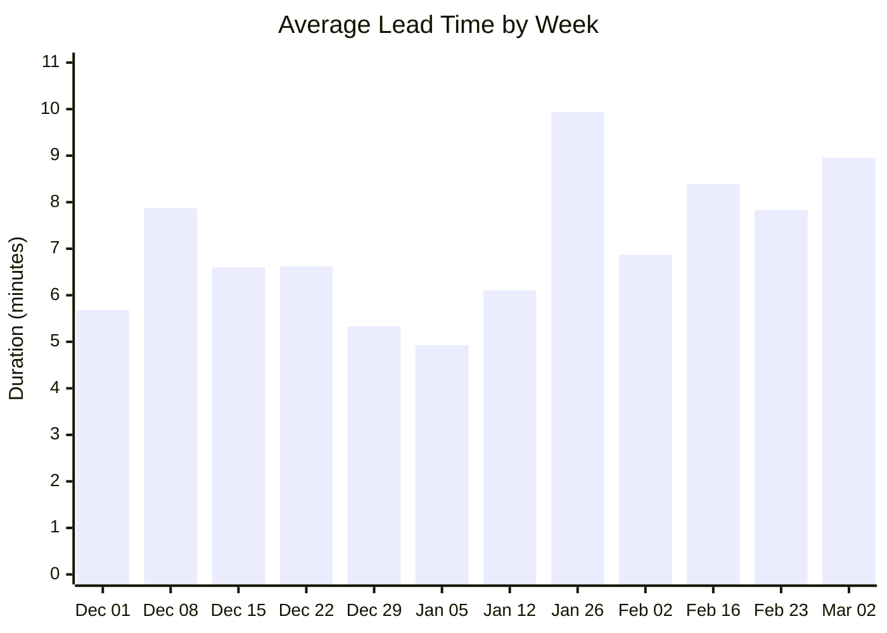
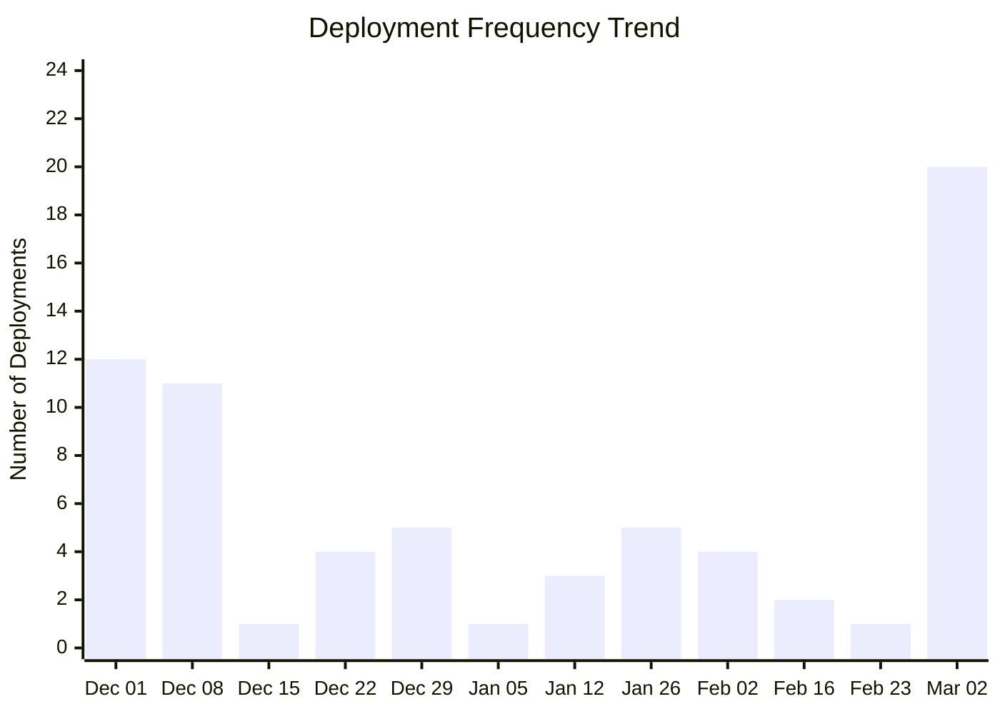
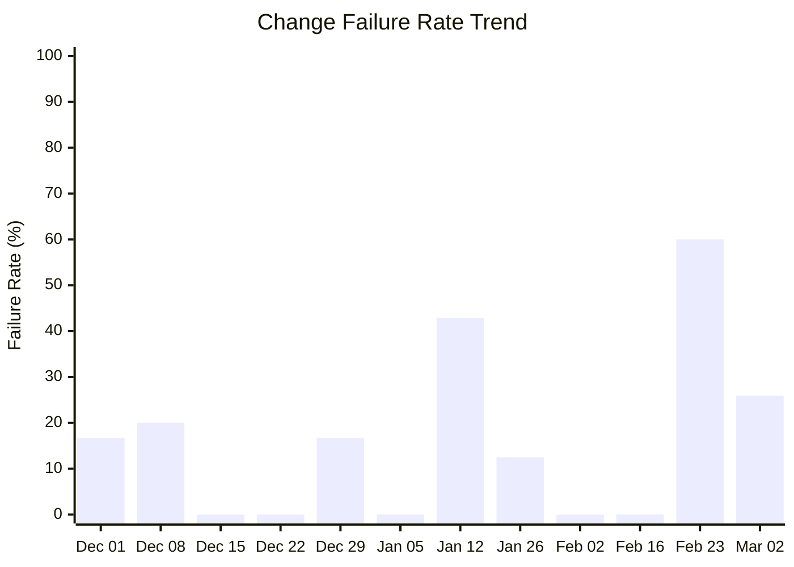

# DORA Metrics Report

**Generated:** 2026-03-10 09:13:25

## Summary

|Metric|Value|Category|
| --- | --- | --- |
| Deployment Frequency | 28.35/week | Elite |
| Lead Time for Changes | 8m 57s | Elite |
| Change Failure Rate | 25.9% | High |
| Time to Restore | 50m 50s | Elite |

**Total Runs:** 27 | **Successful:** 20 (74.1%) | **Failed:** 7 (25.9%)

---

## Visualizations

### Workflow Outcomes

```mermaid
pie title Workflow Run Outcomes
    "Success" : 20
    "Failure" : 7
```

### Lead Time Trend

```mermaid
xychart-beta
    title "Average Lead Time by Week"
    x-axis ["Dec 01", "Dec 08", "Dec 15", "Dec 22", "Dec 29", "Jan 05", "Jan 12", "Jan 26", "Feb 02", "Feb 16", "Feb 23", "Mar 02"]
    y-axis "Duration (minutes)" 0 --> 11
    bar [5.68, 7.87, 6.60, 6.62, 5.33, 4.93, 6.10, 9.94, 6.87, 8.39, 7.83, 8.96]
```

| Week Starting | Avg Lead Time | Deployments |
|---------------|---------------|-------------|
| Dec 01 | 5m 41s | 12 |
| Dec 08 | 7m 52s | 11 |
| Dec 15 | 6m 36s | 1 |
| Dec 22 | 6m 38s | 4 |
| Dec 29 | 5m 20s | 5 |
| Jan 05 | 4m 56s | 1 |
| Jan 12 | 6m 6s | 3 |
| Jan 26 | 9m 56s | 5 |
| Feb 02 | 6m 52s | 4 |
| Feb 16 | 8m 23s | 2 |
| Feb 23 | 7m 50s | 1 |
| Mar 02 | 8m 57s | 20 |

### Deployment Frequency Trend

```mermaid
xychart-beta
    title "Deployment Frequency Trend"
    x-axis ["Dec 01", "Dec 08", "Dec 15", "Dec 22", "Dec 29", "Jan 05", "Jan 12", "Jan 26", "Feb 02", "Feb 16", "Feb 23", "Mar 02"]
    y-axis "Number of Deployments" 0 --> 24
    bar [12.00, 11.00, 1.00, 4.00, 5.00, 1.00, 3.00, 5.00, 4.00, 2.00, 1.00, 20.00]
```

**Deployment Cadence Analysis:**
- **Average per week:** 5.8 deployments
- **Most active week:** 20 deployments
- **Least active week:** 1 deployments
- **Consistency:** Low (irregular release pattern)

### Change Failure Rate Trend

```mermaid
xychart-beta
    title "Change Failure Rate Trend"
    x-axis ["Dec 01", "Dec 08", "Dec 15", "Dec 22", "Dec 29", "Jan 05", "Jan 12", "Jan 26", "Feb 02", "Feb 16", "Feb 23", "Mar 02"]
    y-axis "Failure Rate (%)" 0 --> 100
    bar [16.67, 20.00, 0.00, 0.00, 16.67, 0.00, 42.86, 12.50, 0.00, 0.00, 60.00, 25.93]
```

| Week Starting | Total Runs | Failed | CFR |
|---------------|------------|--------|-----|
| Dec 01 | 18 | 3 | 16.7% |
| Dec 08 | 15 | 3 | 20.0% |
| Dec 15 | 1 | 0 | 0.0% |
| Dec 22 | 4 | 0 | 0.0% |
| Dec 29 | 6 | 1 | 16.7% |
| Jan 05 | 1 | 0 | 0.0% |
| Jan 12 | 7 | 3 | 42.9% |
| Jan 26 | 8 | 1 | 12.5% |
| Feb 02 | 6 | 0 | 0.0% |
| Feb 16 | 2 | 0 | 0.0% |
| Feb 23 | 5 | 3 | 60.0% |
| Mar 02 | 27 | 7 | 25.9% |
**DORA Performance Tiers:**
- Elite: ≤ 15%
- High: 16-30%
- Medium: 31-45%
- Low: > 45%