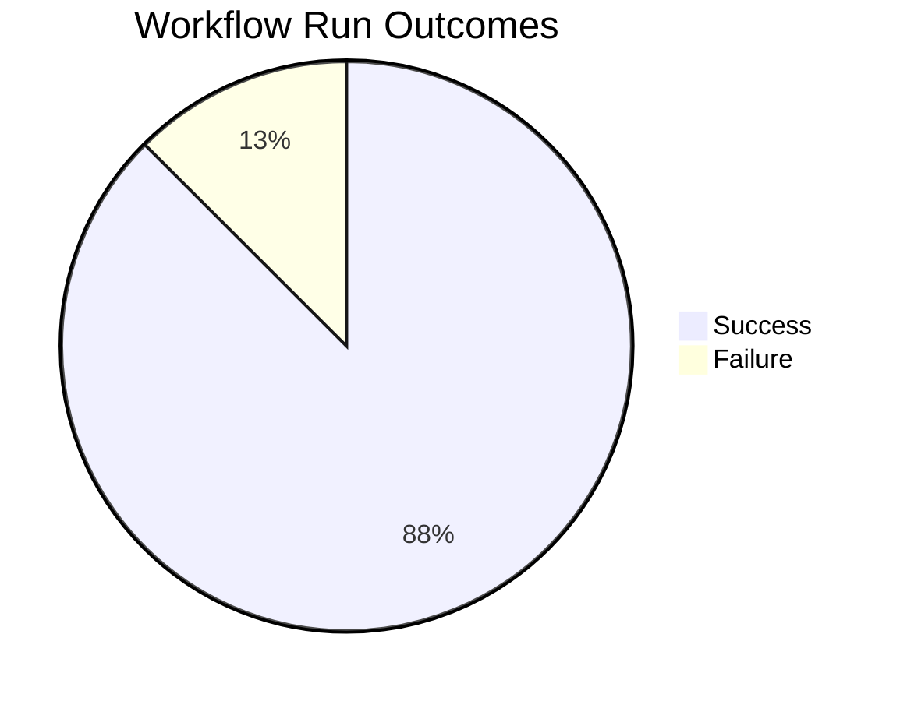
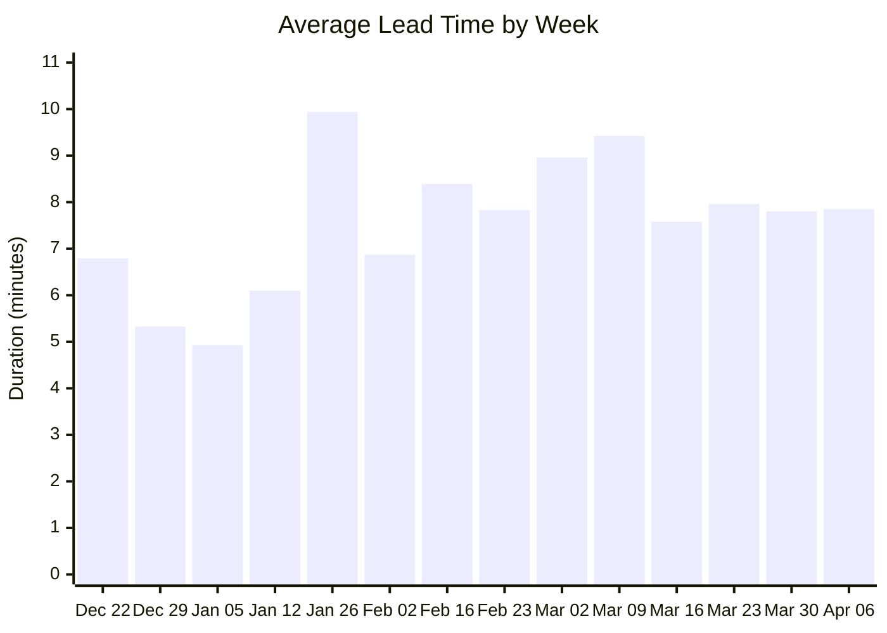
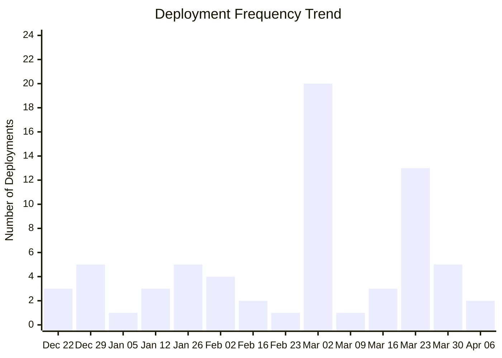
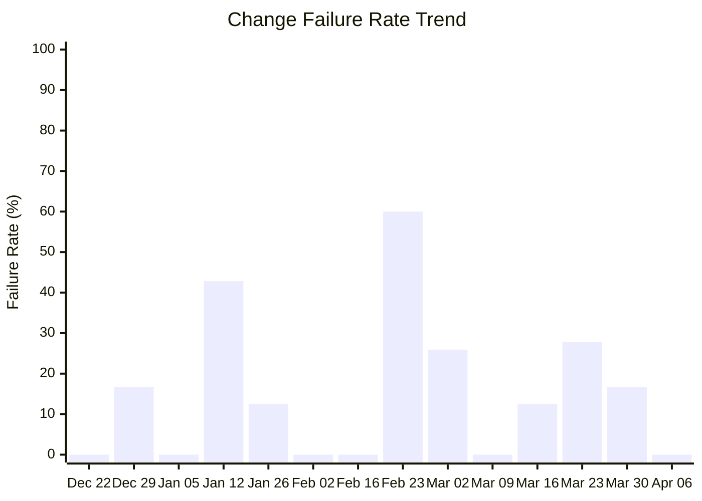

# DORA Metrics Report

**Generated:** 2026-04-07 09:23:39

## Summary

|Metric|Value|Category|
| --- | --- | --- |
| Deployment Frequency | 24.46/week | Elite |
| Lead Time for Changes | 7m 49s | Elite |
| Change Failure Rate | 12.5% | Elite |
| Time to Restore | 2h 48m | High |

**Total Runs:** 8 | **Successful:** 7 (87.5%) | **Failed:** 1 (12.5%)

---

## Visualizations

### Workflow Outcomes

```mermaid
pie title Workflow Run Outcomes
    "Success" : 7
    "Failure" : 1
```

### Lead Time Trend

```mermaid
xychart-beta
    title "Average Lead Time by Week"
    x-axis ["Dec 22", "Dec 29", "Jan 05", "Jan 12", "Jan 26", "Feb 02", "Feb 16", "Feb 23", "Mar 02", "Mar 09", "Mar 16", "Mar 23", "Mar 30", "Apr 06"]
    y-axis "Duration (minutes)" 0 --> 11
    bar [6.79, 5.33, 4.93, 6.10, 9.94, 6.87, 8.39, 7.83, 8.96, 9.42, 7.58, 7.96, 7.80, 7.85]
```

| Week Starting | Avg Lead Time | Deployments |
|---------------|---------------|-------------|
| Dec 22 | 6m 48s | 3 |
| Dec 29 | 5m 20s | 5 |
| Jan 05 | 4m 56s | 1 |
| Jan 12 | 6m 6s | 3 |
| Jan 26 | 9m 56s | 5 |
| Feb 02 | 6m 52s | 4 |
| Feb 16 | 8m 23s | 2 |
| Feb 23 | 7m 50s | 1 |
| Mar 02 | 8m 57s | 20 |
| Mar 09 | 9m 25s | 1 |
| Mar 16 | 7m 35s | 3 |
| Mar 23 | 7m 57s | 13 |
| Mar 30 | 7m 48s | 5 |
| Apr 06 | 7m 51s | 2 |

### Deployment Frequency Trend

```mermaid
xychart-beta
    title "Deployment Frequency Trend"
    x-axis ["Dec 22", "Dec 29", "Jan 05", "Jan 12", "Jan 26", "Feb 02", "Feb 16", "Feb 23", "Mar 02", "Mar 09", "Mar 16", "Mar 23", "Mar 30", "Apr 06"]
    y-axis "Number of Deployments" 0 --> 24
    bar [3.00, 5.00, 1.00, 3.00, 5.00, 4.00, 2.00, 1.00, 20.00, 1.00, 3.00, 13.00, 5.00, 2.00]
```

**Deployment Cadence Analysis:**
- **Average per week:** 4.9 deployments
- **Most active week:** 20 deployments
- **Least active week:** 1 deployments
- **Consistency:** Low (irregular release pattern)

### Change Failure Rate Trend

```mermaid
xychart-beta
    title "Change Failure Rate Trend"
    x-axis ["Dec 22", "Dec 29", "Jan 05", "Jan 12", "Jan 26", "Feb 02", "Feb 16", "Feb 23", "Mar 02", "Mar 09", "Mar 16", "Mar 23", "Mar 30", "Apr 06"]
    y-axis "Failure Rate (%)" 0 --> 100
    bar [0.00, 16.67, 0.00, 42.86, 12.50, 0.00, 0.00, 60.00, 25.93, 0.00, 12.50, 27.78, 16.67, 0.00]
```

| Week Starting | Total Runs | Failed | CFR |
|---------------|------------|--------|-----|
| Dec 22 | 3 | 0 | 0.0% |
| Dec 29 | 6 | 1 | 16.7% |
| Jan 05 | 1 | 0 | 0.0% |
| Jan 12 | 7 | 3 | 42.9% |
| Jan 26 | 8 | 1 | 12.5% |
| Feb 02 | 6 | 0 | 0.0% |
| Feb 16 | 2 | 0 | 0.0% |
| Feb 23 | 5 | 3 | 60.0% |
| Mar 02 | 27 | 7 | 25.9% |
| Mar 09 | 1 | 0 | 0.0% |
| Mar 16 | 8 | 1 | 12.5% |
| Mar 23 | 18 | 5 | 27.8% |
| Mar 30 | 6 | 1 | 16.7% |
| Apr 06 | 2 | 0 | 0.0% |
**DORA Performance Tiers:**
- Elite: ≤ 15%
- High: 16-30%
- Medium: 31-45%
- Low: > 45%