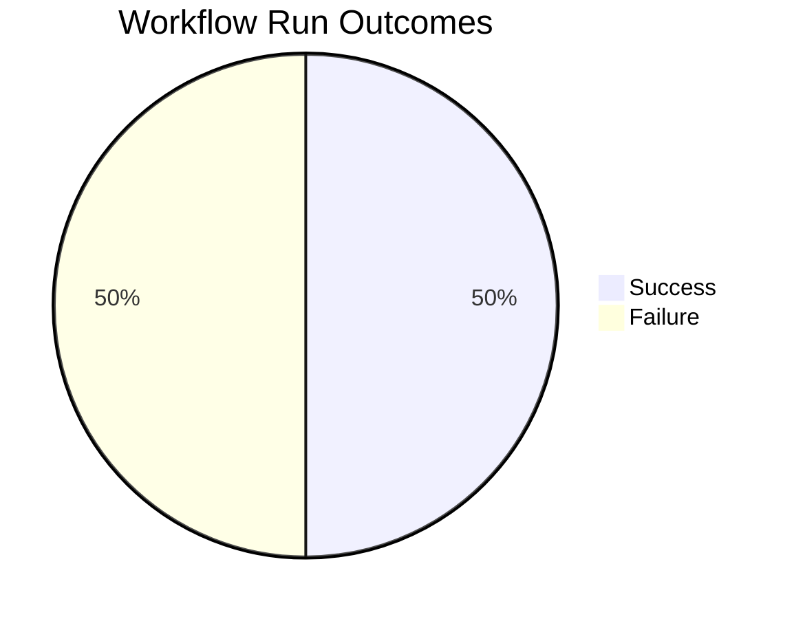
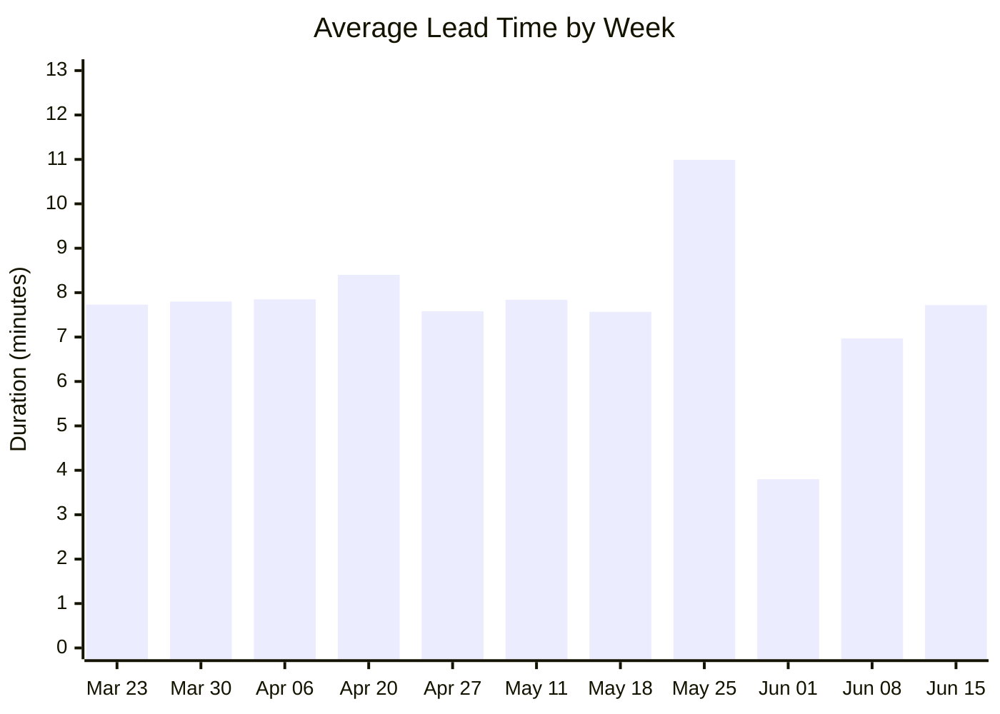
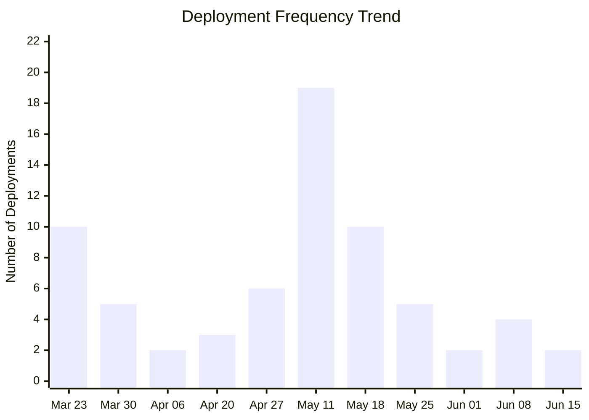
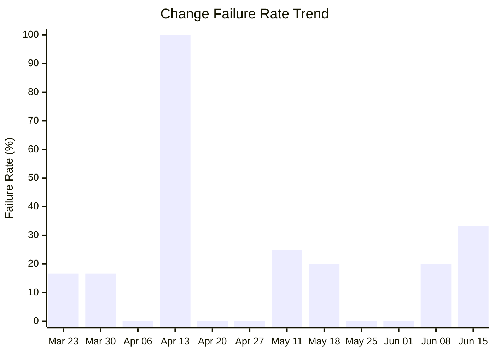

# DORA Metrics Report

**Generated:** 2026-06-23 10:14:30

## Summary

|Metric|Value|Category|
| --- | --- | --- |
| Deployment Frequency | 7.00/week | Elite |
| Lead Time for Changes | 7m 59s | Elite |
| Change Failure Rate | 50.0% | Low |
| Time to Restore | 20h 3m | High |

**Total Runs:** 2 | **Successful:** 1 (50.0%) | **Failed:** 1 (50.0%)

---

## Visualizations

### Workflow Outcomes

```mermaid
pie title Workflow Run Outcomes
    "Success" : 1
    "Failure" : 1
```

### Lead Time Trend

```mermaid
xychart-beta
    title "Average Lead Time by Week"
    x-axis ["Mar 23", "Mar 30", "Apr 06", "Apr 20", "Apr 27", "May 11", "May 18", "May 25", "Jun 01", "Jun 08", "Jun 15"]
    y-axis "Duration (minutes)" 0 --> 13
    bar [7.73, 7.80, 7.85, 8.40, 7.58, 7.84, 7.57, 10.99, 3.80, 6.97, 7.72]
```

| Week Starting | Avg Lead Time | Deployments |
|---------------|---------------|-------------|
| Mar 23 | 7m 44s | 10 |
| Mar 30 | 7m 48s | 5 |
| Apr 06 | 7m 51s | 2 |
| Apr 20 | 8m 24s | 3 |
| Apr 27 | 7m 34s | 6 |
| May 11 | 7m 51s | 19 |
| May 18 | 7m 34s | 10 |
| May 25 | 10m 59s | 5 |
| Jun 01 | 3m 48s | 2 |
| Jun 08 | 6m 58s | 4 |
| Jun 15 | 7m 44s | 2 |

### Deployment Frequency Trend

```mermaid
xychart-beta
    title "Deployment Frequency Trend"
    x-axis ["Mar 23", "Mar 30", "Apr 06", "Apr 20", "Apr 27", "May 11", "May 18", "May 25", "Jun 01", "Jun 08", "Jun 15"]
    y-axis "Number of Deployments" 0 --> 22
    bar [10.00, 5.00, 2.00, 3.00, 6.00, 19.00, 10.00, 5.00, 2.00, 4.00, 2.00]
```

**Deployment Cadence Analysis:**
- **Average per week:** 6.2 deployments
- **Most active week:** 19 deployments
- **Least active week:** 2 deployments
- **Consistency:** Low (irregular release pattern)

### Change Failure Rate Trend

```mermaid
xychart-beta
    title "Change Failure Rate Trend"
    x-axis ["Mar 23", "Mar 30", "Apr 06", "Apr 13", "Apr 20", "Apr 27", "May 11", "May 18", "May 25", "Jun 01", "Jun 08", "Jun 15"]
    y-axis "Failure Rate (%)" 0 --> 100
    bar [16.67, 16.67, 0.00, 100.00, 0.00, 0.00, 25.00, 20.00, 0.00, 0.00, 20.00, 33.33]
```

| Week Starting | Total Runs | Failed | CFR |
|---------------|------------|--------|-----|
| Mar 23 | 12 | 2 | 16.7% |
| Mar 30 | 6 | 1 | 16.7% |
| Apr 06 | 2 | 0 | 0.0% |
| Apr 13 | 2 | 2 | 100.0% |
| Apr 20 | 3 | 0 | 0.0% |
| Apr 27 | 9 | 0 | 0.0% |
| May 11 | 36 | 9 | 25.0% |
| May 18 | 15 | 3 | 20.0% |
| May 25 | 5 | 0 | 0.0% |
| Jun 01 | 2 | 0 | 0.0% |
| Jun 08 | 5 | 1 | 20.0% |
| Jun 15 | 3 | 1 | 33.3% |
**DORA Performance Tiers:**
- Elite: ≤ 15%
- High: 16-30%
- Medium: 31-45%
- Low: > 45%