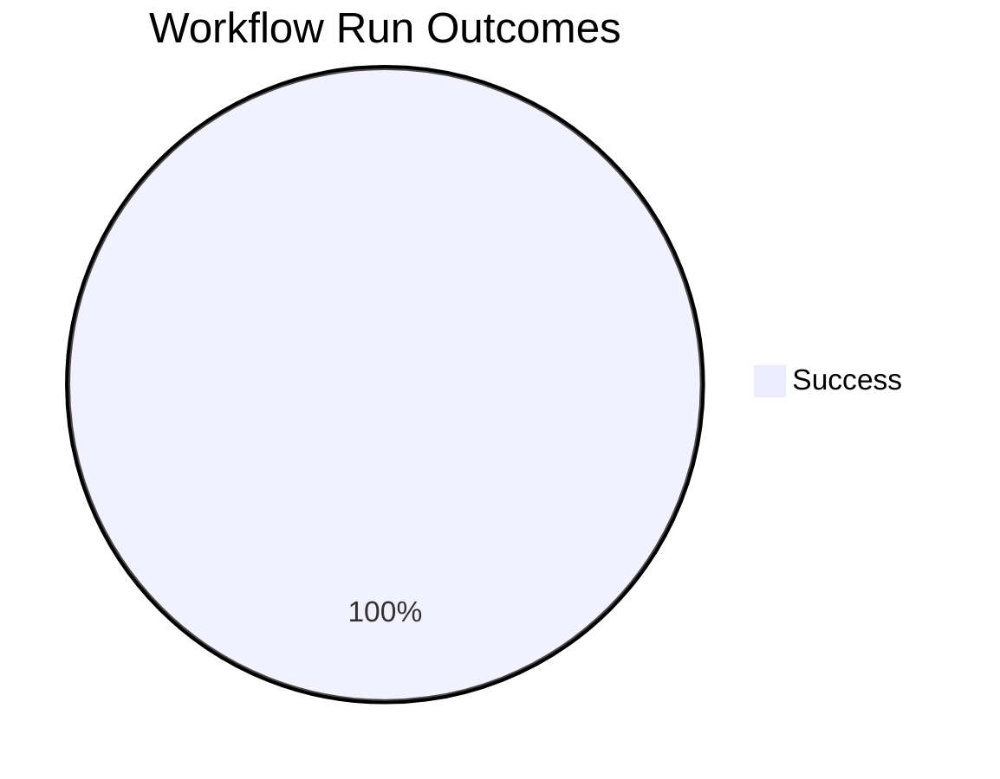
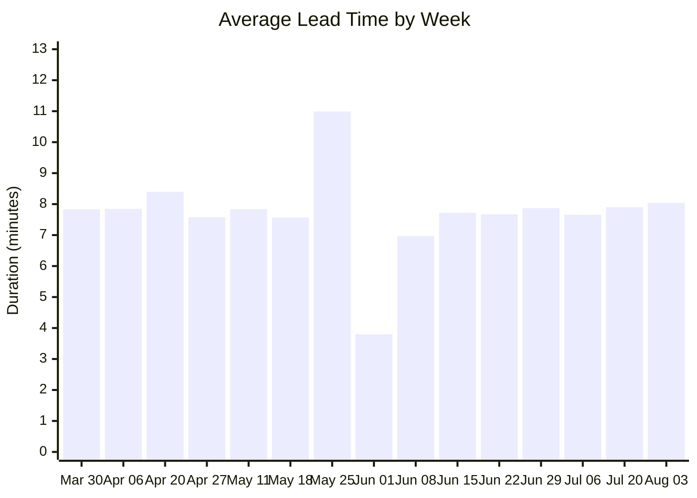
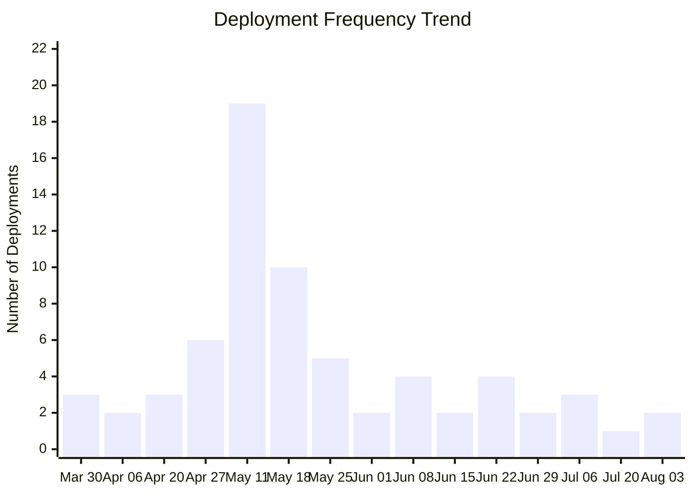
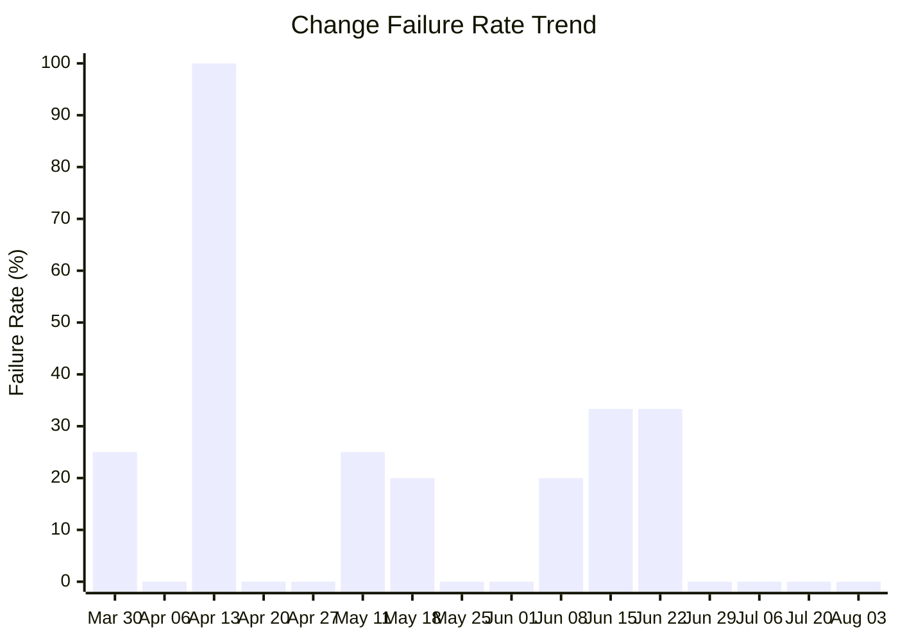

# DORA Metrics Report

**Generated:** 2026-08-11 09:18:53

## Summary

|Metric|Value|Category|
| --- | --- | --- |
| Deployment Frequency | 14.00/week | Elite |
| Lead Time for Changes | 8m 2s | Elite |
| Change Failure Rate | 0.0% | Elite |
| Time to Restore | 21h 22m | High |

**Total Runs:** 2 | **Successful:** 2 (100.0%) | **Failed:** 0 (0.0%)

---

## Visualizations

### Workflow Outcomes

```mermaid
pie title Workflow Run Outcomes
    "Success" : 2
```

### Lead Time Trend

```mermaid
xychart-beta
    title "Average Lead Time by Week"
    x-axis ["Mar 30", "Apr 06", "Apr 20", "Apr 27", "May 11", "May 18", "May 25", "Jun 01", "Jun 08", "Jun 15", "Jun 22", "Jun 29", "Jul 06", "Jul 20", "Aug 03"]
    y-axis "Duration (minutes)" 0 --> 13
    bar [7.83, 7.85, 8.40, 7.58, 7.84, 7.57, 10.99, 3.80, 6.97, 7.72, 7.67, 7.87, 7.66, 7.90, 8.04]
```

| Week Starting | Avg Lead Time | Deployments |
|---------------|---------------|-------------|
| Mar 30 | 7m 50s | 3 |
| Apr 06 | 7m 51s | 2 |
| Apr 20 | 8m 24s | 3 |
| Apr 27 | 7m 34s | 6 |
| May 11 | 7m 51s | 19 |
| May 18 | 7m 34s | 10 |
| May 25 | 10m 59s | 5 |
| Jun 01 | 3m 48s | 2 |
| Jun 08 | 6m 58s | 4 |
| Jun 15 | 7m 44s | 2 |
| Jun 22 | 7m 40s | 4 |
| Jun 29 | 7m 52s | 2 |
| Jul 06 | 7m 39s | 3 |
| Jul 20 | 7m 54s | 1 |
| Aug 03 | 8m 2s | 2 |

### Deployment Frequency Trend

```mermaid
xychart-beta
    title "Deployment Frequency Trend"
    x-axis ["Mar 30", "Apr 06", "Apr 20", "Apr 27", "May 11", "May 18", "May 25", "Jun 01", "Jun 08", "Jun 15", "Jun 22", "Jun 29", "Jul 06", "Jul 20", "Aug 03"]
    y-axis "Number of Deployments" 0 --> 22
    bar [3.00, 2.00, 3.00, 6.00, 19.00, 10.00, 5.00, 2.00, 4.00, 2.00, 4.00, 2.00, 3.00, 1.00, 2.00]
```

**Deployment Cadence Analysis:**
- **Average per week:** 4.5 deployments
- **Most active week:** 19 deployments
- **Least active week:** 1 deployments
- **Consistency:** Low (irregular release pattern)

### Change Failure Rate Trend

```mermaid
xychart-beta
    title "Change Failure Rate Trend"
    x-axis ["Mar 30", "Apr 06", "Apr 13", "Apr 20", "Apr 27", "May 11", "May 18", "May 25", "Jun 01", "Jun 08", "Jun 15", "Jun 22", "Jun 29", "Jul 06", "Jul 20", "Aug 03"]
    y-axis "Failure Rate (%)" 0 --> 100
    bar [25.00, 0.00, 100.00, 0.00, 0.00, 25.00, 20.00, 0.00, 0.00, 20.00, 33.33, 33.33, 0.00, 0.00, 0.00, 0.00]
```

| Week Starting | Total Runs | Failed | CFR |
|---------------|------------|--------|-----|
| Mar 30 | 4 | 1 | 25.0% |
| Apr 06 | 2 | 0 | 0.0% |
| Apr 13 | 2 | 2 | 100.0% |
| Apr 20 | 3 | 0 | 0.0% |
| Apr 27 | 9 | 0 | 0.0% |
| May 11 | 36 | 9 | 25.0% |
| May 18 | 15 | 3 | 20.0% |
| May 25 | 5 | 0 | 0.0% |
| Jun 01 | 2 | 0 | 0.0% |
| Jun 08 | 5 | 1 | 20.0% |
| Jun 15 | 3 | 1 | 33.3% |
| Jun 22 | 6 | 2 | 33.3% |
| Jun 29 | 2 | 0 | 0.0% |
| Jul 06 | 3 | 0 | 0.0% |
| Jul 20 | 1 | 0 | 0.0% |
| Aug 03 | 2 | 0 | 0.0% |
**DORA Performance Tiers:**
- Elite: ≤ 15%
- High: 16-30%
- Medium: 31-45%
- Low: > 45%