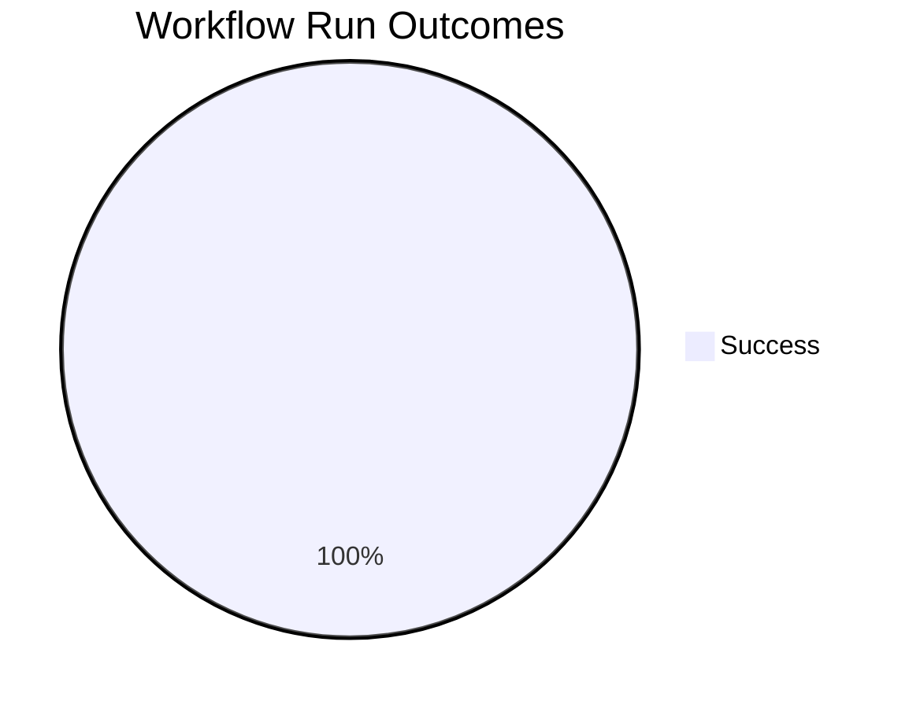
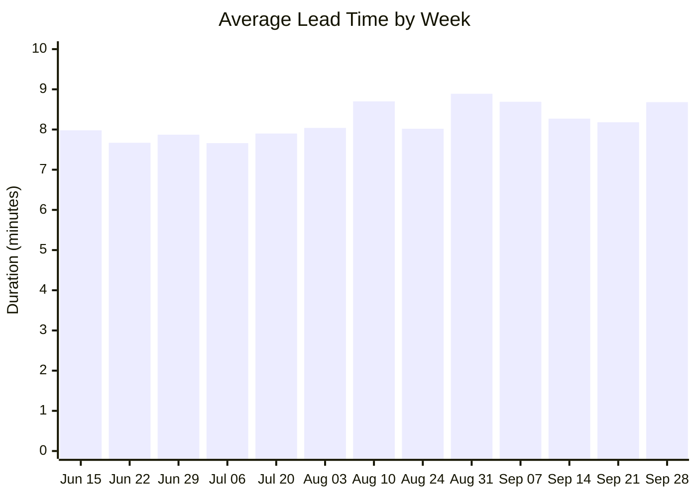
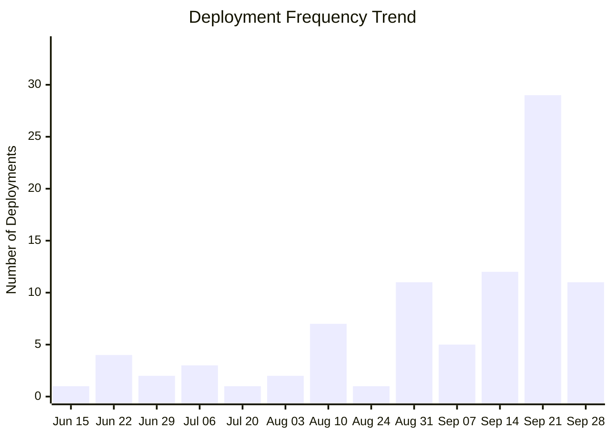
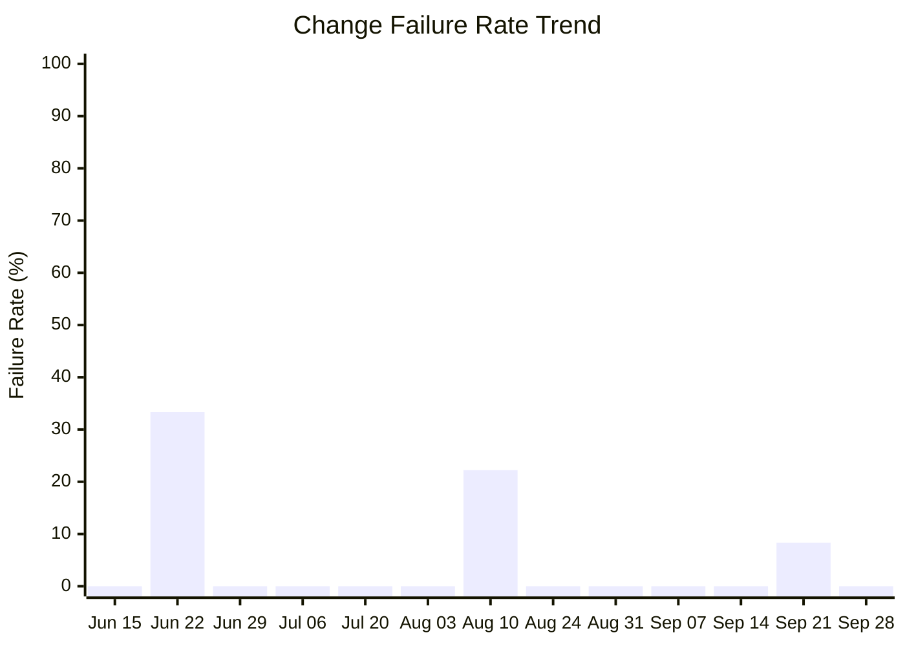

# DORA Metrics Report

**Generated:** 2026-10-06 09:06:27

## Summary

|Metric|Value|Category|
| --- | --- | --- |
| Deployment Frequency | 16.20/week | Elite |
| Lead Time for Changes | 8m 54s | Elite |
| Change Failure Rate | 0.0% | Elite |
| Time to Restore | 4h 10m | High |

**Total Runs:** 7 | **Successful:** 7 (100.0%) | **Failed:** 0 (0.0%)

---

## Visualizations

### Workflow Outcomes

```mermaid
pie title Workflow Run Outcomes
    "Success" : 7
```

### Lead Time Trend

```mermaid
xychart-beta
    title "Average Lead Time by Week"
    x-axis ["Jun 15", "Jun 22", "Jun 29", "Jul 06", "Jul 20", "Aug 03", "Aug 10", "Aug 24", "Aug 31", "Sep 07", "Sep 14", "Sep 21", "Sep 28"]
    y-axis "Duration (minutes)" 0 --> 10
    bar [7.98, 7.67, 7.87, 7.66, 7.90, 8.04, 8.70, 8.02, 8.89, 8.69, 8.27, 8.18, 8.68]
```

| Week Starting | Avg Lead Time | Deployments |
|---------------|---------------|-------------|
| Jun 15 | 7m 59s | 1 |
| Jun 22 | 7m 40s | 4 |
| Jun 29 | 7m 52s | 2 |
| Jul 06 | 7m 39s | 3 |
| Jul 20 | 7m 54s | 1 |
| Aug 03 | 8m 2s | 2 |
| Aug 10 | 8m 42s | 7 |
| Aug 24 | 8m 1s | 1 |
| Aug 31 | 8m 53s | 11 |
| Sep 07 | 8m 41s | 5 |
| Sep 14 | 8m 16s | 12 |
| Sep 21 | 8m 11s | 29 |
| Sep 28 | 8m 41s | 11 |

### Deployment Frequency Trend

```mermaid
xychart-beta
    title "Deployment Frequency Trend"
    x-axis ["Jun 15", "Jun 22", "Jun 29", "Jul 06", "Jul 20", "Aug 03", "Aug 10", "Aug 24", "Aug 31", "Sep 07", "Sep 14", "Sep 21", "Sep 28"]
    y-axis "Number of Deployments" 0 --> 34
    bar [1.00, 4.00, 2.00, 3.00, 1.00, 2.00, 7.00, 1.00, 11.00, 5.00, 12.00, 29.00, 11.00]
```

**Deployment Cadence Analysis:**
- **Average per week:** 6.8 deployments
- **Most active week:** 29 deployments
- **Least active week:** 1 deployments
- **Consistency:** Low (irregular release pattern)

### Change Failure Rate Trend

```mermaid
xychart-beta
    title "Change Failure Rate Trend"
    x-axis ["Jun 15", "Jun 22", "Jun 29", "Jul 06", "Jul 20", "Aug 03", "Aug 10", "Aug 24", "Aug 31", "Sep 07", "Sep 14", "Sep 21", "Sep 28"]
    y-axis "Failure Rate (%)" 0 --> 100
    bar [0.00, 33.33, 0.00, 0.00, 0.00, 0.00, 22.22, 0.00, 0.00, 0.00, 0.00, 8.33, 0.00]
```

| Week Starting | Total Runs | Failed | CFR |
|---------------|------------|--------|-----|
| Jun 15 | 1 | 0 | 0.0% |
| Jun 22 | 6 | 2 | 33.3% |
| Jun 29 | 2 | 0 | 0.0% |
| Jul 06 | 3 | 0 | 0.0% |
| Jul 20 | 1 | 0 | 0.0% |
| Aug 03 | 2 | 0 | 0.0% |
| Aug 10 | 9 | 2 | 22.2% |
| Aug 24 | 1 | 0 | 0.0% |
| Aug 31 | 11 | 0 | 0.0% |
| Sep 07 | 5 | 0 | 0.0% |
| Sep 14 | 12 | 0 | 0.0% |
| Sep 21 | 36 | 3 | 8.3% |
| Sep 28 | 11 | 0 | 0.0% |
**DORA Performance Tiers:**
- Elite: ≤ 15%
- High: 16-30%
- Medium: 31-45%
- Low: > 45%