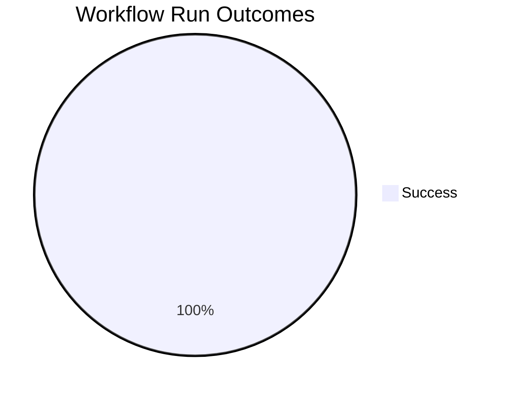
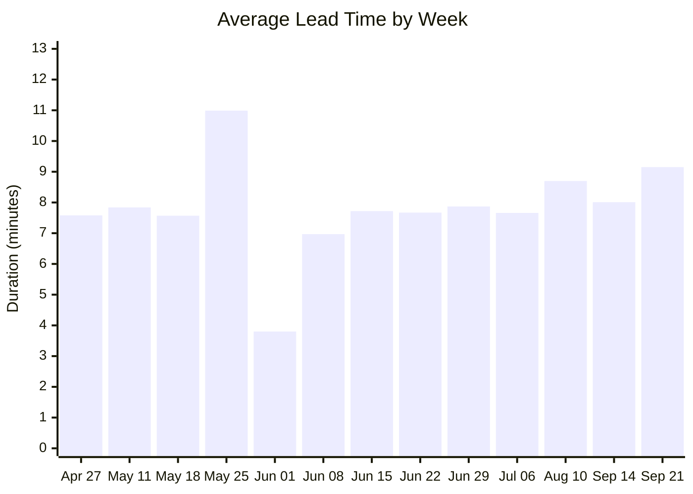
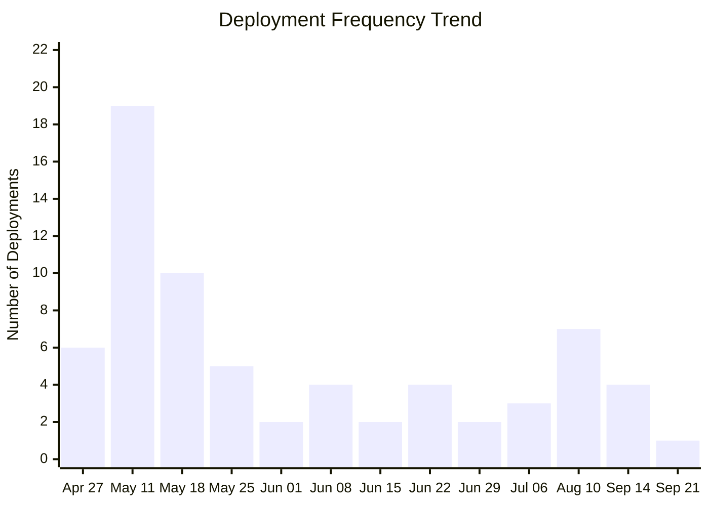
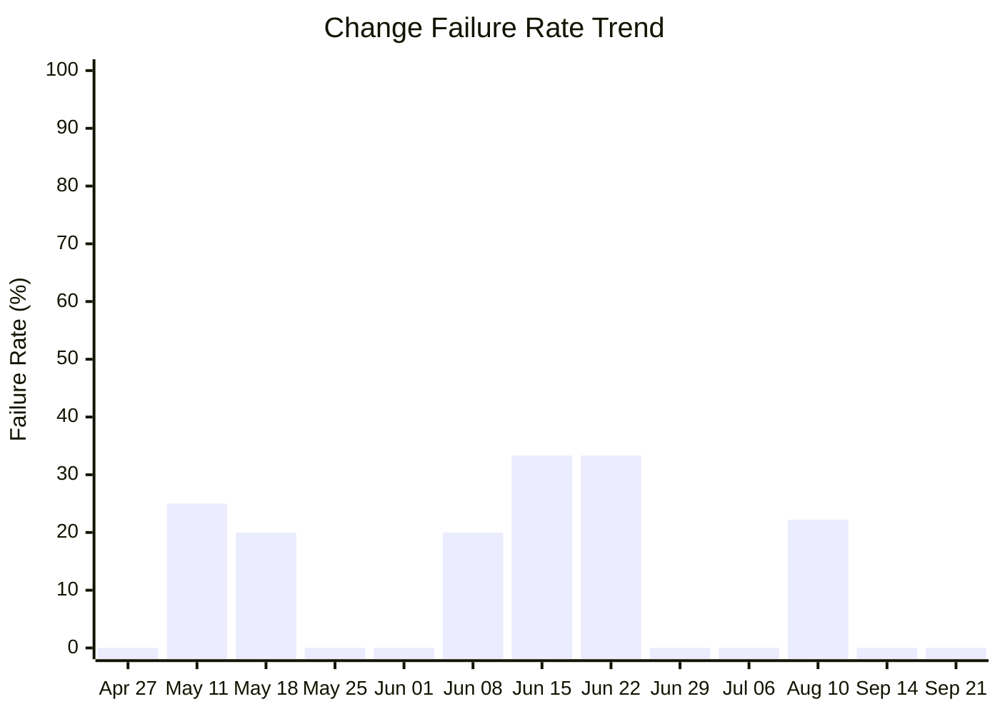

# DORA Metrics Report

**Generated:** 2026-09-29 09:06:37

## Summary

|Metric|Value|Category|
| --- | --- | --- |
| Deployment Frequency | 1.00/week | High |
| Lead Time for Changes | 9m 9s | Elite |
| Change Failure Rate | 0.0% | Elite |
| Time to Restore | 2h 20m | High |

**Total Runs:** 1 | **Successful:** 1 (100.0%) | **Failed:** 0 (0.0%)

---

## Visualizations

### Workflow Outcomes

```mermaid
pie title Workflow Run Outcomes
    "Success" : 1
```

### Lead Time Trend

```mermaid
xychart-beta
    title "Average Lead Time by Week"
    x-axis ["Apr 27", "May 11", "May 18", "May 25", "Jun 01", "Jun 08", "Jun 15", "Jun 22", "Jun 29", "Jul 06", "Aug 10", "Sep 14", "Sep 21"]
    y-axis "Duration (minutes)" 0 --> 13
    bar [7.58, 7.84, 7.57, 10.99, 3.80, 6.97, 7.72, 7.67, 7.87, 7.66, 8.70, 8.01, 9.15]
```

| Week Starting | Avg Lead Time | Deployments |
|---------------|---------------|-------------|
| Apr 27 | 7m 34s | 6 |
| May 11 | 7m 51s | 19 |
| May 18 | 7m 34s | 10 |
| May 25 | 10m 59s | 5 |
| Jun 01 | 3m 48s | 2 |
| Jun 08 | 6m 58s | 4 |
| Jun 15 | 7m 44s | 2 |
| Jun 22 | 7m 40s | 4 |
| Jun 29 | 7m 52s | 2 |
| Jul 06 | 7m 39s | 3 |
| Aug 10 | 8m 42s | 7 |
| Sep 14 | 8m 1s | 4 |
| Sep 21 | 9m 9s | 1 |

### Deployment Frequency Trend

```mermaid
xychart-beta
    title "Deployment Frequency Trend"
    x-axis ["Apr 27", "May 11", "May 18", "May 25", "Jun 01", "Jun 08", "Jun 15", "Jun 22", "Jun 29", "Jul 06", "Aug 10", "Sep 14", "Sep 21"]
    y-axis "Number of Deployments" 0 --> 22
    bar [6.00, 19.00, 10.00, 5.00, 2.00, 4.00, 2.00, 4.00, 2.00, 3.00, 7.00, 4.00, 1.00]
```

**Deployment Cadence Analysis:**
- **Average per week:** 5.3 deployments
- **Most active week:** 19 deployments
- **Least active week:** 1 deployments
- **Consistency:** Low (irregular release pattern)

### Change Failure Rate Trend

```mermaid
xychart-beta
    title "Change Failure Rate Trend"
    x-axis ["Apr 27", "May 11", "May 18", "May 25", "Jun 01", "Jun 08", "Jun 15", "Jun 22", "Jun 29", "Jul 06", "Aug 10", "Sep 14", "Sep 21"]
    y-axis "Failure Rate (%)" 0 --> 100
    bar [0.00, 25.00, 20.00, 0.00, 0.00, 20.00, 33.33, 33.33, 0.00, 0.00, 22.22, 0.00, 0.00]
```

| Week Starting | Total Runs | Failed | CFR |
|---------------|------------|--------|-----|
| Apr 27 | 9 | 0 | 0.0% |
| May 11 | 36 | 9 | 25.0% |
| May 18 | 15 | 3 | 20.0% |
| May 25 | 5 | 0 | 0.0% |
| Jun 01 | 2 | 0 | 0.0% |
| Jun 08 | 5 | 1 | 20.0% |
| Jun 15 | 3 | 1 | 33.3% |
| Jun 22 | 6 | 2 | 33.3% |
| Jun 29 | 2 | 0 | 0.0% |
| Jul 06 | 3 | 0 | 0.0% |
| Aug 10 | 9 | 2 | 22.2% |
| Sep 14 | 4 | 0 | 0.0% |
| Sep 21 | 1 | 0 | 0.0% |
**DORA Performance Tiers:**
- Elite: ≤ 15%
- High: 16-30%
- Medium: 31-45%
- Low: > 45%