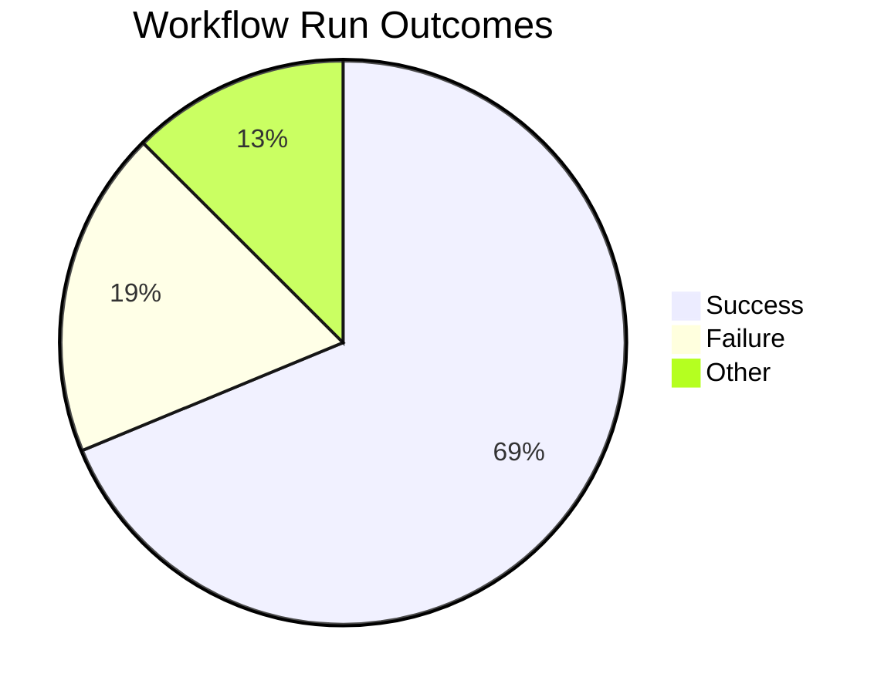
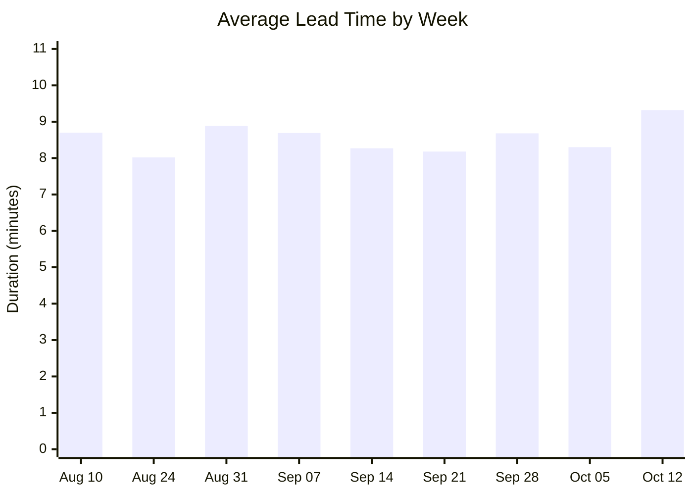
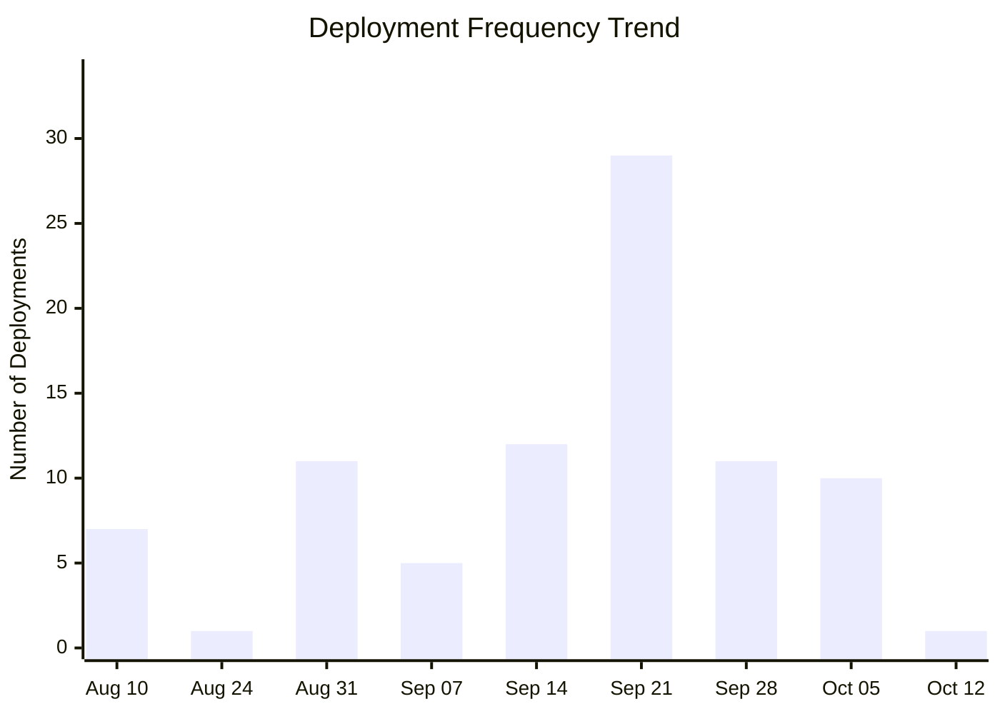
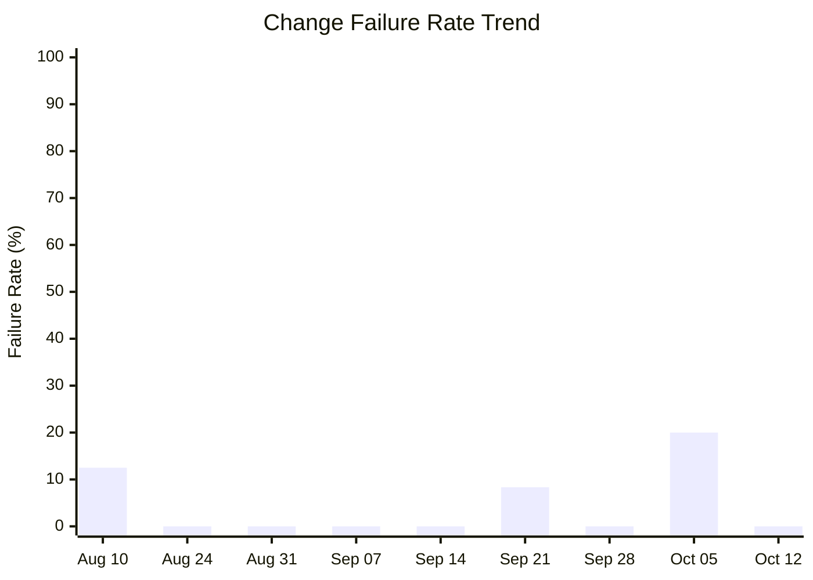

# DORA Metrics Report

**Generated:** 2026-10-13 09:10:15

## Summary

|Metric|Value|Category|
| --- | --- | --- |
| Deployment Frequency | 31.53/week | Elite |
| Lead Time for Changes | 8m 23s | Elite |
| Change Failure Rate | 21.4% | High |
| Time to Restore | 28m 7s | Elite |

**Total Runs:** 16 | **Successful:** 11 (68.8%) | **Failed:** 3 (18.8%) | **Other:** 2 (12.5%)

---

## Visualizations

### Workflow Outcomes

```mermaid
pie title Workflow Run Outcomes
    "Success" : 11
    "Failure" : 3
    "Other" : 2
```

### Lead Time Trend

```mermaid
xychart-beta
    title "Average Lead Time by Week"
    x-axis ["Aug 10", "Aug 24", "Aug 31", "Sep 07", "Sep 14", "Sep 21", "Sep 28", "Oct 05", "Oct 12"]
    y-axis "Duration (minutes)" 0 --> 11
    bar [8.70, 8.02, 8.89, 8.69, 8.27, 8.18, 8.68, 8.30, 9.32]
```

| Week Starting | Avg Lead Time | Deployments |
|---------------|---------------|-------------|
| Aug 10 | 8m 42s | 7 |
| Aug 24 | 8m 1s | 1 |
| Aug 31 | 8m 53s | 11 |
| Sep 07 | 8m 41s | 5 |
| Sep 14 | 8m 16s | 12 |
| Sep 21 | 8m 11s | 29 |
| Sep 28 | 8m 41s | 11 |
| Oct 05 | 8m 18s | 10 |
| Oct 12 | 9m 19s | 1 |

### Deployment Frequency Trend

```mermaid
xychart-beta
    title "Deployment Frequency Trend"
    x-axis ["Aug 10", "Aug 24", "Aug 31", "Sep 07", "Sep 14", "Sep 21", "Sep 28", "Oct 05", "Oct 12"]
    y-axis "Number of Deployments" 0 --> 34
    bar [7.00, 1.00, 11.00, 5.00, 12.00, 29.00, 11.00, 10.00, 1.00]
```

**Deployment Cadence Analysis:**
- **Average per week:** 9.7 deployments
- **Most active week:** 29 deployments
- **Least active week:** 1 deployments
- **Consistency:** Low (irregular release pattern)

### Change Failure Rate Trend

```mermaid
xychart-beta
    title "Change Failure Rate Trend"
    x-axis ["Aug 10", "Aug 24", "Aug 31", "Sep 07", "Sep 14", "Sep 21", "Sep 28", "Oct 05", "Oct 12"]
    y-axis "Failure Rate (%)" 0 --> 100
    bar [12.50, 0.00, 0.00, 0.00, 0.00, 8.33, 0.00, 20.00, 0.00]
```

| Week Starting | Total Runs | Failed | CFR |
|---------------|------------|--------|-----|
| Aug 10 | 8 | 1 | 12.5% |
| Aug 24 | 1 | 0 | 0.0% |
| Aug 31 | 11 | 0 | 0.0% |
| Sep 07 | 5 | 0 | 0.0% |
| Sep 14 | 12 | 0 | 0.0% |
| Sep 21 | 36 | 3 | 8.3% |
| Sep 28 | 11 | 0 | 0.0% |
| Oct 05 | 15 | 3 | 20.0% |
| Oct 12 | 1 | 0 | 0.0% |
**DORA Performance Tiers:**
- Elite: ≤ 15%
- High: 16-30%
- Medium: 31-45%
- Low: > 45%