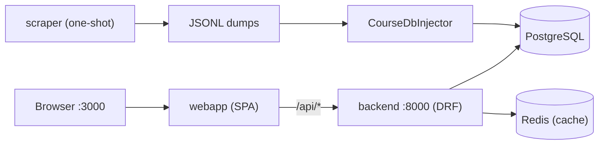

# Developer Onboarding

How to go from zero to first merged MR in the Rate UKMA codebase. Every path
below is relative to the repo root and was verified against the current tree.

| You are | Do this |
| --- | --- |
| First day | §2 repo map, §3 run the stack, open `:3000`, submit one rating |
| First week | §4 or §5 trace (pick your side), §7 tasks 1–2 |
| First MR | §6 conventions, §7 task 3, §8 when stuck |

## 1. Big picture

Rate UKMA is a course-rating platform for NaUKMA students: a React SPA talks to
a Django REST API backed by PostgreSQL and Redis. Start with
`docs/architecture/high-level-design.md` for the N-tier layer diagram, then
come back here for where that diagram lives in code.


## 2. Repo map

| Path | What lives there |
| --- | --- |
| `src/docker-compose.yml` | All services: postgres, redis, backend (`:8000`), webapp (`:3000`) |
| `src/.env.sample` | Copy to `src/.env` before first `docker compose` run |
| `src/backend/` | Django + DRF API (`manage.py`, `pytest.ini`, `conftest.py`) |
| `src/backend/rating_app/` | The product: `views/`, `services/`, `repositories/`, `models/`, `serializers/`, `application_schemas/`, `exception/`, `auth/`, `management/commands/` |
| `src/backend/rateukma/` | Project plumbing: `settings/` (`_base.py`, `dev.py`, `prod.py`, `testing.py`), `protocols/`, `ioc/`, `caching/` |
| `src/backend/scraper/` | University-portal importer: `browser.py`, `parsers/`, `services/`, `models/` |
| `src/webapp/` | React 19 + TanStack Router SPA (`orval.config.ts`, `playwright.config.ts`) |
| `src/webapp/src/routes/` | File-based routes (`index.tsx`, `explore.tsx`, `courses.$courseId.tsx`, `feed.tsx`, `my-ratings.tsx`, `login.tsx`) |
| `src/webapp/src/features/` | Feature slices: `courses/`, `ratings/`, `feed/`, `notifications/`, `instructors/`, `course-offerings/`, `promo/` |
| `src/webapp/src/components/` | Shared UI (`Layout.tsx`, `Header`, `ErrorBoundary.tsx`, `ui/`) |
| `src/webapp/src/lib/` | Cross-cutting code: `api/apiClient.ts`, `auth`, `feature-flags`, `test-ids.ts` |
| `src/webapp/src/integrations/tanstack-query/RootProvider.tsx` | 5-min stale time, exponential-backoff retry (never on 401/403 or when no HTTP response came back) |
| `src/webapp/src/test-utils/` | `factories.ts`, `render.tsx`, `router.tsx` for component tests |
| `docs/api/openapi-generated.yaml` | The API contract both sides code against |
| `docs/architecture/decisions/` | ADRs plus `INDEX.md`; process in `0000-use-adrs.md`, blank in `TEMPLATE.md` |
| `scripts/dora-metrics/` | DORA metrics generator run by `.github/workflows/dora.yml` |
| `CONTRIBUTING.md` | License headers (required on every new file), workflow rules |

## 3. Run it

Follow `README.md` § "Running Project": copy `src/.env.sample` to `src/.env`
(inside containers the backend reaches Redis as `redis`, so override
`REDIS_HOST=redis` in `src/.env` — the sample's `localhost` only fits local runs),
then `docker compose --profile dev up -d --build` from `src/`. You get the
webapp on `:3000` and the API on `:8000` (`/admin` included). For IDE feedback
without Docker, each side has its own setup guide: `src/backend/README.md`
(`uv sync`, `uv venv`) and `src/webapp/README.md` (`pnpm install`).

Seed data for local exploration: `src/backend/rating_app/management/commands/`
has `generate_mock_data.py` and `generate_mock_ratings.py`, runnable via
`python manage.py <name>` (locally or with `docker exec -it <backend> ...`).
Seeds create bare `Student` rows with no login or enrollments, so submitting a
rating needs an enrolled user (easiest: Django admin) — browsing works immediately.
Both seed commands rebuild the feed index when they finish; after any other bulk
or raw-SQL load, run `python manage.py rebuild_feed_index` or the feed stays empty.

## 4. Backend: follow one request

Trace a rating submission to learn the layering (enforced by ADR-0005):

1. **View** (`src/backend/rating_app/views/rating_viewset.py`): thin HTTP adapter, Pydantic
   input schemas from `src/backend/rating_app/application_schemas/` validate at the boundary.
2. **Service** (`src/backend/rating_app/services/rating_service.py`): business rules only,
   e.g. raises `NotEnrolledException`, `RatingPeriodNotStarted`,
   `DuplicateRatingException`. No ORM here beyond what repositories return.
3. **Repository** (`src/backend/rating_app/repositories/rating_repository.py`): catches ORM
   errors and re-raises domain exceptions, e.g. `Rating.DoesNotExist` →
   `RatingNotFoundError` (see `src/backend/rating_app/exception/` — one module per domain).
4. **Side effects**: the service writes the row and calls
   `notify(RatingEvent(...))` inside one `transaction.atomic()`. Observers in
   `src/backend/rating_app/services/domain_event_listeners/` update course
   aggregates, invalidate caches, and sync the feed index, so a failing listener
   rolls the rating back with it.
5. **Response**: DRF maps the exception to a status code and
   `src/backend/rating_app/exception/exception_handler.py` normalizes dict-shaped
   errors to `{detail, status, fields?}` (list-detail errors pass through bare).
   Output serialization stays in DRF serializers
   (`src/backend/rating_app/serializers/`).

Supporting pieces: singleton wiring in `src/backend/rating_app/ioc_container/`
(`@once` providers),
per-user feature flags via django-waffle (`GET /api/v1/flags/`, allowlist
`PUBLIC_FEATURE_FLAGS` in `src/backend/rateukma/settings/_base.py` — see ADR-0009),
in-app notifications in `src/backend/rating_app/services/notification_service.py`
with `src/backend/rating_app/views/notification_viewset.py`
(grouped reads behind a per-user cursor, event types in
`src/backend/rating_app/models/choices.py::NotificationEventType`),
and the activity feed (`GET /api/v1/feed/`,
`src/backend/rating_app/services/feed_service.py`), which reads one
`feed_event` index table (`src/backend/rating_app/models/feed_event.py`, see
ADR-0010) kept in step with ratings, comments and admin posts by
`src/backend/rating_app/services/feed_update_service.py`.

After changing endpoints or serializers, regenerate the contract from
`src/backend/AGENTS.md`:

```bash
.venv/bin/python manage.py spectacular --file ../../docs/api/openapi-generated.yaml
```

Tests live next to the code (`test_*.py`, e.g.
`src/backend/rating_app/views/test_rating.py`,
`src/backend/rating_app/services/test_notification_service.py`). Read
`docs/testing/backend-tests.md` before writing one: factories are
pytest-factoryboy fixtures registered in `src/backend/conftest.py`
(`course_factory`, `rating_factory`, … — take them as parameters, never import
them), `src/backend/rating_app/tests/` holds only `factories.py` and
`semester_dates.py`, and `token_client.user` has no `Student` row until you
create one. `src/backend/pytest.ini` runs `--reuse-db --strict-markers`; a
database test carries `@pytest.mark.django_db` plus `@pytest.mark.integration`,
and `e2e` is reserved for webapp Playwright flows. Type safety: `uv run pyright`
must stay at 0 errors (conventions in `src/backend/AGENTS.md`).

## 5. Frontend: follow one page

Trace the course page (`src/webapp/src/routes/courses.$courseId.tsx`):

1. **Route** renders directly from generated query hooks
   (`useCoursesRetrieve`, `useCoursesOfferingsList` from `@/lib/api/generated`)
   plus **feature hooks** such as `useUserCourseRating(courseId)`
   (`src/webapp/src/features/ratings/hooks/`) — no route loaders.
2. **Feature slice** (`features/courses/`, `features/ratings/`) owns its
   components, formatting (`courseFormatting.ts`), and param mapping
   (`courseFiltersParams.ts`, `filterTransformations.ts`).
3. **API layer** (`lib/api/apiClient.ts` + `authorizedFetcher`) calls hooks
   generated by orval from `docs/api/openapi-generated.yaml`. The generated
   output (`src/lib/api/generated/`) is gitignored — it appears after
   `pnpm install` (postinstall runs `orval`). Never edit it by hand.
4. **Failures** surface through react-query errors (no retry on 401/403),
   `components/ErrorBoundary.tsx`, and the `connection-error.tsx` route: a
   request with no HTTP response is never retried, and the `apiClient.ts`
   response interceptor sends it to `/connection-error` on the first failure
   (`lib/api/networkError.ts` stops the redirect from bouncing back and forth).

Rules that bite newcomers (from `src/webapp/AGENTS.md`): design tokens live in
`src/styles.css` (`:root` + `.dark`, used as `bg-card` etc. — no ad-hoc hex in
JSX); gate UI with `useFeatureFlag("fe_<name>")` / `useFeatureFlagState`, whose
name is typed as `FeatureFlagName` (keys of the generated `PublicFeatureFlags`),
so a new flag needs `PUBLIC_FEATURE_FLAGS` and a regenerated spec first or `tsc`
fails; stable selectors go in `lib/test-ids.ts`; check `src/components` and
`src/components/ui` (shadcn) before building new UI.

Commands (`src/webapp/package.json`): `pnpm start`, `pnpm test` (vitest),
`pnpm test:e2e` (playwright, `playwright.config.ts`), `pnpm check`
(lint + format:check + typecheck — the CI gate).

## 6. Conventions before your first MR

- Commit style: `semantic-commit.sh` at the root; MR titles look like
  `fix(#NNN): ...`.
- New files need the GPL v3 header from `CONTRIBUTING.md`.
- New architecture choice? Write an ADR from `docs/architecture/decisions/TEMPLATE.md`
  and link it in `INDEX.md`.
- Each app has agent notes worth one skim: `src/backend/AGENTS.md`,
  `src/webapp/AGENTS.md`.
- Agents do the typing: your job is the goal, the constraints, and the
  verification. Never paste secrets, `.env` contents, or user data into a prompt.

## 7. Suggested first tasks

1. Run the stack, seed mock data, open a course page and browse ratings
   (submitting needs an enrolled user — see §3).
2. Add a field to a serializer, regenerate the OpenAPI yaml, run
   `pnpm install` in webapp, and watch the generated hook change.
3. Flip an allowlisted `waffle` flag (names in `PUBLIC_FEATURE_FLAGS`) in Django
   admin and gate a UI string behind `useFeatureFlagState` (see
   `docs/feature-flags.md`).

## 8. When stuck

| Symptom | Fix |
| --- | --- |
| Port already in use | `lsof -i :3000` / `:8000`, stop the other process |
| Backend can't reach DB | `docker compose ps` in `src/`; check `src/.env` exists (copied from `.env.sample`) |
| `src/webapp/src/lib/api/generated/` missing | rerun `pnpm install` (postinstall runs orval) |
| How tests are organized | `docs/testing/testing-strategy.md`, how to write a backend test in `docs/testing/backend-tests.md`, e2e in `docs/testing/e2e-tests.md` |
| Feed empty after a bulk or raw-SQL load | `python manage.py rebuild_feed_index` (writes that skip the service layer never reach `feed_event`) |
| Auth/key incident | `docs/runbooks/` (key rotation), then tell the team lead |
