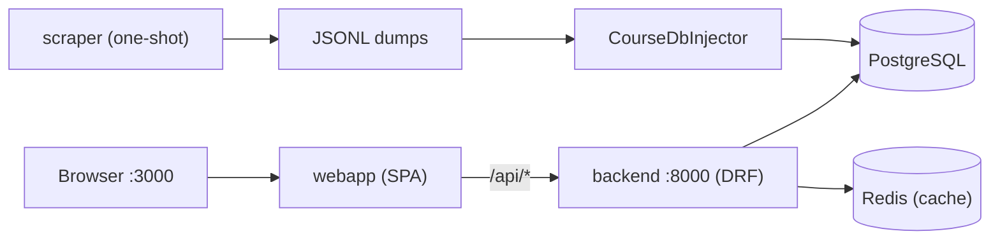

# Developer Onboarding

From zero to a first merged MR in Rate UKMA. Every link opens the file on GitHub
or in your editor and was checked against the current tree.

| You are | Do this |
| --- | --- |
| First day | [Repo map](#2-repo-map), [run the stack](#3-run-it), open `:3000`, browse a course |
| First week | [Backend](#4-backend-follow-one-request) or [frontend](#5-frontend-follow-one-page) trace, [tasks](#7-suggested-first-tasks) 1–2 |
| First MR | [Conventions](#6-conventions-before-your-first-mr), task 3, [when stuck](#8-when-stuck) |

## 1. Big picture

A React SPA talks to a Django REST API backed by PostgreSQL and Redis. The layer
diagram is in [high-level-design.md](architecture/high-level-design.md); this
guide shows where it lives in code.



## 2. Repo map

| Path | What lives there |
| --- | --- |
| [`src/docker-compose.yml`](../src/docker-compose.yml) | postgres, redis, backend `:8000`, webapp `:3000` |
| [`src/.env.sample`](../src/.env.sample) | Copy to `src/.env` before the first `docker compose` run |
| [`src/backend/rating_app/`](../src/backend/rating_app/) | The product: [`views/`](../src/backend/rating_app/views/), [`services/`](../src/backend/rating_app/services/), [`repositories/`](../src/backend/rating_app/repositories/), [`models/`](../src/backend/rating_app/models/), [`serializers/`](../src/backend/rating_app/serializers/), [`exception/`](../src/backend/rating_app/exception/) |
| [`src/backend/rateukma/`](../src/backend/rateukma/) | Plumbing: [`settings/`](../src/backend/rateukma/settings/), [`ioc/`](../src/backend/rateukma/ioc/), [`caching/`](../src/backend/rateukma/caching/), [`protocols/`](../src/backend/rateukma/protocols/) |
| [`src/backend/scraper/`](../src/backend/scraper/) | University-portal importer |
| [`src/webapp/src/routes/`](../src/webapp/src/routes/) | File-based TanStack Router pages |
| [`src/webapp/src/features/`](../src/webapp/src/features/) | Feature slices: [`courses/`](../src/webapp/src/features/courses/), [`ratings/`](../src/webapp/src/features/ratings/), [`feed/`](../src/webapp/src/features/feed/), [`notifications/`](../src/webapp/src/features/notifications/), … |
| [`src/webapp/src/components/`](../src/webapp/src/components/) | Shared UI, shadcn primitives in [`ui/`](../src/webapp/src/components/ui/) |
| [`src/webapp/src/lib/`](../src/webapp/src/lib/) | API client, auth, feature flags, test ids |
| [`docs/api/openapi-generated.yaml`](api/openapi-generated.yaml) | The API contract both sides code against |
| [`docs/architecture/decisions/`](architecture/decisions/) | ADRs, listed in [`INDEX.md`](architecture/decisions/INDEX.md) |

## 3. Run it

1. Copy [`src/.env.sample`](../src/.env.sample) to `src/.env` and set
   `REDIS_HOST=redis` (the sample's `localhost` only works outside Docker).
2. From `src/`: `docker compose --profile dev up -d --build`. Webapp on `:3000`,
   API and `/admin` on `:8000`. More in
   [README § Running Project](../README.md#-running-project).
3. Seed data with `python manage.py generate_mock_data` and
   `generate_mock_ratings` ([commands](../src/backend/rating_app/management/commands/)),
   locally or through `docker exec -it <backend> ...`.

Seeded students have no login or enrollments: browsing works at once, submitting
a rating needs an enrolled user (easiest: Django admin). For IDE support without
Docker see the [backend README](../src/backend/README.md) (`uv sync`) and the
[webapp README](../src/webapp/README.md) (`pnpm install`).

## 4. Backend: follow one request

A rating submission, layer by layer
([ADR-0005](architecture/decisions/0005-api-data-validation.md)):

1. **View** [`rating_viewset.py`](../src/backend/rating_app/views/rating_viewset.py):
   thin HTTP adapter; Pydantic schemas in
   [`application_schemas/`](../src/backend/rating_app/application_schemas/)
   validate input.
2. **Service** [`rating_service.py`](../src/backend/rating_app/services/rating_service.py):
   business rules only, e.g. raises `NotEnrolledException`,
   `DuplicateRatingException`.
3. **Repository** [`rating_repository.py`](../src/backend/rating_app/repositories/rating_repository.py):
   turns ORM errors into domain ones (`Rating.DoesNotExist` →
   `RatingNotFoundError`), one module per domain in
   [`exception/`](../src/backend/rating_app/exception/).
4. **Side effects**: the service saves the row and calls
   `notify(RatingEvent(...))` in one `transaction.atomic()`.
   [Listeners](../src/backend/rating_app/services/domain_event_listeners/)
   update aggregates, caches and the feed index; if one fails, the rating rolls
   back.
5. **Response**: [`exception_handler.py`](../src/backend/rating_app/exception/exception_handler.py)
   shapes errors as `{detail, status, fields?}`; output goes through
   [`serializers/`](../src/backend/rating_app/serializers/).

Also worth knowing:

- **Wiring**: singletons are `@once` providers in
  [`ioc_container/`](../src/backend/rating_app/ioc_container/).
- **Feature flags**: django-waffle behind `GET /api/v1/flags/`; only names in
  `PUBLIC_FEATURE_FLAGS` ([`_base.py`](../src/backend/rateukma/settings/_base.py))
  reach the frontend ([ADR-0009](architecture/decisions/0009-feature-flags.md)).
- **Notifications**: [`notification_service.py`](../src/backend/rating_app/services/notification_service.py)
  and [`notification_viewset.py`](../src/backend/rating_app/views/notification_viewset.py);
  event types are `NotificationEventType` in
  [`choices.py`](../src/backend/rating_app/models/choices.py).
- **Feed**: `GET /api/v1/feed/` reads one `feed_event` index table
  ([`feed_event.py`](../src/backend/rating_app/models/feed_event.py),
  [ADR-0010](architecture/decisions/0010-feed-event-table.md)), which
  [`feed_update_service.py`](../src/backend/rating_app/services/feed_update_service.py)
  keeps in step with ratings, comments and admin posts.
- **API contract**: after changing endpoints or serializers, regenerate it from
  `src/backend`:

  ```bash
  uv run python manage.py spectacular --file ../../docs/api/openapi-generated.yaml
  ```

**Tests** sit next to the code, e.g.
[`views/test_rating.py`](../src/backend/rating_app/views/test_rating.py). Read
[backend-tests.md](testing/backend-tests.md) before writing one. The traps:

- Factories are fixtures (`course_factory`, `rating_factory`, …) registered in
  [`conftest.py`](../src/backend/conftest.py): take them as parameters, never
  import them.
- `token_client.user` has no `Student` row until you create one.
- A database test carries both `@pytest.mark.django_db` and
  `@pytest.mark.integration`; [`pytest.ini`](../src/backend/pytest.ini) rejects
  unknown markers.
- `uv run pyright` must stay at 0 errors
  ([backend AGENTS.md](../src/backend/AGENTS.md)).

## 5. Frontend: follow one page

The course page, [`courses.$courseId.tsx`](../src/webapp/src/routes/courses.$courseId.tsx):

1. **Route** reads data straight from hooks, no route loaders: generated
   `useCoursesRetrieve` and `useCoursesOfferingsList`, plus feature hooks such
   as [`useUserCourseRating`](../src/webapp/src/features/ratings/hooks/useUserCourseRating.ts).
2. **Feature slices** ([`courses/`](../src/webapp/src/features/courses/),
   [`ratings/`](../src/webapp/src/features/ratings/)) own their components,
   formatting and filter-param mapping.
3. **API layer**: [`apiClient.ts`](../src/webapp/src/lib/api/apiClient.ts) plus
   hooks that orval generates from the OpenAPI yaml into `src/lib/api/generated/`
   (gitignored, created by `pnpm install`; never edit by hand).
4. **Failures**: queries retry with backoff, never on 401/403
   ([`RootProvider.tsx`](../src/webapp/src/integrations/tanstack-query/RootProvider.tsx)).
   A request with no HTTP response goes straight to
   [`/connection-error`](../src/webapp/src/routes/connection-error.tsx); other
   errors reach the page as react-query `isError`, and render crashes hit
   [`ErrorBoundary.tsx`](../src/webapp/src/components/ErrorBoundary.tsx).

Rules that bite newcomers ([webapp AGENTS.md](../src/webapp/AGENTS.md)):

- Colors come from tokens in [`styles.css`](../src/webapp/src/styles.css)
  (`bg-card` etc.), never hex in JSX.
- Gate UI with `useFeatureFlag("fe_<name>")` or `useFeatureFlagState`. Names are
  typed from the generated spec, so a new flag needs `PUBLIC_FEATURE_FLAGS` and a
  regenerated spec first ([feature-flags.md](feature-flags.md)).
- Stable selectors go in [`test-ids.ts`](../src/webapp/src/lib/test-ids.ts).
- Check [`components/ui/`](../src/webapp/src/components/ui/) (shadcn) before
  building new UI.

Commands ([`package.json`](../src/webapp/package.json)): `pnpm start`,
`pnpm test` (vitest), `pnpm test:e2e` (Playwright), `pnpm check` (lint, format
and types; the CI gate).

## 6. Conventions before your first MR

- Commits follow `type(scope): subject`, enforced by
  [`semantic-commit.sh`](../semantic-commit.sh); MR titles look like
  `fix(#NNN): ...`.
- New files get the GPL v3 header from [CONTRIBUTING.md](../CONTRIBUTING.md).
- New architecture choice? Copy [`TEMPLATE.md`](architecture/decisions/TEMPLATE.md)
  into an ADR and list it in [`INDEX.md`](architecture/decisions/INDEX.md).
- Skim the agent notes: [backend](../src/backend/AGENTS.md),
  [webapp](../src/webapp/AGENTS.md).
- Agents do the typing: you own the goal, the constraints and the verification.
  Never paste secrets, `.env` contents or user data into a prompt.

## 7. Suggested first tasks

1. Run the stack, seed data, open a course page and browse ratings (submitting
   needs an enrolled user, see [Run it](#3-run-it)).
2. Add a field to a serializer, regenerate the OpenAPI yaml, run `pnpm install`
   in the webapp and watch the generated hook change.
3. Flip an allowlisted waffle flag in Django admin and gate a UI string behind
   `useFeatureFlagState` ([feature-flags.md](feature-flags.md)).

## 8. When stuck

| Symptom | Fix |
| --- | --- |
| Port already in use | `lsof -i :3000` / `:8000`, stop the other process |
| Backend can't reach the DB | `docker compose ps` in `src/`; check `src/.env` exists |
| `src/webapp/src/lib/api/generated/` missing | Rerun `pnpm install` (postinstall runs orval) |
| Feed empty after a bulk or raw-SQL load | `python manage.py rebuild_feed_index` |
| How tests are organized | [testing-strategy.md](testing/testing-strategy.md), [backend-tests.md](testing/backend-tests.md), [e2e-tests.md](testing/e2e-tests.md) |
| Auth or key incident | [`docs/runbooks/`](runbooks/), then tell the team lead |
