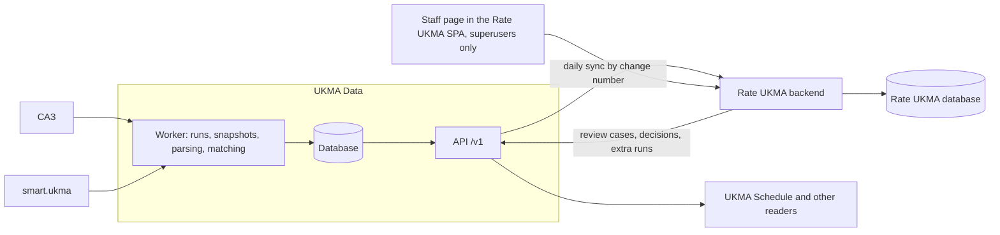
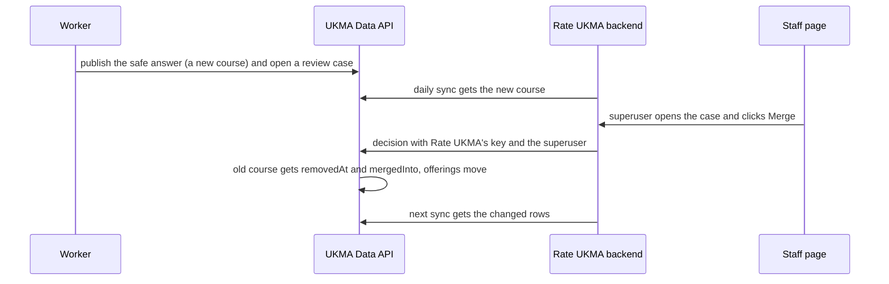

# UKMA Data

UKMA Data collects NaUKMA data from САЗ and smart.ukma on a schedule and serves it over an HTTP API with keys. Rate UKMA is its first reader.

## Motivation

- Rate UKMA already parses course cards, terms, enrollments and course history since 2018, but a developer runs that scraper by hand for 2 to 3 hours. The last enrollment import was on 2026-07-05.
- Rate UKMA knows a course's teachers only from ratings: a student picks teachers when they rate. No offering has an official teacher.
- UKMA Schedule crawls the same САЗ pages every hour on its own. One service can crawl once for both.

## Overview

An unclear match, from the run that finds it to Rate UKMA:

## Decisions

| Area | Decision | Why |
| --- | --- | --- |
| Readers | Every reader is an ordinary consumer, Rate UKMA included. | No single reader shapes the API. |
| | Rate UKMA keeps its own copy of the data it needs and syncs once a day. | When the service is down, Rate UKMA keeps working. Its data only gets older. |
| Data | Keep every year that САЗ shows, and students with full name and email. | Rate UKMA shows student names today. |
| | Group offerings into courses across years. | Every reader needs the same course identity. |
| | Link smart.ukma teachers to offerings by title, department, term and credits. | No code joins the two sources. smart.ukma has an `optimaCode` from the university's Optima system, but it was empty in every sampled row. |
| | The service decides clear cases itself. An unclear case gets the safe answer at once and waits for staff review. | One unclear course does not block the others, and the safe answer is easy to undo. |
| Crawling | A scheduled worker crawls. A key with the right scope can ask for an extra run. | Load on САЗ does not grow with the number of readers. |
| | The worker signs in with a team member's own account. | There is no service account yet. |
| Access | Every request needs a key, and every endpoint needs a scope. Scopes are granular, one per resource and action. A new key gets the scopes without personal data. | One check for every endpoint, and personal data only for keys that ask for it. |
| | Scopes sit on the key. No roles. | With a few keys, roles add a second concept. |
| Build | TypeScript with Effect 4. | One schema gives validation and the OpenAPI file. UKMA Schedule's САЗ crawler already runs on it. |
| | The service has no UI. Staff use a small section in the Rate UKMA SPA, open only to Rate UKMA superusers. Every action there is an API call through Rate UKMA's backend. | No second frontend to build and deploy. Everything the section does also works without it. |
| Hosting | Rate UKMA monorepo, own folder and own database. | Shared context and CI. HTTP is the only link to Rate UKMA. |
| | Kubernetes on Hetzner, set up with Terraform ([deployment](deployment-infrastructure.md)). | Rate UKMA already runs on Hetzner. Terraform keeps the new cluster in code. |
| | `data.rateukma.com` | `rateukma.com/api/` is already Rate UKMA's API. |
| Observability | Sentry for errors, logs and alerts from the first release. | Rate UKMA already uses it. Rate UKMA keeps working when the service fails, so without alerts a failure is silent. |

## Glossary

- **САЗ**: my.ukma.edu.ua, where students register for courses.
- **smart.ukma**: smart.ukma.edu.ua, the university system that lists teachers and their disciplines.
- **Course page**: the САЗ page `/course/{id}`. It shows the card and loads the enrollments from the students page `/course/{id}/students`.
- **Offering**: one САЗ course card, that is, one course in one academic year. It runs in one or more terms.
- **Term**: one season of one academic year, written `2026-27-FALL`. Both years are in the id because САЗ and Rate UKMA count years differently.
- **Course**: the offerings of one subject across years.
- **Programme**: a study programme that an offering counts for, as compulsory, professionally oriented or elective.
- **Instructor**: a teacher from smart.ukma.
- **Student**: a person from САЗ students pages, with email, last name, first name, patronymic and programme.
- **Enrollment**: one student on one offering, with a status and a group.
- **Run**: one pass of the worker over one part of a source, for example САЗ courses of 2026-27.
- **Page snapshot**: an HTML page without the parts that change on every request, such as the security token, or a JSON response as it came. It keeps the page's tables and labels, so a later parser can read new fields from it.
- **Review case**: a match the service could not decide, published with its safe answer and waiting for staff.
- **Decision**: a staff answer to a review case, stored as its own row.
- **Change number**: the number of the last change to a row, from one counter for the whole service.
- **Scope**: one permission on a key.

## Rules

1. Ids are ours, permanent and opaque, with a type prefix (`off_...`). Source ids, like the САЗ code, are only lookup keys.
2. The worker stores a page snapshot when its hash changes, then parses the snapshot. A parser fix re-parses stored snapshots and sends no request to the source. Raw HTML is kept only when a snapshot fails.
3. A run visits each course page once and fetches its card and enrollments together.
4. Soft delete: no row is ever deleted. A row that leaves its source gets `removedAt` and keeps its id. For example, САЗ drops the 2025-26 card of «Вступ до аналізу даних». The offering gets `removedAt: 2026-10-03`, readers hide it, and ratings on it stay valid. If the card comes back, `removedAt` is cleared.
5. Every change, removals included, gets the next number from one counter, and writes take turns, so the numbers appear in order. A reader keeps one saved number per list, asks each list for rows above its number, and saves the list's new number only after it has stored every page of it. Readers never sync by time: a slow write can appear after a later one and be skipped.
6. A run publishes new and changed rows at once. It removes rows only when it read its whole part of the source without errors, so a partial crawl removes nothing. When it would remove more of the offerings it covers than a set threshold allows, it holds the removals as a review case and publishes the rest. A page that fails to parse keeps its last good version and becomes a review case.
7. An offering can run in more than one term, for example in fall and in spring. The service stores every term of an offering and has no single "semester" field. Rate UKMA picks one term for its own semester field when it syncs, as its importer does today.
8. The service keeps what it read from a page apart from what it works out from it: which course an offering belongs to and which teachers teach it. These links are computed from stored pages plus decisions. A better matching rule runs again on stored data and needs no new crawl.
9. The first import takes Rate UKMA's current courses as the course groups, so every course and its ratings keep their place. When the service is not sure, it picks the answer that is easy to undo: a new course rather than a merge, and no teacher link rather than a guess. The matching rules are not fixed here: they start simple and change as we work with the data.
10. A decision only changes rows, and readers get it with their next sync. Staff can merge two courses or split one. When two courses merge, the old course gets `removedAt` and `mergedInto`, the id of the course that now holds its offerings. A split moves some offerings to a new course, for example when one title covers two different courses of two programmes.
11. Every change has a trail. Each run records the rows it added, changed and removed. Each decision records who made it (the key, and the superuser when it came from the staff section), when, and the rows it changed. The staff section shows both.
12. Adding a source needs no change to the database schema.

## API

JSON under `/v1`. The OpenAPI file is generated from the code and is the contract, so this spec names only resources and scopes. Paths and filters can change until a second reader depends on them. After that, a breaking change needs `/v2`.

| Resource | Holds | Scope |
| --- | --- | --- |
| Reference lists | terms, faculties, departments, programmes | Read catalog |
| Courses | a course, its offerings, `mergedInto` | Read catalog |
| Offerings | one САЗ card with its terms and programmes | Read catalog |
| Instructors | teachers, their emails, what they teach | Read instructors |
| Students | full name, email, programme | Read students |
| Enrollments | a student on an offering, status, group | Read students |
| Runs | runs and data freshness | Read runs |
| | an extra run of one source part | Start runs |
| Review cases | open cases, their safe answers, decisions | Decide review cases |

Every list takes the change number a reader saved and uses cursor pagination. Every response says when its data was last updated.

## Access and personal data

- A key goes in a header. It is shown once, stored as a hash, expires and can be revoked.
- The first key comes from the service's command line. Every later key is made with a key that can manage keys.
- Scopes are picked when a key is created. To change them, issue a new key and revoke the old one.

| Scope | Gives | Default |
| --- | --- | --- |
| Read catalog | terms, faculties, departments, programmes, courses, offerings | yes |
| Read runs | runs and data freshness | yes |
| Read instructors | teachers, their emails, what they teach | no |
| Read students | students and enrollments | no |
| Start runs | an extra run | no |
| Decide review cases | review cases and decisions | no |
| Read snapshots | page snapshots, which carry student names | no |
| Read audit log | the audit log | no |
| Manage keys | create and revoke keys | no |

- Example keys: Rate UKMA has the defaults plus instructors, students, start runs and decide review cases. UKMA Schedule has the defaults plus students. The team's own key has every scope, and only it can manage keys.
- In the staff section, Rate UKMA's backend checks that the user is a superuser, then calls the service with Rate UKMA's key. The browser never holds a key.
- The audit log records key changes, extra runs, decisions and every read of student data. It stores no data values.
- No real student data in fixtures, logs, screenshots or issues.

## Observability

Rate UKMA keeps working when the service fails, so nobody sees a failure unless something reports it. For example, САЗ renames a field on the course card. Every page fails to parse and keeps its last good version, so the data stops changing and no user sees an error.

Every run and Rate UKMA's daily sync report when they finish, and an alert fires when one stops reporting. The tool for this is TBD. Sentry events and logs carry ids and counts, never student names, emails or page content.

Each signal alerts when it crosses a threshold. Thresholds are settings. Each gets a starting value before the first release and is tuned after the first weeks of real runs.

| Signal | Seen in |
| --- | --- |
| A run fails, including a failed САЗ sign-in | Sentry |
| A source part, or Rate UKMA's sync, has no successful run for too long | TBD |
| Pages that fail to parse in one run | Sentry, staff section |
| Open review cases, and the age of the oldest | Sentry, staff section |
| Requests to САЗ and their errors (429, 5xx), requests per key | Sentry, staff section |

## Done when

- Rate UKMA syncs from the service every day, works with the service stopped, and `src/backend/scraper` is deleted.
- Every САЗ code that Rate UKMA holds for 2018 to 2025 exists in the service.
- Some 2026-27 offerings in Rate UKMA have a teacher.

## Out of scope

Not planned:

- keys that students create, and a sign-in page for keys;
- a separate change feed, because lists by change number cover it;
- a UI inside the service;
- write endpoints other than an extra run and decisions;
- live seat counts.

Later, no priority now:

- САЗ schedule files.
- Metrics dashboards and tracing beyond Sentry (Prometheus, Loki), with the observability ADR from the [deployment](deployment-infrastructure.md) doc.
