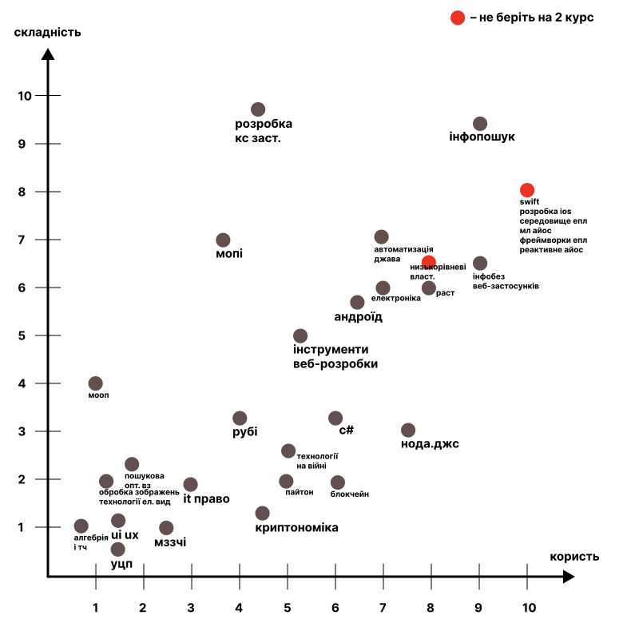
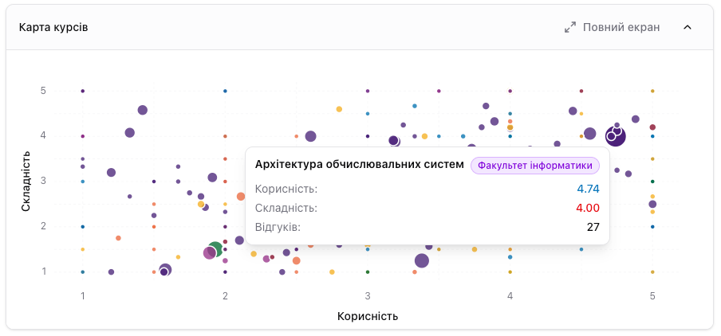

<!-- _class: lead -->
<!-- _paginate: false -->

Rate <strong>UKMA</strong>

Генеративний ШІ в розробці програмного забезпечення

# План на семестр

Вересень 2026, rateukma.com

<!--
Добрий день. Ми плануємо продовжити роботу над Rate UKMA: продукту вже рік, ним реально користуються студенти.
-->

---

## Проблема

Щоб дізнатися, що за курс, доводилося ходити й питати.

<svg class="dg wide" viewBox="0 0 1000 130" role="img" aria-label="Де студенти шукали досвід про курси">
<defs><marker id="p2" viewBox="0 0 8 8" refX="7.5" refY="4" markerWidth="8" markerHeight="8" orient="auto"><path d="M0 0 L8 4 L0 8 z" class="hd ac"/></marker></defs>
<rect class="bd" x="0" y="20" width="280" height="90" rx="12"/>
<text x="24" y="56">Старшокурсники</text>
<text class="mu" x="24" y="86">хто вже брав</text>
<path class="ln ac" d="M280 65 H336" marker-end="url(#p2)"/>
<rect class="bd" x="340" y="20" width="280" height="90" rx="12"/>
<text x="364" y="56">Друзі й знайомі</text>
<text class="mu" x="364" y="86">хто що чув</text>
<path class="ln ac" d="M620 65 H676" marker-end="url(#p2)"/>
<rect class="bd" x="680" y="20" width="320" height="90" rx="12"/>
<text x="704" y="56">Відповіді по шматочках</text>
<text class="mu" x="704" y="86">ніде не зібрані разом</text>
</svg>

Тепер це в одному місці: оцінки й відгуки студентів.

<!--
Трохи повернемося в часі. У САЗ ти бачиш назву, кредити й, можливо, анотацію. Кредити показують загальне навантаження, а не реальне. Тому йдеш питати знайомих, друзів, старшокурсників: чи курс реально якісний. Відгуки ніде не лежали разом: усе збирав по шматочках і складав пазл у голові. Rate UKMA закриває цей пробіл: усі відгуки в одному місці.
-->

---

## Як усе почалося

На одному з предметів був вибір тем проєкту, і ми згадали саморобний графік курсів.

Тоді: графік із чату

Зараз: карта курсів у продукті

Графік дав ідею, а ми перетворили її в продукт.

<!--
А почалося все з предмета: там був вибір теми проєкту, і згадався графік курсів, який нам раніше кидали в чат. Ми фактично перетворили його в частину функціоналу Rate UKMA: той самий графік зі складністю й корисністю, тільки дані оновлюються в реальному часі, коли хтось додає відгук.
-->

---

## Rate UKMA сьогодні

<i></i>Rate <b>UKMA</b>

<h4>Функціональне програмування</h4>

<b>Бакалавр</b>Факультет інформатики

ІПЗКН4 ECTSОсіньЗаписи в САЗ 19

3.4

Складність

Стандартне навантаження

2.5

Корисність

Знання застосовні

Відгуки студентів <b>15</b>Найпопулярніші

<u></u>Анонімний відгукОсінь 2025Складність <b class="h">4.0</b> Корисність <b class="u">1.0</b>

Багато теорії й щотижневі лаби, але без Haskell далі важко розуміти інші мови.

<u></u>Анонімний відгукОсінь 2025Складність <b class="h">3.0</b> Корисність <b class="u">3.0</b>

Лектор відповідає на питання, головне не накопичувати завдання до кінця семестру.

<u></u>Анонімний відгукОсінь 2024Складність <b class="h">4.0</b> Корисність <b class="u">2.0</b>

Проєкт замість екзамену, захист наживо.

Рік у проді, вхід лише з поштою ukma.edu.ua

<!--
Rate UKMA сьогодні це платформа для оцінки курсів Могилянки. Оцінки й текстові відгуки залишають студенти, які ці курси проходять або проходили, а зайти можна тільки з корпоративної пошти.
-->

---

## Де ми зараз

- **~300 студентів** щомісяця
- **1 700 оцінок**, 830 текстових
- **520 курсів** з оцінками

<svg class="dg" viewBox="0 0 480 230" role="img" aria-label="Оцінки по місяцях">
<rect class="bar lite" x="0" y="196" width="34" height="4"/>
<rect class="bar lite" x="44" y="146" width="34" height="54"/>
<rect class="bar lite" x="88" y="199" width="34" height="1"/>
<rect class="bar" x="132" y="30" width="34" height="170"/>
<rect class="bar lite" x="176" y="122" width="34" height="78"/>
<rect class="bar lite" x="220" y="177" width="34" height="23"/>
<rect class="bar lite" x="264" y="180" width="34" height="20"/>
<rect class="bar lite" x="308" y="187" width="34" height="13"/>
<rect class="bar lite" x="352" y="191" width="34" height="9"/>
<rect class="bar lite" x="396" y="197" width="34" height="3"/>
<text class="mu" x="0" y="222" font-size="13">лис</text>
<text class="mu" x="44" y="222" font-size="13">гру</text>
<text class="mu" x="88" y="222" font-size="13">лют</text>
<text class="ac" x="126" y="222" font-size="13">бер</text>
<text class="mu" x="176" y="222" font-size="13">кві</text>
<text class="mu" x="220" y="222" font-size="13">тра</text>
<text class="mu" x="264" y="222" font-size="13">чер</text>
<text class="mu" x="308" y="222" font-size="13">лип</text>
<text class="mu" x="352" y="222" font-size="13">сер</text>
<text class="mu" x="396" y="222" font-size="13">вер</text>
<text class="ac" x="132" y="22" font-size="14">794</text>
</svg>

Оцінки по місяцях

<!--
Уже понад тисячу сімсот оцінок, тисяча двісті пʼятдесят користувачів і триста студентів щомісяця.
-->

---

## Репозиторій

<b>564</b> коміти з вересня 2025

<b>368</b> змерджених PR

<b>44 000</b> рядків коду

<b>844</b> тести, покриття бекенду 87%

<b>10</b> ADR

<a href="https://github.com/ukma-cs-ssdm-2025/rate-ukma">github.com/ukma-cs-ssdm-2025/rate-ukma</a>

Стек

Python
Django
TypeScript
React
TanStack
Tailwind
Postgres
Redis
Docker
Hetzner
Sentry
Actions

CI на кожен PR: лінт, типи, тести, e2e на Playwright, DORA-метрики.

<!--
Що до репозиторію й стека, то тут усе зображено: понад пʼятсот комітів, понад триста змерджених PR, тести і сорок чотири тисячі рядків коду.
-->

---

## Команда

| Хто                  | GitHub |
|----------------------|---|
| Анастасія Алексєєнко | @stasiaaleks |
| Катерина Братюк      | @katerynabratiuk |
| Андрій Валеня        | @Fybex |
| Мілана Горалевич     | @miqdok |
| Анастасія Двойленко  | @anastasiaaq |

Усі інженери, без окремих аналітиків і тестувальників.

<!--
Наша команда це пʼятеро людей: Настя приєдналася недавно, до цього нас було четверо. Окремих аналітиків чи тестувальників немає, всі пишемо код і ревʼюємо одне одного.
-->

---

## Що робимо цього семестру

### Зараз

<h3>1. Планувальник ІНП</h3>

Катерина Братюк, Анастасія Двойленко

<h3>2. Парсер САЗ</h3>

Андрій Валеня, Анастасія Алексєєнко

<h3>3. Аналітика</h3>

Мілана Горалевич

### Беклог

<h3>4. Рекомендації</h3>

Що брали студенти зі схожим набором курсів

<h3>5. Сповіщення</h3>

Нагадати оцінити курс, відповіли на коментар

<h3>6. Мітки з відгуків</h3>

ШІ зводить відгуки до ярликів для фільтра

<!--
У плані шість великих ініціатив, але зараз беремо три: планувальник ІНП, парсер САЗ і аналітику. Решта чекає в беклозі.
-->

---

## 1. Планувальник ІНП

Дисциплін багато, а кредити рахуєш руками.

<h4>Теорія ігор</h4>
Додати в ІНП

<b>Бакалавр</b>Факультет інформатики

КН3 ECTSОсіньвільний вибір

Класичні й сучасні моделі теорії ігор, рівноваги, аукціони, кооперативні ігри та задачі на стратегічну поведінку.

2.8

Складність

Помірне навантаження

4.1

Корисність

Знання застосовні

ІНП на 4 курс Варіант A

<b>60 / 60</b> кредитів

<b>25 / 25</b> вільного вибору

<table>
<tr><th>Семестр</th><th>Курси</th><th>Кредити</th></tr>
<tr><td>Осінь</td><td>Паралельне програмування, 4 крГенеративний ШІ, 3 крТеорія ігор, 3 кр</td><td>24</td></tr>
<tr><td>Весна</td><td>Комп'ютерна графіка, 4 крБлокчейн, 4 кр+ 3 кредити</td><td>24</td></tr>
<tr><td>Літо</td><td>Кваліфікаційна робота, 12 кр</td><td>12</td></tr>
</table>

Зробимо додавання зі сторінки курсу, автоматичні ліміти і кілька варіантів ІНП.

<!--
Дисциплін багато, а кредити рахуєш руками: зібрати курси, додати в корзину й перевірити, чи виходить потрібна кількість, зараз важко. Хочемо це спростити: комбінувати курси й дивитися різні варіанти. У Rate UKMA вже є відгуки, тож логічно збирати ІНП тут. Навесні буде зручніше й швидше.
-->

---

## 2. Парсер САЗ

Парсер є, але заливка даних руками це 2-3 години розробника.

<svg class="dg wide" viewBox="0 0 1000 120" role="img" aria-label="Сервіс даних між САЗ і Rate UKMA">
<defs><marker id="p1" viewBox="0 0 8 8" refX="7.5" refY="4" markerWidth="8" markerHeight="8" orient="auto"><path d="M0 0 L8 4 L0 8 z" class="hd ac"/></marker></defs>
<rect class="bd" x="0" y="20" width="280" height="80" rx="12"/>
<text x="22" y="52">my.ukma.edu.ua</text>
<text class="mu" x="22" y="78">каталог, місця, викладачі</text>
<path class="ln ac" d="M280 60 H356" marker-end="url(#p1)"/>
<rect class="bd ac" x="360" y="20" width="280" height="80" rx="12"/>
<text class="ac" x="382" y="48">Сервіс даних</text>
<text class="mu" x="382" y="72" font-size="16">оновлює дані сам,</text>
<text class="mu" x="382" y="90" font-size="16">бачить, що змінилося</text>
<path class="ln ac" d="M640 60 H716" marker-end="url(#p1)"/>
<rect class="bd now" x="720" y="20" width="280" height="80" rx="12"/>
<text class="wh" x="742" y="52">Rate UKMA</text>
<text class="wh" x="742" y="78" font-size="16">курси, оцінки, план</text>
</svg>

<!--
Друге, дані. Ми отримуємо багато даних із САЗ, щоб валідувати, хто що може оцінювати, і поки це мануальний процес. Хочемо підтягнути парсер, щоб він валідував сам, а ми чисто бачили, що саме змінилося в даних.
-->

---

## 3. Аналітика

Не бачимо, як студенти користуються продуктом. Приклад: почав писати відгук і кинув.

<svg class="dg wide" viewBox="0 0 1000 240" role="img" aria-label="Воронка від входу до оцінки, яку ми не вимірюємо">
<rect class="bar" x="0" y="0" width="1000" height="46" rx="8"/>
<text class="wh" x="18" y="30">Зайшли на сайт</text>
<text class="wh" x="982" y="30" text-anchor="end">?</text>
<rect class="bar" x="0" y="62" width="760" height="46" rx="8" opacity="0.78"/>
<text class="wh" x="18" y="92">Відкрили сторінку курсу</text>
<text class="wh" x="742" y="92" text-anchor="end">?</text>
<rect class="bar" x="0" y="124" width="520" height="46" rx="8" opacity="0.56"/>
<text class="wh" x="18" y="154">Почали писати відгук</text>
<text class="wh" x="502" y="154" text-anchor="end">?</text>
<rect class="bar" x="0" y="186" width="280" height="46" rx="8" opacity="0.34"/>
<text class="wh" x="18" y="216">Відправили оцінку</text>
<text class="wh" x="262" y="216" text-anchor="end">?</text>
</svg>

Зробимо події у кілька рядків, щоб на кожній новій фічі бачити, чи нею користуються.

<!--
Третє, аналітика, ще одна чорна зона. Ми не бачимо цифр: де люди відвалюються, що і скільки роблять. Не можемо нормально тестувати новий функціонал і розуміти, чому, наприклад, хтось почав писати відгук і передумав.
-->

---

## Як працюємо з ШІ

### Що вже є

- Агент пише **код і доки**, відкриває PR, стежить за CI
- **CodeRabbit і Greptile** перед людським рев'ю
- Правила для агентів: **`AGENTS.md`** на бек і фронт

### Куди рухаємось далі

- Покращимо **коментарі й тести агента**
- Синхронізуємо **`AGENTS.md`** з реальним процесом
- Навчимо **CodeRabbit і Greptile** наших правил
- Перенесемо очевидні перевірки в **лінтер**

<!--
Тут коротко про те, як ми працюємо з ШІ. До цього можемо повернутися.
-->

---

<!-- _class: closing -->
<!-- _paginate: false -->

Rate <strong>UKMA</strong>

# Дякуємо за увагу. Раді відповісти на питання

rateukma.com

Ця презентація зроблена з ШІ та вичитана людьми)

<!--
І загалом це все, дякую за увагу.
-->
