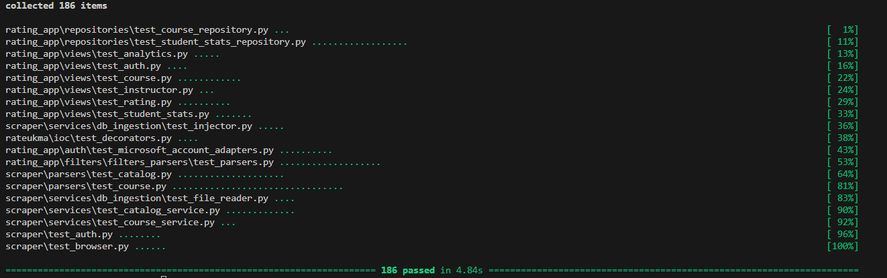

# SonarCloud Refactoring Report

## Overview

This week’s refactoring cycle focused on improving code reliability, reducing minor code smells, and further cleaning up the code duplication footprint across backend modules.
All updates were verified through SonarCloud analysis and confirmed by automated regression tests.

---

## SonarCloud Metrics | Evolution

| Metric               | Before (30.10) | After (05.11) |
|----------------------|----------------|---------------|
| **Maintainability**  | A              | A             |
| **Reliability**      | E              | A             |
| **Duplicated Lines** | 0.04 %         | 0.01 %        |

<small>Note: the only issue left is a harmless to-do comment (severity: info)</small>

---

## Refactoring Highlights

See [#211](https://github.com/ukma-cs-ssdm-2025/rate-ukma/issues/211) for the full commit history.

### Cognitive Complexity Reduction

- Simplified deeply nested functions (`_get_base_class_names`, `_build_login_page_success`, `fetch_details_by_ids`) using early returns and helper extraction.  
- Replaced redundant conditionals and recursion patterns with explicit, intentional logic.  
- Introduced utility helpers (e.g. `_serialize_filters`, field mapping helpers) to isolate repeated transformations.  
- Significantly reduced SonarCloud “Cognitive Complexity” warnings in `rating_app` and `rateukma` modules.

### Backend Structural Cleanup

- Standardized text-based fields (`description`, `name`, `title`, etc.) to use `blank=True, default=""` instead of `null=True` for schema consistency.  
- Added safe migrations reflecting new defaults.  
- Extracted duplicated literals like `"Not found"` and `"Invalid"` into shared constants.  
- Removed unnecessary `async` keywords, redundant imports, and obsolete helper methods.  
- Fixed minor argument mismatches and clarified `reset()` behavior for better readability.

### Frontend Sonar Improvements

- Replaced conditional rendering blocks with nested ternaries for improved readability and reduced branching depth.
- Reduced JSX nesting complexity and improved function readability.  
- Simplified data-fetching logic to align with backend API responses.  
- Improved comments, naming, and adherence to SonarCloud linting rules.

---

## Regression Testing Results

All regression tests passed successfully. No functional regressions were introduced.

---

## Summary  

This refactoring cycle brought major reliability improvements, taking the project from E → A on SonarCloud.
By simplifying complex logic, standardizing model definitions, and tightening frontend components, the codebase is now more stable and consistent across both backend and frontend layers.
Maintainability remains strong at A, duplication continues to decline, and all regression tests confirm a fully stable release.
