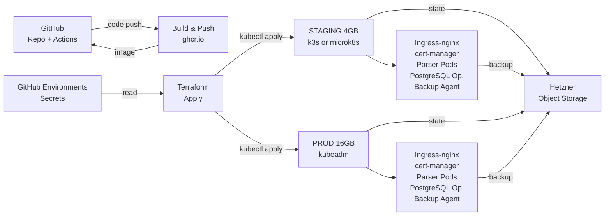

# Deployment Infrastructure Specification: Parser Service

## Overview

The parser service (currently a Django app within the monolith at `src/backend/scraper/`, run only via ad-hoc management commands) is being extracted into a standalone, independently deployable service. This specification documents how that service will be deployed across two environments (staging and production): a Kubernetes cluster provisioned with Terraform on self-managed VMs via Hetzner, a self-hosted PostgreSQL database within each cluster, container image builds and pushes via the existing GitHub Actions CI, and a publicly exposed API endpoint (API design and business logic are out of scope).

## Problem Space

### Functional Requirements

- Standalone service: independently deployable from the rate-ukma monolith, with its own release/deployment lifecycle.
- Two deployment environments: staging (for testing, non-critical load) and production (for live parser operations).
- Own database: a PostgreSQL instance per environment, not shared with the main rate-ukma application.
- Public API: the service's HTTP endpoint(s) are reachable by external clients; internal routing/DNS details are not in scope.
- Container-based: packaged and deployed via container images, built once and run everywhere.

### Non-Functional Requirements & Constraints

- **Monorepo coexistence**: deployment configuration (Terraform, Kubernetes manifests) is stored in the rate-ukma repository for now, in a new `infra/parser-service/` or similar subdirectory, with the understanding that this may be extracted to a separate infrastructure repository in the future.
- **Reuse existing CI**: the parser service must not require a new CI system; deployment is triggered via the existing GitHub Actions workflows (`.github/workflows/`), extended with parser-specific build and rollout steps.
- **Reuse existing cloud provider**: follow ADR-0007 and continue using Hetzner Cloud for VM provisioning, avoiding vendor lock-in to a new cloud or managed Kubernetes service (EKS, GKE, AKS).
- **Resource-conscious sizing**: staging is budgeted at 4GB RAM (lightweight Kubernetes distro, fewer concurrent pods); production is budgeted at 16GB RAM (standard Kubernetes distro, single node, no multi-node HA). Both are single-node clusters.
- **Environment isolation**: maintain the blast-radius isolation achieved in ADR-0007 — staging and production failures must not affect each other. Achieved via fully separate clusters on separate VMs.
- **No multi-node HA yet**: today, each cluster is a single node. Multi-node high-availability is out of scope pending traffic/uptime requirements.

### Explicitly Out of Scope

- API design and endpoint specification.
- Observability (metrics, logging, tracing, alerting) — see Appendices: Open Questions.
- Multi-node Kubernetes cluster design and cross-node networking.
- GitOps tooling (e.g., ArgoCD) and continuous deployment reconciliation.
- Disaster recovery and cross-region replication.

## Architecture Diagram

---

## Solution Space

### 1. Cloud Substrate (where to run Kubernetes)

| Option                              | Pros                                                          | Cons                                             | Decision      |
| ----------------------------------- | ------------------------------------------------------------- | ------------------------------------------------ | ------------- |
| **Managed K8s (EKS, GKE, AKS)**     | Zero control-plane ops; vendor HA.                            | Vendor lock-in; control-plane costs; new vendor. | ✗             |
| **Self-managed K8s on Hetzner VMs** | Reuses Hetzner (ADR-0007); full control; lower per-node cost. | We own patching, upgrades.                       | ✓ **Decided** |

**Rationale:** Reuses existing vendor and team experience from ADR-0007; avoids new vendor lock-in and managed service costs.

### 2. Cluster Topology

| Option                          | Pros                                                                    | Cons                                                    | Decision      |
| ------------------------------- | ----------------------------------------------------------------------- | ------------------------------------------------------- | ------------- |
| **One cluster, two namespaces** | Single control plane; lower cost.                                       | Shared failure domain; resource contention across envs. | ✗             |
| **Two separate clusters**       | Complete blast-radius isolation (mirrors ADR-0007); resource isolation. | Double control-plane ops; higher cost.                  | ✓ **Decided** |

**Rationale:** Maintains ADR-0007's per-environment isolation principle; production stability worth the ops cost.

---

### 3. Kubernetes Distribution per Environment

| Option                                                              | Pros                                              | Cons                                                            | Decision      |
| ------------------------------------------------------------------- | ------------------------------------------------- | --------------------------------------------------------------- | ------------- |
| **Same distro both** (e.g., k3s everywhere)                         | Consistency; same ops/troubleshooting.            | k3s is lightweight; prod needs standard K8s without constraints. | ✗             |
| **Lightweight staging, standard prod** (k3s/microk8s vs. kubeadm)   | Efficient 4GB staging; full standard K8s on prod. | Distro differences between envs.                                | ✓ **Decided** |

**Rationale:** Staging: k3s or microk8s (lightweight, optimized for 4GB node). Production: kubeadm (standard, full-featured Kubernetes on 16GB node with no resource trade-offs).

### 4. Database: Managed Service / In-Cluster

| Option                                           | Pros                                                                   | Cons                                                                                   | Decision      |
| ------------------------------------------------ | ---------------------------------------------------------------------- | -------------------------------------------------------------------------------------- | ------------- |
| **Managed Postgres (RDS, Hetzner managed)**      | Vendor-managed HA, backups, monitoring.                                | Vendor dependency, cost, external service, new account.                                | ✗             |
| **Self-hosted Postgres in K8s (operator)**       | Self-contained; full control; operator automates init/backups/scaling. | We own maintenance, backup reliability, operator monitoring.                           | ✓ **Decided** |
| **Juju charms (Postgres charm deployed on K8s)** | Declarative charm-based deployment; Canonical support.                 | Adds Juju runtime/tooling; less native to K8s ecosystem; Juju-specific learning curve. | ✗             |

**Rationale:** K8s operators (CloudNativePG or Zalando postgres-operator) are the native K8s approach for lifecycle management; tighter integration with K8s APIs, RBAC, and declarative manifests. Juju is an alternative orchestration layer, better suited to multi-cloud deployments outside K8s, and would introduce another dependency/tool. Operators keep the infra self-contained and auditable in the repository.

### 5. Database Availability

| Option                                                          | Pros                                                                       | Cons                                                                      | Decision          |
| --------------------------------------------------------------- | -------------------------------------------------------------------------- | ------------------------------------------------------------------------- | ----------------- |
| **Single instance + backups** (to object storage)               | Simple, low resource cost; straightforward recovery (restore from backup). | Manual restore required; brief downtime; no automatic failover.           | ✗                |
| **HA with standby replica** (primary + replica, auto-promotion) | Automatic failover; near-zero downtime; high availability.                 | Higher resource cost (2 Postgres pods); operator complexity; replica lag. | ✓ **Decided**    |

**Decided:** HA with primary + 1 standby replica, automatic promotion on primary failure.

**Rationale:** HA provides automatic failover and near-zero downtime, essential for a parser service handling live data ingestion. While resource cost is higher (2 Postgres pods), both the 16GB prod node and 4GB staging node can accommodate a single replica each. The operator (CloudNativePG or Zalando) handles lifecycle automation (init, backup, failover). Backup strategy remains: backups still go to Hetzner Object Storage for disaster recovery (data loss protection, not just failover).

### 6. Container Image Build & Registry

| Option                       | Pros                                                                         | Cons                                                     | Decision      |
| ---------------------------- | ---------------------------------------------------------------------------- | -------------------------------------------------------- | ------------- |
| **ghcr.io + GitHub Actions** | Zero new accounts; images alongside code; team familiar with GitHub Actions. | GitHub-tied; images require re-push to other registries. | ✓ **Decided** |
| **Docker Hub**               | Widely used; free tier.                                                      | Separate account/credentials; extra management overhead. | ✗             |
| **Self-hosted registry**     | Full control.                                                                | Another service to operate, backup, monitor.             | ✗             |

**Rationale:** Reuses existing GitHub Actions CI; no new tooling or credentials needed.

### 7. Secrets & Configuration Management

| Option                                           | Pros                                                        | Cons                                                                                  | Decision      |
| ------------------------------------------------ | ----------------------------------------------------------- | ------------------------------------------------------------------------------------- | ------------- |
| **K8s Secrets (GitHub Env Secrets → Terraform)** | Simple, built-in; matches ADR-0007 pattern; no new tooling. | Secrets at-rest in etcd unencrypted by default (mitigated by etcd encryption config). | ✓ **Decided** |
| **Sealed Secrets / SOPS**                        | Version-controlled secrets; GitOps-friendly.                | New tooling; sealing/unsealing overhead; key management.                              | ✗             |
| **External manager (Vault, KMS)**                | Centralized; audit logs; rotation.                          | Vendor lock-in; operational overhead; new auth mechanism.                             | ✗             |

**Rationale:** Reuses ADR-0007 pattern (GitHub Environment secrets + Terraform); no new tooling. Secrets stored in K8s Secrets; enable etcd encryption at rest for added confidentiality.

### 8. Ingress & TLS

| Option                            | Pros                                                                                                         | Cons                                                    | Decision      |
| --------------------------------- | ------------------------------------------------------------------------------------------------------------ | ------------------------------------------------------- | ------------- |
| **ingress-nginx + cert-manager**  | CNCF-backed; cert-manager automates TLS renewal; closest to ADR-0007 Nginx+Certbot (declarative K8s-native). | Learning curve; new component to monitor.               | ✓ **Decided** |
| **Traefik**                       | Modern; auto service discovery; ingress+routing+TLS unified.                                                 | Less familiar to team; different from nginx.            | ✗             |
| **Manual Nginx + Certbot in pod** | Mirrors ADR-0007 setup.                                                                                      | Stateful pod; manual renewal scripting; not K8s-native. | ✗             |

**Rationale:** CNCF-backed production components; cert-manager automates Let's Encrypt renewal. Closest match to current setup but K8s-native. Team's Nginx knowledge transfers directly.

### 9. Terraform State Backend

| Option                                                     | Pros                                                                      | Cons                                                                | Decision      |
| ---------------------------------------------------------- | ------------------------------------------------------------------------- | ------------------------------------------------------------------- | ------------- |
| **Remote backend (Hetzner Object Storage, S3-compatible)** | Shared state; locking prevents concurrent corruption; no local file sync. | Requires S3-compatible bucket + credentials.                        | ✓ **Decided** |
| **Local state file**                                       | Simplicity; no external service.                                          | Merge conflicts; embedded credentials (security risk); state drift. | ✗             |

**Rationale:** Remote backend with locking prevents concurrent apply corruption. Hetzner Object Storage provides S3-compatible API. Credentials in GitHub Environments, passed to Terraform via CI.

### 10. CI/CD Pipeline Shape

| Option                                       | Pros                                                | Cons                                                                       | Decision      |
| -------------------------------------------- | --------------------------------------------------- | -------------------------------------------------------------------------- | ------------- |
| **Extend GitHub Actions workflows**          | Reuses existing CI; team familiar; minimal tooling. | Can become complex; additional workflow files to maintain.                 | ✓ **Decided** |
| **New CI system** (GitLab CI, Jenkins, Argo) | Tailored to K8s deployments.                        | Abandons GitHub Actions investment; new tool burden; operational overhead. | ✗             |

**Rationale:** Reuses mature GitHub Actions setup and team expertise. Extend existing workflows (build → push → terraform apply → kubectl rollout); no new tooling.

---

## Summary

| Aspect                  | Staging                                                | Production                                             | Notes                                                                                                                                     |
| ----------------------- | ------------------------------------------------------ | ------------------------------------------------------ | ----------------------------------------------------------------------------------------------------------------------------------------- |
| **Compute**             | 4GB Hetzner VM                                         | 16GB Hetzner VM                                        | Self-managed, separate VMs per environment.                                                                                               |
| **Kubernetes Distro**   | k3s or microk8s (lightweight)                          | kubeadm (standard Kubernetes)                          | Lightweight distro for staging's 4GB constraint; standard full-featured K8s for prod's 16GB node.                                       |
| **Cluster Topology**    | Single-node cluster                                    | Single-node cluster                                    | Separate clusters for blast-radius isolation.                                                                                             |
| **Database**            | PostgreSQL (primary + 1 replica)                       | PostgreSQL (primary + 1 replica)                       | Self-hosted via operator (CloudNativePG or Zalando); HA with automatic failover. Scheduled backups to Hetzner Object Storage.            |
| **Database HA**         | Configured: primary + 1 standby, auto-promotion       | Configured: primary + 1 standby, auto-promotion        | Automatic failover on primary failure; near-zero downtime RTO. Backups protect against data loss (disaster recovery).                  |
| **Image Registry**      | GitHub Container Registry (ghcr.io)                    | GitHub Container Registry (ghcr.io)                    | Built via GitHub Actions, pushed per commit/release.                                                                                      |
| **Ingress & TLS**       | ingress-nginx + cert-manager                           | ingress-nginx + cert-manager                           | Let's Encrypt certificates; automatic renewal.                                                                                            |
| **Secrets Management**  | GitHub Env Secrets → K8s Secrets (via Terraform + CI)  | GitHub Env Secrets → K8s Secrets (via Terraform + CI)  | No new secrets tooling; reuses ADR-0007 pattern.                                                                                          |
| **Terraform State**     | Remote backend (Hetzner Object Storage, S3-compatible) | Remote backend (Hetzner Object Storage, S3-compatible) | Locked state per environment to prevent concurrent applies.                                                                               |
| **CI/CD**               | Extended GitHub Actions workflows                      | Extended GitHub Actions workflows                      | Build → push → terraform apply → rollout within existing CI system.                                                                       |
| **Deployment Approach** | Code-driven (Terraform + Kubernetes manifests in git)  | Code-driven (Terraform + Kubernetes manifests in git)  | Infrastructure declared in rate-ukma repository; applied via CI.                                                                          |

---

## References

**Architectural Decision Records (rate-ukma):**

- [ADR-0002: v1.0 Deployment Strategy](../../architecture/decisions/0002-initial-deployment-strategy.md) — Initial single-VM per environment pattern.
- [ADR-0007: Migrate Deployment from AWS EC2 to Hetzner Cloud](../../architecture/decisions/0007-hetzner-deployment.md) — Current production deployment on Hetzner; Docker Compose + Nginx + Certbot; GitHub Environments for secrets.
- [ADR-0003: Technology Stack](../../architecture/decisions/0003-tech-stack.md) — Django/Python backend, React frontend; provides context for container-based deployment.

**Rate-UKMA Codebase:**

- [`.github/workflows/`](../../../.github/workflows/) — Existing CI/CD workflows (build.yml, deploy.yml, prod-pipeline.yml, etc.).
- [`scripts/ci/deploy.sh`](../../../scripts/ci/deploy.sh) — Current deployment script; pattern for extending to Terraform + K8s.
- [`src/backend/scraper/`](../../../src/backend/scraper/) — Parser service codebase to be extracted.

**External Technologies & Documentation:**

- **Kubernetes:**
  - [Kubernetes Official Docs](https://kubernetes.io/docs/)
  - [k3s Documentation](https://docs.k3s.io/)
  - [microk8s Documentation](https://microk8s.io/docs)

- **PostgreSQL Operators (choose one):**
  - [CloudNativePG Documentation](https://cloudnative-pg.io/)
  - [Zalando postgres-operator](https://github.com/zalando/postgres-operator)

- **Kubernetes Add-ons:**
  - [ingress-nginx Controller](https://kubernetes.github.io/ingress-nginx/)
  - [cert-manager Documentation](https://cert-manager.io/docs/)

- **Infrastructure-as-Code:**
  - [Terraform Official Docs](https://www.terraform.io/docs)
  - [Terraform Hetzner Cloud Provider](https://registry.terraform.io/providers/hetznercloud/hcloud/latest/docs)

- **Container Registry:**
  - [GitHub Container Registry (ghcr.io) Docs](https://docs.github.com/en/packages/working-with-a-docker-registry/working-with-the-container-registry)

- **Secrets & State:**
  - [Kubernetes Secrets Docs](https://kubernetes.io/docs/concepts/configuration/secret/)
  - [Terraform Remote State (Backends)](https://www.terraform.io/language/state/remote)
  - [Hetzner Object Storage (S3-compatible)](https://www.hetzner.cloud/docs/object-storage/)

---

## Appendices

### A. Glossary

- **Cluster**: A Kubernetes cluster; in this spec, a single-node cluster (control plane + worker on one machine).
- **k3s**: A lightweight, optimized Kubernetes distribution; uses less CPU/memory, good for resource-constrained nodes (staging). Production-ready but designed for edge/IoT.
- **microk8s**: Another lightweight Kubernetes distro (Canonical); alternative to k3s for staging with similar constraints.
- **kubeadm**: A tool for bootstrapping standard, full-featured Kubernetes clusters. Recommended for production where resource constraints are not a concern.
- **StatefulSet**: A Kubernetes workload for stateful services (databases, key-value stores). Used for PostgreSQL.
- **Operator**: A Kubernetes controller that extends the API with domain-specific knowledge (e.g., a Postgres operator understands backup, replication, recovery).
- **Ingress**: A Kubernetes API object that exposes HTTP(S) routes to services within the cluster to external clients.
- **ingress-nginx**: An ingress controller that uses Nginx to route traffic; standard CNCF project.
- **cert-manager**: A Kubernetes controller that automates TLS certificate provisioning and renewal (e.g., via Let's Encrypt).
- **Terraform State**: The source of truth for Terraform-managed infrastructure; typically stored in a remote backend for team collaboration and locking.
- **GitHub Container Registry (ghcr.io)**: GitHub's container image registry; free for public and private repositories.
- **Hetzner Object Storage**: S3-compatible object storage provided by Hetzner Cloud, suitable for backups and Terraform state.

---

### B. Open Questions (Future ADRs/Specs)

1. **Observability**: Monitoring, logging, tracing, and alerting for the parser service are out of scope for this spec. A future ADR should detail: metrics collection (Prometheus or equivalent), log aggregation (ELK, Loki, or equivalent), distributed tracing (Jaeger or equivalent), and alerting rules (Alertmanager or equivalent). This spec assumes the service will be integrated into the rate-ukma observability stack once that is defined.

2. **Disaster Recovery Procedures & Testing**: This spec defines HA with automatic failover (RTO ≈ 0), and backups to object storage. A future runbook should detail: tested backup/restore procedures (monthly testing), retention policies, RTO/RPO targets, and incident response procedures for replica lag, data corruption, or multi-region scenarios.

3. **GitOps & Continuous Deployment**: This spec describes a CI-driven deployment model (push → CI runs terraform + kubectl). A future spec could consider GitOps tooling (e.g., ArgoCD) to auto-sync desired state from git to cluster, adding additional automation and auditability.

4. **Cost Optimization**: As the service grows, a future review should assess: pod resource requests/limits (right-sizing), node utilization, and cost vs. multi-node cluster design (could 2 smaller nodes be cheaper and more efficient than 1 large node?).

5. **Multi-Region**: As the service scales and availability requirements grow, a future spec should address: data residency, replication across regions, failover strategy, and cost/complexity trade-offs.

---

### C. Implementation Notes (Out of Scope, But Listed for Reference)

- **Terraform module structure**: The Terraform code should be organized into modules per concern (VMs, Kubernetes setup, Postgres operator, ingress, etc.) for reusability and clarity.
- **Helm or Kustomize**: Kubernetes manifests will likely be packaged via Helm charts or Kustomize overlays for staging vs. prod differences (e.g., resource limits, replica counts). This decision is deferred to implementation.
- **NetworkPolicy**: Once traffic patterns are understood, Kubernetes NetworkPolicy should be configured to restrict traffic between pods (defense-in-depth).
- **Pod Security Standards (PSS)**: Kubernetes' Pod Security Standards should be enforced (at least "restricted" mode) to harden the cluster against common misconfigurations.
- **RBAC (Role-Based Access Control)**: Least-privilege RBAC policies should be enforced for all service accounts and admin operations.
- **Backup Testing**: Backup+restore procedures must be tested regularly (at least monthly); a runbook should document the process and expected RTOs/RPOs.
